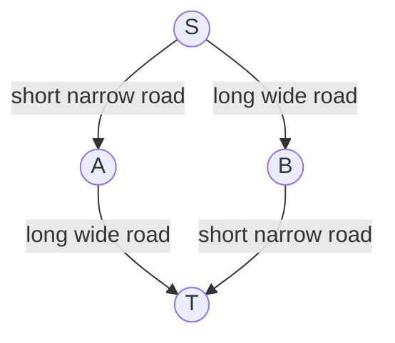
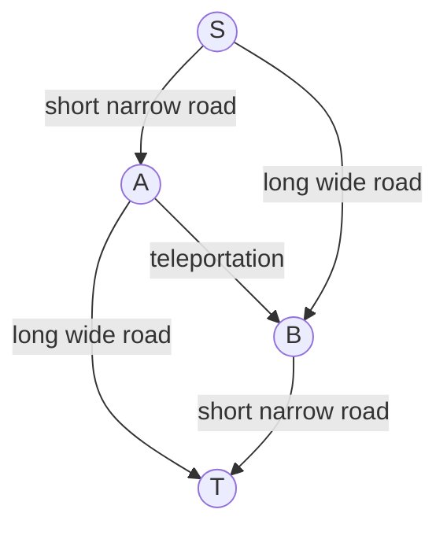
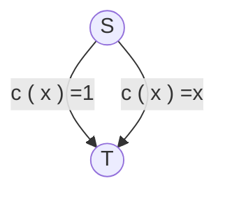
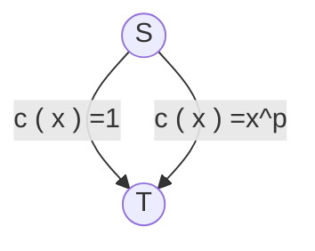
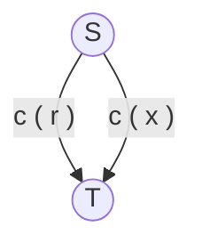

Today we start to consider other topic than mechanism design.

# Review of Braess' paradox

A road network for sending traffic from location $s$ to location $t$

Latency of the long wide road: $1$ hour

Latency of the short  narrow road: $x$ hours, where $x$ is the fraction traffic

Travel time: $1.5$ hours 因为均衡：左边多了会有人到右边，右边多了会有人到左边

If authority build a very fast short-cut from A to B:

**All users have an incentive to use the new road**

> 假设只走左边的有 $\alpha$，只走右边的有 $\beta$，使用传送节点的有 $1-\alpha-\beta$。
>
> 对于只走左边的时间：$(\alpha+(1-\alpha-\beta))+1=1-\beta+1=2-\beta$
>
> 同理，对于只走右边的时间：$1+1-\alpha=2-\alpha$
>
> 对于使用传送节点的时间：$1-\beta+0+1-\alpha=2-\alpha-\beta$
>
> 可以看出使用传送节点对于所有人都是最优选。

New travel time: $2$ hours

Price of anarchy: quantifies inefficiencies

Here, $\text{price of anarchy}=\frac{4}{3}$.

# Pigou's example

One unit of traffic from $s$ to $t$.

Equilibrium: all traffic uses the lower path ($x=100\%$, travel time = $1$)

Optimal route (i.e., minimizing average travel time): **half** traffic through the left path, **half** traffic from the right path.

Optimal average travel time $=\frac{3}{4}$

Price of anarchy $=\frac{4}{3}$

What if for short path, $c(x)=x^p$?

Optimal route: **some** traffic through the left path, **some** traffic through the right path.
$$
\text{Average travel time}=1\times(1-x)+x\times x^p
$$
Optimal average time $=$ minimal of average travel time $=(\frac{1}{p+1})^\frac{p+1}{p}-(\frac{1}{p+1})^\frac{1}{p}+1$

Price of anarchy **depends on $p$**

## Ingredients of a Pigou-like network

- Two nodes, $s$ and $t$
- Two edges between $s$ and $t$, called the upper (left) and lower (right) path
- A non-negative traffic rate $r$
- A cost function $c(\cdot)$ on the lower path
- Constant cost function equal to $c(r)$ on the upper path

## The PoA of a Pigou-like network

$$
\text{PoA}=\sup_{x\ge0}\{\frac{r\times c(r)}{x\times c(x)+(r-x)\times c(r)}\}=\sup_{0\le x\le r}\{\frac{r\times c(r)}{x\times c(x)+(r-x)\times c(r)}\}
$$

> $\forall x\gt r,\exists x'\in[0,r]:x\cdot c(x)+(r-x)\cdot c(r)\ge x'\cdot c(x')+(r-x')\cdot c(r)$
>
> To prove this, it suffices to observe that
>
> $x\cdot c(x)+(r-x)\cdot c(r)=r\cdot c(r)+x(c(x)-c(r))\ge r\cdot c(r)=x'\cdot c(x')+(r-x')\cdot c(r)$ for $x'=r\in[0,r]$

Price of Anarchy equals:

cost at equilibrium (all routing traffic on the lower path) over

cost of routing a traffic fraction $x$ on the lower path + cost of routing a traffic fraction $r-x$ on the upper path

Family of latency functions $C$.

- linear latencies: $c(x)=ax+b$, $a,b\ge0$
- quadratic latencies: $c(x)=ax^2+bx+c$, $a,b,c\ge0$
- polynomial of degree d: $c(x)=\sum_{j=0}^da_jx^j$, $a_j\ge0$
- concave non-decreasing function 上凸非减函数

Let $C$ be a set of non-negative, continuous, non-decreasing cost functions:
$$
a(C)=\sup_{c\in C}\sup_{r\ge0}\sup_{x\ge0}\{\frac{r\times c(r)}{x\times c(x)+(r-x)\times c(r)}\}
$$
**Application: $\text{PoA}=\frac{4}{3}$ for linear (affine) or concave cost functions.**

1. $c(x)=\alpha x+\beta$:

> $a(\text{linear})=\sup_{\alpha,\beta\ge0}\sup_{r\ge0}\sup_{x\ge0}\frac{r(\alpha r+\beta)}{x(\alpha x+\beta)+(r-x)(\alpha r+\beta)}$
>
> derivative of denominator $=0\Rightarrow 2\alpha x+\beta-\alpha r-\beta=0\Rightarrow x=\frac{r}{2}$
>
> Thus, the denominator becomes: $\alpha\frac{r^2}{4}+\frac{\beta r}{2}+\alpha\frac{r^2}{2}+\frac{\beta r}{2}=\frac{3}{4}\alpha r^2+\beta r\ge\frac{3}{4}r(\alpha r+\beta)$
>
> 所以无序的代价 PoA 最大值是 $\frac{4}{3}$

2. $a(\text{concave non-decreasing})=\frac{4}{3}$

> For every concave non-decreasing latency function $c$, there is a linear latency function $c'$ with $c(r)=c'(r)$, s.t. $\frac{r\cdot c(r)}{x\cdot c(x)+(r-x)\cdot c(r)}\le\frac{r\cdot c'(r)}{x\cdot c'(x)+(r-x)\cdot c'(r)}$
>
> 通过画图可以证明，上凸函数和线性函数 $x\cdot c(x)\ge x\cdot c'(x)$, $(r-x)\cdot c(r)=(r-x)\cdot c'(r)$. 分子相等，分母左边比右边小。

# The Price of anarchy of selfish routing

## Theorem

For every set $C$ of cost functions, and every selfish routing network with cost functions in $C$, the Price of Anarchy is at most $a(C)$.

Selfish routing network: connecting node $s$ to node $t$

Equilibrium flow: traffic travels only on shortest $s-t$ paths.

Volume of $r$ of users who want to route traffic from $s$ to $t$.

$c_e$: latency function of edge $e$

$f_e$: total volume of user who cross edge $e=\sum_{p,e\in p}f_p$

$p$: a path from $s$ to $t$ in $G$.

$f_p$: total volume of user who use path $p$

Equilibrium condition: For every path $p$ from $s$ to $t$, s.t. $f_p\gt0$, the total latency $\sum_{e\in p}c_e(f_e)$ is minimum possible.

$C(f)$: total cost of set of strategies $f$

$f^*$ optimal set of strategies i.e. the strategies minimizing the total latency.

Cost of a flow:
$$
C(f)=\sum_{e\in E}f_e\times c_e(f_e)
$$
Assume that $f$ and $f^*$ are an equilibrium and optimal flow respectively, then
$$
\frac{C(f)}{C(f^*)}\le a(C)
$$

## Proof

> Information we will use in the proof: Why don't the players use their optimal strategies at equilibrium.
>
> - Observation: For a path $p$ with $f_p\gt0$, we have that the latency is minimum possible. i.e. $\sum_{e\in p}c_e(f_e)=L$ ① which is as low as possible. Meaning that for every path $p$ with $f^*_p\gt0$, We have 
> $$
> \sum_{e\in p}c_e(f_e)\ge L ②.
> $$
> 
> - By summing ① for all paths with $f_p\gt0$ from $s$ to $t$, we have
>
> $$
> \sum_{p:f_p\gt 0}f_p \cdot \sum_{e\in p}c_e(f_e)=\sum_{p: f_p\gt 0}L\cdot f_p=r\times L
> $$
>
> - By doing the same with ② and all paths with $f^*_p\gt0$ from $s$ to $t$, we have
>
> $$
> \sum_{p:f^*_p\gt0}f^*_p\cdot\sum_{e\in p}c_e(f_e)\ge\sum_{p:f^*_p\gt0}f^*_pL=r\times L ③
> $$
> 
> - The Left Hand Side of ③ is equal to $\sum_{p:f_p\gt0}f_p\cdot\sum_{e\in p}c_e(f_e)$
>
> $$
> =\sum_{e\in E}\sum_{p:f_p\gt0,e\in p}f_p\cdot c_e(f_e)=\sum_{e\in E}c_e(f_e)\sum_{p:f_p\gt0,e\in p}f_p ④
> $$
> 
> - The LHS of ④ is equal to $\sum_{e\in p}\sum_{p:f^*_p\gt0}f^*_p\cdot c_e(f_e)$
>
> $$
> =\sum_{e\in E}\sum_{e\in p,p:f^*_p\gt0}f^*_pc_e(f_e)=\sum_{e\in E}c_e(f_e)\sum_{e\in p,p:f^*_p\gt0}f^*_p=\sum_{e\in E}f^*_ec_e(f_e)
> $$
>
> - From ③ and ④ and their equivalent expressions, we have $\sum_{e\in E}(f^*_e-f_e)c_e(f_e)\ge0$
>
> $$
> a(c)=\sup_{c\in C}\sup_{r\ge0}\sup_{x\ge0}\frac{rc(r)}{xc(x)+(r-x)c(r)}
> $$
> 
> Thus, using $c=c_e,r=f_e,x=f^*_e$, we have that
>
> $$
> a(c)\ge\frac{f_ec_e(f_e)}{f^*_ec_e(f^*_e)+(f_e-f^*_e)c(f_e)}
> $$
> 
> $$
> \Rightarrow f_ec_e(f_e)\le a(c)f^*_ec_e(f^*_e)+a(c)(f_e-f^*_e)c_e(f_e)
> $$
>
> Summing over all edges, we have
> 
> $$
> \sum_{e\in E}f_ec_e(f_e)\le a(c)\sum_{e\in E}f^*_ec_e(f^*_e)+a(c)\sum_{e\in E}(f^*_e-f_e)c_e(f_e)
> $$
> 
> $$
> \le a(c)\sum_{e\in E}f^*_ec_e(f^*_e)
> $$
>
> $$
> \Rightarrow c(f)=\sum_pf_p\sum_{e\in p}c_e(f_e)=\sum_p\sum_ef_pc_e(f_e)=\sum_ef_ec_e(f_e)
> $$
>
> $$
> \therefore c(f)\le a(c)\cdot c(f^*)
> $$

