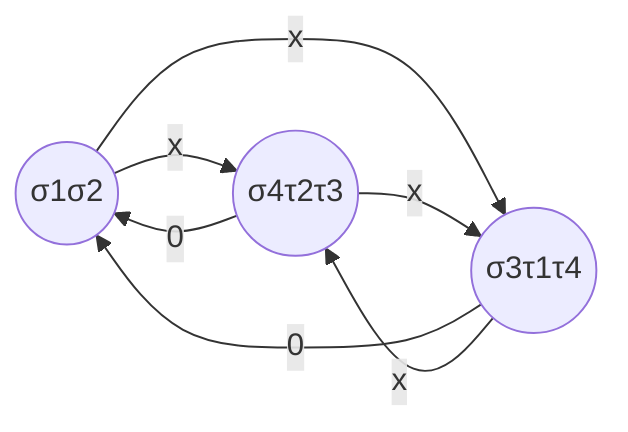

# Atomic selfish routing

3 players: strategies: connect source $s_i$ with destination $t_i$.

Assuming that all edges have latency functions $c_e(x)=x$ how do the players act?

> 肯定尽量选不挤的路径。

# Load balancing games

Every player has a job and wants to assign it to some machine so that its completion time is minimized

$m$ parallel machines

- Machine $j$ has speed $\sigma_j$
- If machine $j$ gets $x$ jobs, the latency/cost experienced by each of the players/owners of these jobs is $\frac{x}{\sigma_j}$.

Similar to atomic selfish routing with among $n$ players who want to route from a common source $s$ to a common destination $t$ through $m$ parallel edges of latency function $c_j(x)=\frac{x}{\sigma_j}$.

# Congestion games

Set $N$ of $n$ players, set $E$ with $m$ resources

Resource $e$ has latency function $c_e:N\rightarrow\mathbb R_{\ge0}$

- Non-decreasing, denotes the latency caused by the resources to the players who use it.

Player $i$ has a **set of strategies** $\Sigma_i$.

- Every strategy is a set of resources (denotes the resources used by the player)

**State** $S=(s_1,\cdots,s_n)$, where player $i$ selects strategy $s_i\in\Sigma_i$,

**Load** $f_e(S)$ of resource $e$ at state $S=$ number of players who use resource $e$ at state $S$.

Hence, the quantity $c_e(f_e(S))$ denotes the **latency** incurred by resource $e$ to the players who use it.

Cost/latency of player $i$ at state $S$:
$$
\text{cost}_i(S)=\sum_{e\in s_i}c_e(f_e(S))
$$
Every player aims at minimizing own cost

**Pure Nash equilibrium**: $\text{cost}_i\le\text{cost}_i(S_{-i},s)$ for every strategy $s\in\Sigma_i$ of player $i$

# Potential functions

Definition: Function $\Phi:\mathbf S\rightarrow\mathbb R$ is a **potential function** if for every two states $S_1$ and $S_2$ that differ in the strategy of a single player $i$, the differences $\Phi(S_1)-\Phi(S_2)$ and $\text{cost}_i(S_1)-\text{cost}_i(S_2)$ have the **same sign**.

Potential games: those admitting a potential function

**Theorem: Every potential game have at least one pure Nash equilibrium**

Proof

> Consider the Nash dynamics graph which has a node for each state of the game and a directed edge from state $S$ to state $S'$ if they differ in the strategy of a single player $i$, who improves cost when deviating from the strategy she uses in state $S$ to the strategy she uses in state $S'$.
>
> By definition of the potential function $\Phi$, the potential value $\Phi(S)$ is strictly higher than $\Phi(S')$. Then, the Nash dynamics graph can not have directed cycles. This implies that there will be a node which is a sink i.e., it has only incoming edges. Let $S$ be such the state corresponding to this node. Then, no player has an incentive to deviate from $S$. Thus, $S$ is a pure Nash equilibrium.

## Rosenthal's potential function

**Theorem: for every congestion games, the function**
$$
\Phi(S)=\sum_{e\in E}\sum_{j=1}^{f_e(S)}c_e(j)
$$
**is a potential function.**

Proof

> We will show that for two states $S_1,S_2$ that different in the strategy of player $i$, it holds $\Phi(S_1)-\Phi(S_2)=\text{cost}_i(S_1)-\text{cost}_i(S_2)$.
>
> By the definition of Rosenthal's potential function, we have
> $$
> \Phi(S)-\Phi(S')=\sum_{e\in E}\sum_{j=1}^{f_e(S)}c_e(j)-\sum_{e\in E}\sum_{j=1}^{f_e(S')}c_e(j)\\
> =\sum_{e\in E}\left(\sum_{j=1}^{f_e(S)}c_e(j)-\sum_{j=1}^{f_e(S')}c_e(j)\right)\\
> =\sum_{e\notin s_i\cup s_i'}\left(\sum_{j=1}^{f_e(S)}c_e(j)-\sum_{j=1}^{f_e(S')}c_e(j)\right)+\sum_{e\in s_i\cap s_i'}\left(\sum_{j=1}^{f_e(S)}c_e(j)-\sum_{j=1}^{f_e(S')}c_e(j)\right)\\
> +\sum_{e\in s_i\diagdown s_i'}\left(\sum_{j=1}^{f_e(S)}c_e(j)-\sum_{j=1}^{f_e(S')}c_e(j)\right)+\sum_{e\in s_i'\diagdown s_i}\left(\sum_{j=1}^{f_e(S)}c_e(j)-\sum_{j=1}^{f_e(S')}c_e(j)\right)
> $$
> Now, we can observe the following
>
> 1. if $e\notin s_i\cup s_i'$, then $f_e(S)=f_e(S')$ and hence, $\sum_{j=1}^{f_e(S)}c_e(j)-\sum_{j=1}^{f_e(S')}c_e(j)=0$
> 2. if $e\in s_i\cap s_i'$, then $f_e(S)=f_e(S')$ and hence, $\sum_{j=1}^{f_e(S)}c_e(j)-\sum_{j=1}^{f_e(S')}c_e(j)=c_e(f_e(S))-c_e(f_e(S'))$
> 3. if $e\in s_i\diagdown s_i'$, then $f_e(S)=f_e(S')+1$ and hence, $\sum_{j=1}^{f_e(S)}c_e(j)-\sum_{j=1}^{f_e(S')}c_e(j)=c_e(f_e(S))$
> 4. if $e\in s_i'\diagdown s_i$, then $f_e(S)=f_e(S')-1$ and hence, $\sum_{j=1}^{f_e(S)}c_e(j)-\sum_{j=1}^{f_e(S')}c_e(j)=-c_e(f_e(S'))$
>
> Thus, we have
> $$
> \Phi(S)-\Phi(S')=\sum_{e\in s_i\cap s_i'}(c_e(f_e(S))-c_e(f_e(S')))+\sum_{e\in s_i\diagdown s_i'}c_e(f_e(S))-\sum_{e\in s_i'\diagdown s_i}c_e(f_e(S'))\\
> =\sum_{e\in s_i}c_e(f_e(S))-\sum_{e\in s_i'}c_e(f_e(S'))\\
> =\text{cost}_i(S)-\text{cost}_i(S')
> $$

## The social cost

Quantification of the performance of a system that is modeled by a strategic game

Typically $SC(S)=\sum_{i\in N}\text{cost}_i(S)$

The state that minimizes the social cost is not necessarily a pure Nash equilibrium.

So equilibrium are suboptimal

How is this sub-optimality quantified? Price of anarchy/Price of stability.

 # Price of stability/anarchy

$$
PoS=\min_{s\in EQ}\frac{SC(s)}{SC(s^*)}\\
PoA=\max_{s\in EQ}\frac{SC(s)}{SC(s^*)}
$$

where $s^*$ denotes the optimal state i.e., one of minimum social cost.

PoS/PoA is an optimistic/pessimistic measure:

- How close to/far from the optimal social cost can a system/game be due to strategic behavior

# Linear Congestion games

## Price of stability

Linear congestion games: resources $e$ has latency function
$$
c_e(x)=a_ex+b_e
$$
**Lemma: The social cost of a linear congestion game and Rosenthal's potential function value at state $S$ are connected with the inequalities**
$$
\frac{SC(S)}{2}\le\Phi(S)\le SC(S)
$$
Proof

>By definition of latency functions in linear congestion games and the definition of the social cost, we have:
>$$
>SC(S)=\sum_{i\in N}\text{cost}_i(S)\\
>=\sum_{i\in N}\sum_{e\in s_i}c_e(f_e(S))\\
>=\sum_{e\in E}c_e(f_e(S))\times\sum_{i\in N:e\in s_i}1\\
>=\sum_{e\in E}f_e(S)(a_ef_e(S)+b_e)\\
>=\sum_{e\in E}(a_ef_e(S)^2+f_e(S)b_e)
>$$
>Also, by definition of Rosenthal's potential function, we have:
>$$
>\Phi(S)=\sum_{e\in E}\sum_{j=1}^{f_e(S)}c_e(j)\\
>=\sum_{e\in E}\sum_{j=1}^{f_e(S)}(a_ej+b_e)\\
>=\sum_{e\in E}\left(a_e\sum_{j=1}^{f_e(S)}j+f_e(S)b_e\right)\\
>=\sum_{e\in E}\left(a_e\frac{f_e(S)^2+f_e(S)}{2}+f_e(S)b_e\right)
>$$
>To prove the leftmost inequality in the statement of the lemma, it suffice to bound the potential function from below. Working with the equivalent expression for $\Phi(S)$, we have:
>$$
>\Phi(S)=\sum_{e\in E}\left(a_e\frac{f_e(S)^2+f_e(S)}{2}+f_e(S)b_e\right)\\
>\ge\sum_{e\in E}\left(a_e\frac{f_e(S)^2}{2}+b_ef_e(S)\right)\\
>\ge\sum_{e\in E}\left(a_e\frac{f_e(S)^2}{2}+b_e\frac{f_e(S)}{2}\right)\\
>=\frac{1}{2}\sum_{e\in E}(a_ef_e(S)^2+f_e(S)b_e)\\
>=\frac{1}{2}SC(S)
>$$
>For the rightmost inequality, we bound the potential function from above as follows:
>$$
>\Phi(S)=\sum_{e\in E}\left(a_e\frac{f_e(S)^2+f_e(S)}{2}+f_e(S)b_e\right)\\
>\le\sum_{e\in E}\left(a_e\frac{f_e(S)^2+f_e(S)^2}{2}+f_e(S)b_e\right)\\
>=\sum_{e\in E}(a_ef_e(S)^2+f_e(S)b_e)\\
>=SC(S)
>$$
>Q. E. D.

**Theorem: The PoS of linear congestion games is at most 2.**

Proof

> We use *potential function method*, We start from the state $S^*$ of minimum social cost. If it is a pure Nash equilibrium, then the price of stability is $1$. Otherwise, we let the players change their strategies and improve their cost until we reach an equilibrium $S$. By Lemma above, we have $SC(S)\le2\Phi(S)$, By the main property of the potential function, we have that $\Phi(S)\le\Phi(S^*)$. Finally, again by Lemma above, we have that $\Phi(S^*)\le SC(S^*)$. Thus,
> $$
> SC(S)\le2\Phi(S)\le2\Phi(S^*)\le2SC(S^*)
> $$
> The above bound is not best possible, An upper bound of $1+\frac{1}{\sqrt3}\approx 1.578$ has been proved.

## A lower bound on the price of anarchy

4 player

pure Nash equilibrium

- Each player uses two edges
- social cost = 10

optimal state:

- every player uses her direct edge
- social cost = 4
- $PoS=\frac{5}{2}$

## A matching upper bound

**Theorem: The price of anarchy of linear congestion game is at most $\frac{5}{2}$.**

Proof（:warning:难度贼高的证明）

>Lemma first
>
>先证明引理 $\forall x,y\in \mathbb N,xy+y\le\frac{x^2}{3}+\frac{5y^2}{3}$.
>$$
>\Lrarr x^2+5y^2-3xy-3y\ge0
>$$
>Obviously true if $y=0$.
>
>If $y=1$, we need to show that $x^2-3x+2\ge0\Lrarr(x-1)(x-2)\ge0$
>
>显然成立，对于 $x=1,2$，二次函数=0，对于大于 3，小于 0，两项同号。
>
>If $y\ge2$, $5y^2-3y\ge\frac{9}{4}y^2$, hence $x^2+5y^2-3xy-3y\gt x^2-3xy+\frac{9}{4}y^2=(x-\frac{3}{2}y)^2\ge0$.
>
>引理证明完毕。（难点一：**想出**引理并证明）
>
>
>
>Now consider a linear congestion game and let $S^*=(s_1^*,\cdots,s_n^*)$ be the state of minimum social cost and $S=(s_1,\cdots,s_n)$ a pure Nash equilibrium. Thus, at state $S$, no player $i$ has an incentive to change her strategy $s_i$ to $s_i^*$, i.e., for every player $i$, it holds $\text{cost}_i(S)\le\text{cost}_i(S_{-i},s_i^*)$（这个放缩指的意思是，在一个纳什均衡状态下，某一个智能体单方面改变其策略只能是 social cost 增大）.
>
>Summing over all players, we get
>$$
>SC(S)=\sum_{i\in N}\text{cost}_i(S)\\
>\le\sum_{i\in N}\text{cost}_i(S_{-i},s_i^*)\\
>=\sum_{i\in N}\sum_{e\in s_i^*}c_e(f_e(S_{-i},s_i^*))\\
>=\sum_{i\in N}\sum_{e\in s_i^*}(a_ef_e(S_{-i},s_i^*)+b_e)
>$$
>Notice that for every resource $e\in E$, it holds that $f_e(S_{-i},s_i^*)\le f_e(S)+1$（难点二（放缩）：对于任何一种资源，当一个智能体的策略改变时，该资源的负载最多是之前状态下的负载加 1，取等的条件是：智能体 $i$ 在策略 $s_i$ 下没有使用资源 $e$, 而在 $s_i'$ 策略下使用了资源 $e$） since only one player changes her strategy at state $(S_{-i},s_i^*)$ compared to state $S$. Thus, we have:
>$$
>SC(S)\le\sum_{i\in N}\sum_{e\in s_i^*}(a_e(f_e(S)+1)+b_e)\\
>=\sum_{e\in E}\sum_{i\in N:e\in s_i^*}(a_e(f_e(S)+1)+b_e)\\
>=\sum_{e\in E}f_e(S^*)(a_e(f_e(S)+1)+b_e)\\
>=\sum_{e\in E}(a_ef_e(S^*)f_e(S)+a_ef_e(S^*)+b_ef_e(S^*))
>$$
>By applying Lemma above for $x=f_e(S),y=f_e(S^*)$, we have:
>$$
>SC(S)\le\sum_{e\in E}\left(\frac{1}{3}a_ef_e(S)^2+\frac{5}{3}a_ef_e(S^*)^2+b_ef_e(S^*)\right)\\
>\le\frac{1}{3}\sum_{e\in E}(a_ef_e(S)^2+b_ef_e(S))+\frac{5}{3}\sum_{e\in E}(a_ef_e(S^*)^2+b_ef_e(S^*))\\
>=\frac{1}{3}SC(S)+\frac{5}{3}SC(S^*)
>$$
>Thus we conclude that $SC(S)\le\frac{5}{2}SC(S^*)$
>
>Q. E. D.

