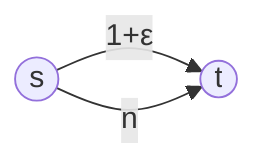
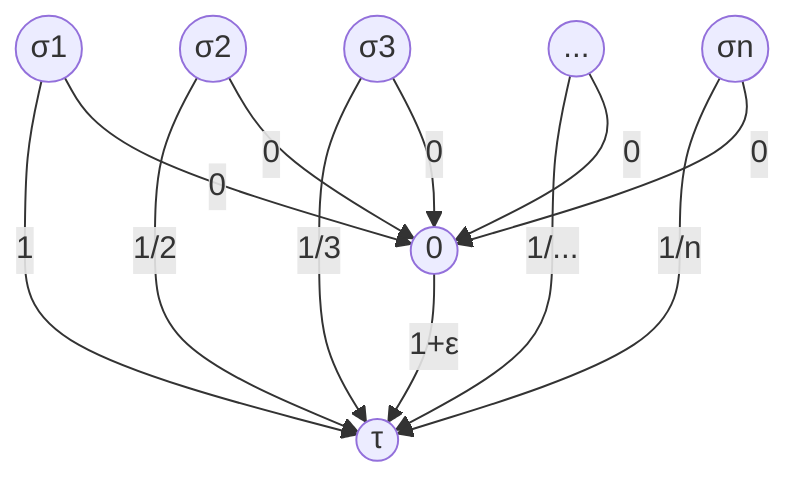

# Cut games

Graph $G=(V,E)$ with weight $w_e$ on each edge $e\in E$.

Every node corresponds to a player.

Two strategies per player/node $v$:

- To put $v$ at the left or right side of the cut

$Cut(S)$: the set of edges with their endpoints on different sides of the cut at a state $S$

$$
\text{payoff}_i(S)=\sum_{e\in Cut(S)\cap N_i}w_e
$$

A **pure Nash equilibrium** was found.

带权图的最大割 [Maximum cut](https://en.wikipedia.org/wiki/Maximum_cut)

## Cut games are potential games

Lemma: the function 

$$
\Phi(S)=\sum_{e\in Cut(S)}w_e
$$

is a potential function for a cut game.

Proof

> Consider two states $S$ and $S'$ that differ in the strategy of player $i$ i.e., $S'=(S_{-i},s_i')$
>
> we will show that $\Phi(S)-\Phi(S')=\text{payoff}_i(S)-\text{payoff}_i(S')$
> 
> $$
> \Phi(S)-\Phi(S')=\sum_{e\in Cut(S)}w_e-\sum_{e\in Cut(S')}w_e\\
> $$
>
> $$
> =\sum_{e\in Cut(S)\cap N_i}w_e+\sum_{e\in Cut(S)\diagdown N_i}w_e-\sum_{e\in Cut(S')\cap N_i}w_e-\sum_{e\in Cut(S')\diagdown N_i}w_e\\
> $$
>
> Observe that the edges which belong to the cut but are not incident to node $i$ are the same in states $S$ and $S'$, since they are not affected by the change of strategy for player $i$. （与 $i$ 不相邻的点在其改变策略前后对势函数的贡献不变） Hence, we have:
> 
> $$
> =\sum_{e\in Cut(S)\cap N_i}w_e+\cancel{\sum_{e\in Cut(S)\diagdown N_i}w_e}-\sum_{e\in Cut(S')\cap N_i}w_e-\cancel{\sum_{e\in Cut(S')\diagdown N_i}w_e}\\
> $$
>
> $$
> =\text{payoff}_i(S)-\text{payoff}_i(S')
> $$

## Price of anarchy/stability

Review: price of stability (defined in social cost) 如果用社会福利定义，分子分母反过来。
$$
PoS=\frac{\text{value of best Nash equilibrium}}{\text{value of optimal solution}},PoS\ge0
$$

The potential function mainly gives us information about the structure of the game. To assess the quality of states, we use the notion of the social welfare, defined as the total payoff of all players in state $S$, i.e. Social welfare: total payoff of all players in state $S$,
$$
SW(S)=\sum_i\text{payoff}_i(S)
$$
Observation: $SW(S)=2\Phi(S)$.

Proof:

> （简单来讲，就是因为一条割边被记了两次 because two player share a cut edge while \(\Phi(S)\) only count cut edge once.）
>
> By definition of the social welfare, we have
>
> \[
> SW(S)=\sum_i\text{payoff}_i(S)=\sum_i\sum_{e\in CUT(S)\cap N_i}w_e
> \]
>
> Now, observe that every edge in the cut contributes to the payoff the two players controlling its end points. Thus, we have:
>
> \[
> SW(S)=\sum_{e\in CUT(S)}2w_e=2\Phi(S)
> \]

Hence the price of stability is equal to 1. (Why?)

Proof:

> By Lemma proved above, notice that the state of maximum social welfare maximizes the value of the potential function and is, thus, an equilibrium. The theorem follows by the definition of the price of stability.

Theorem: The price of anarchy is at most 2

Proof

>*Similar to the proof that a simple local search algorithm for solving the MAX-CUT problem has good performance. MAX-CUT is formally defined as follows: Given a graph $G$ with non-negative weights on the edges, find a partition of the nodes in two set so that the total weight of edges with their endpoints is different sets of the partition is maximized.*
>
>Let $S_{eq}$ be a pure Nash equilibrium and $u$ a node that is at the left of the cut in state $S_{eq}$. Since $S_{eq}$ is an equilibrium, the player controlling node $u$ has no incentive to deviate from her strategy.
>
>This means that the **total weight of edges in the cut which are incident to $u$** is **at least half the total weight of all edges** which are incident to $u$. Thus, for every player at the left of the cut, we have:
>
>$$
>\text{payoff}_u(S_{eq})=\sum_{e\in CUT(S_{eq})\cap N_u}w_e\ge\frac{1}{2}\sum_{e\in N_u}w_e
>$$
>
>Using similar reasoning, we can verify an analogous for the nodes at right of the cut. Summing over all players and using the definition of social welfare, we have
>
>$$
>SW(S_{eq})=\sum_{u\in V}\text{payoff}_u(S_{eq})\ge\frac{1}{2}\sum_{u\in V}\sum_{e\in N_u}w_e=\sum_{e\in E}w_e
>$$
>
> The last equality follows since when we sum over all nodes, we count each edge $e=(u,v)$ twice since $e$ belongs to both sets $N_u$ and $N_v$. Now, it suffices to observe that $2\times\sum_{e\in E}w_e$ is a upper bound on the social welfare of any state, including the state $S^*$ of maximum social welfare. Indeed（一个点的 payoff 最多只能被所有与之相连的边贡献，$SW(S^*)$ 不能超过所有点连出去的所有边权之和）:
>
>$$
>SW(S^*)=\sum_{u\in V}\text{payoff}_u(S^*)\le\sum_{u\in V}\sum_{e\in N_u}w_e=2\times\sum_{e\in E}w_e
>$$
>
> Thus, we have $SW(S_{eq})\ge\frac{1}{2}SW(S^*)$ Q. E. D.

Theorem: There exists cut games with PoA exactly 2

> example:
>
> a-1-b-1-c-1-d-1-a
>
> ab cd: SW=4
>
> ac bd: SW=8

# Network design games

Graph $G=(V,E)$

Cost $w_e$ for edge $e\in E$

- indicates the cost of establishing the corresponding link in the network

$n$ player

- player $i$ want to connect a source $\sigma_i$ to a destination node $\tau_i$.
- strategies: the different paths that connect node $\sigma_i$ with node $\tau_i$.

Cost of player $i$ at a state $S$ where the strategy $s_i$ is used for player $i$

$$
\text{cost}_i(S)=\sum_{e\in s_i}\frac{w_e}{f_e(S)}
$$

$f_e(S)$: 在 $S$ 状态下，使用 $e$ 边的玩家总数

Social cost = total cost of all players at a state

$$
SC(S)=\sum_i\text{cost}_i(S)\\
=\sum_i\sum_{e\in s_i}\frac{w_e}{f_e(S)}\\
=\sum_{e\in E}\sum_{i\in N_i,e\in s_i}\frac{w_e}{f_e(S)}\\
=\sum_{e\in E}\frac{w_e}{f_e(S)}\sum_{i\in N_i,e\in s_i}1\\
=\sum_{e\in E}w_e\\=\text{sum of weights of edges used by at least one player.}
$$

Alternatively, the total cost of the edges used by at least one player.

**Theorem: There exists a network with PoA arbitrarily close to $n$**

> $$
> PoA=\max_{S\in PNE}\frac{SC(S)}{SC(S^*)}\\
> $$
> 
> $$
> PoS=\min_{S\in PNE}\frac{SC(S)}{SC(S^*)}\\
> $$
> 
> $$
> S^*:\text{state of minimum social cost}\\
> $$
>
> $$
> 1\le PoS\le PoA
> $$
>
> 考虑一种均衡，当有 $n$ 个玩家，全部都使用下面的路径，每个玩家的损失都是 $1$, 此时没有玩家有 incentive to 使用上面那条 $1+\epsilon$ 的路径。所以
> $$
> PoA=\frac{1\times n}{\frac{1+\epsilon}{n}\times n}=\frac{n}{1+\epsilon}\rightarrow n
> $$

## Price of stability

Theorem: there exists a network design game with PoS arbitrarily close to $H_n=\sum_{i=1}^n\frac{1}{i}$.

Proof:

>
>$$
>SC(S^*)=1+\epsilon\\
>SC(S)=\sum_{i=1}^n\frac{1}{i}=H_n
>$$

Proof via Rosenthal's potential function

> 先证明：所有的玩家使用 $\frac{1}{i}$ 一步到位的路径确实是纯纳什均衡的。
>
> - 当所有玩家使用上面那条路径时候，没有 player has incentive to deviate to $1+\epsilon$ path since $1+\epsilon\gt\frac{1}{i}(\forall i=1,\cdots)$.
>
> 再证明：这个所有玩家使用一步到位的路径的纯纳什均衡是唯一的。只要有人选择 $1+\epsilon$ 的路径，那么就不是纳什均衡的。
>
> - $S'$: 假设有的人走 $1\over i$ 一步到位的路径，有的人走 $0$，再走 $1+\epsilon$ 的路径。We will show that $S'$ is not Pure Nash Equilibrium for every $\epsilon\gt0$.
>
> - Consider there are $l$ players using $1+\epsilon$ path. Among the players who use the direct edge to $\tau$ let $i^*$ be the player of minimum index.
>
> - It must be that $i^*\le l+1$. If $i^*\le l$, cost is at least $1\over l$ By deviating the cost would be $\frac{1+\epsilon}{l+1}\lt\frac{1}{l}$.
>
> - When $i^*=l+1$ i.e., $1,\cdots,l$-th players using $1+\epsilon$ edge. The remaining players use direct edge.
>
>   Player $l$ has cost $\frac{1+\epsilon}{l}$. By deviating to the direct yields smaller cost $1\over l$.
>
>   Therefore $S^*$ is not PNE.
>
> $$
> SC(S_{eq})\le H_n\times SC(S^*)\\
> \Rightarrow PoS=\min_{S\in PNE}\frac{SC(S)}{SC(S^*)}\le\frac{SC(S_{eq})}{SC(S^*)}\le H_n
> $$
>
> Rosenthal's potential is a potential function for network design game
> $$
> \Phi(S)=\sum_{e\in E}\sum_{i=1}^{f_e(S)}\frac{w_e}{i}=\sum_{e\in E;f_e(S)\gt0}w_eH_{f_e(S)}\le\sum_{e\in E;f_e(S)\gt0}w_eH_n\\
> SC(S)=\sum_{e\in E;f_e(S)\gt0}w_e\le\sum_{e\in E;f_e(S)\gt0}w_eH_{f_e(S)}=\Phi(S)\\
> SC(S_{eq})\le\Phi(S_{eq})\le\Phi(S^*)\le H_nSC(S^*)
> $$

$S,S'$ states that differ in the strategy of player $i$.

Strategy of player $i$: $S=(s_{-i},s_i),S'=(s_{-i},s_i')$
$$
\Phi(S)-\Phi(S')=\sum_{e\in E;f_e(S)\gt0}w_eH_{f_e(S)}-\sum_{e\in E;f_e(S')\gt0}w_eH_{f_e(s')}(*)
$$
4 cases

1. $E_1$: edges used by $i$ in both $S$ and $S'$
2. $E_2$: edges used by $i$ in $S$ not in $S'$.
3. $E_3$: edges used by $i$ in $S'$ not in $S$.
4. $E_4$: edges neither used by $i$ in $S$ nor $S'$

$$
(*)=\sum_{e\in E_1,f_e(S)\gt0}w_eH_{f_e(S)}+\sum_{e\in E_2,f_e(S)\gt0}w_eH_{f_e(S)}+\sum_{e\in E_3,f_e(S)\gt0}w_eH_{f_e(S)}+\sum_{e\in E_4,f_e(S)\gt0}w_eH_{f_e(S)}\\
-\sum_{e\in E_1,f_e(S')\gt0}w_eH_{f_e(S')}-\sum_{e\in E_2,f_e(S')\gt0}w_eH_{f_e(S')}-\sum_{e\in E_3,f_e(S')\gt0}w_eH_{f_e(S')}-\sum_{e\in E_4,f_e(S')\gt0}w_eH_{f_e(S')}\\
=\sum_{e\in E_1,f_e(S)\gt0,f_e(S')\gt0}w_e(H_{f_e(S)}-H_{f_e(S')})+\sum_{e\in E_2,f_e(S)\gt0}w_e(H_{f_e(S)}-H_{f_e(S')})\\
+\sum_{e\in E_3,f_e(S')\gt0}w_e(H_{f_e(S)}-H_{f_e(S')})+\sum_{e\in E_4,f_e(S)\gt0,f_e(S')\gt0}w_e(H_{f_e(S)}-H_{f_e(S')})\\
=\cancel{\sum_{e\in E_1,f_e(S)\gt0,f_e(S')\gt0}(\frac{w_e}{f_e(S)}-\frac{w_e}{f_e(S')})}+\sum_{e\in E_2,f_e(S)\gt0}\frac{w_e}{f_e(S)}-\sum_{e\in E_3,f_e(S')\gt0}\frac{w_e}{f_e(S')}-\cancel0\\
=\sum_{e\in s_i}\frac{w_e}{f_e(S)}-\sum_{e\in s_i'}\frac{w_e}{f_e(S')}=\text{cost}_i(S)-\text{cost}_i(S')
$$