Read the paper [*Proportionally Fair Clustering*](https://arxiv.org/abs/1905.03674) by Chen et al.

# Abstract

$n$ points, $k$ centers.

Proportionality: any $n/k$ points are entitled to form own cluster if there is another center that is closer in distance for all $n/k$ points.

Clustering with no justified complaints from any subset of agents.

Tradeoff between proportional solutions and $k$-means objective.

# Introduction

In centroid clustering, we want to partition data into $k$ clusters by choosing $k$ centers and then matching points to one of the centers.

Each data point represents a individual. We with the clustering to be fair. These agents prefer to be clustered accurately.

A clustering is fair if it respects the entitlements of groups of agents: a subset of agents is entitled to choose a center for themselves if they constitute a sufficiently large fraction of the population w.r.t. the total number of clusters. No priori knowledge about which points should be protected.

## Preliminaries

$\mathcal N$ data points, $|\mathcal N|=n$.

$\mathcal M$ feasible cluster centers, $|\mathcal M|=m$.

For $i,j\in\mathcal M\cup\mathcal N$, we have distance $(i,j)$ satisfying the triangle inequality.

Open a set $X\subseteq\mathcal M$ of $|X|=k$ centers, and then match all points in $\mathcal N$ to the closest center in $X$.

For a  particular solution $X$ and agent $i\in\mathcal N$, let $D_i(X)=\min_{x\in X}d(i,x)$. A good clustering solution $X$ will have small values of $D_i(X)$.

Different measures, different objectives:

- $k$-median: $\sum_{i\in\mathcal N}D_i(X)$
- $k$-means: $\sum_{i\in\mathcal N}(D_i(X))^2$
- $k$-center: $\max_{i\in\mathcal N}D_i(X)$

Individuals prefer to be closer to their center in terms of distance.

:book:**Definition 1.** Let $X\subseteq\mathcal M$ with $|X|=k$. $S\subseteq N$ is a **blocking coalition** against $X$ if $|S|\ge\lceil\frac{n}{k}\rceil$ and $\exists y\in\mathcal M$ s.t. $\forall i\in S,d(i,y)\lt D_i(X)$. $X\subseteq \mathcal N$ is **proportional** if there is no blocking coalition against $X$.

!!! info

    阻塞联盟：存在一个候选中心点 $y$，存在一组数据点 $S$ 满足其点数要比簇平均点数多：使得 $S$ 中任意一点到 $y$ 的距离，都比这组数据点到原来分配的对应簇中心点的距离近。

    比例公平：一组簇分配中不包含阻塞联盟，则该簇分配是比例公平的。

Equivalently, $X$ is **proportional** if $\forall S \subseteq N$ with $|S| \ge\lceil\frac{n}{k}\rceil$ and for all $y \in M$, there exists $i \in S$ with $d(i, y) \ge D_i(X)$.

:book:The quantification is over **all** subset of **sufficient** size. Do not consider a single $i\in S$ and ignore all of the other points.

### Advantages of PROP

- PROP implies weak **Pareto optimality**: For any PROP solution $X$, there does not exist another solution $X'$ s.t. $D_i(X')\lt D_i(X)$ for all $i\in\mathcal N$.
- *Oblivious*, does not depend on **sensitive attribute** or **protected sub-groups**.
- **Robust** to outlier.
- **Scale invariant**: a multiplicative scaling of all distances does not affect the set of PROP solution.
- **Approximately PROP** can be efficiently computed.
- **Can be efficiently checked**: no need to compute entire pairwise distance matrix.

However, PROP is incompatible with $k$-center, $k$-means, $k$-median in the worst case.

:book:**Definition 2**. $X\subseteq\mathcal M$ with $|X|=k$ is $\rho$**-approximate proportional** (abbr. $\rho$-proportional) if $\forall S\subseteq\mathcal N$ with $|S|\gt\lceil\frac{n}{k}\rceil$ and $\forall y\in\mathcal M$, there exists $i\in S$ with $\rho\cdot d(i,y)\ge D_i(X)$.

## Results and Outline

### Existence of PROP and its approximation

PROP clustering solution doesn't always exist.

- Better than $2$-PROP solution doesn't always exist.

A greedy algorithm yields $(1+\sqrt2)$-PROP solution in the worst case.

### PROP as constraint

To optimize $k$-median objective subject to PROP constraint.

Use the **rounding** to find an $O(1)$-PROP solution to the $k$-median.

### PROP and Randomness

PROP is approximately preserved if we take a random sample of the data points of size $\tilde{O}(k^3)$.

For constant $k$, we can check if a given clustering s proportional as well as compute approximately PROP solutions in near linear time, comparable to the time for classic $k$-means heuristic.

# Existence and Computation of PROP Solutions

:thinking:Claim 1. For all $\rho\lt2$, a $\rho$-PROP solution is not guaranteed to exist.

> Consider instance $\mathcal N=\{a_i\},\mathcal M=\{x_i\}$ with $|\mathcal N|=|\mathcal M|=6,k=3$ with distance:
>
> |      |  x1  |  x2  |  x3  |  x4  |  x5  |  x6  |
> | :--: | :--: | :--: | :--: | :--: | :--: | :--: |
> |  a1  |  4   |  1   |  2   |  ∞   |  ∞   |  ∞   |
> |  a2  |  2   |  4   |  1   |  ∞   |  ∞   |  ∞   |
> |  a3  |  1   |  2   |  4   |  ∞   |  ∞   |  ∞   |
> |  a4  |  ∞   |  ∞   |  ∞   |  4   |  1   |  2   |
> |  a5  |  ∞   |  ∞   |  ∞   |  2   |  4   |  1   |
> |  a6  |  ∞   |  ∞   |  ∞   |  1   |  2   |  4   |
>
> It's easy to check that any solution can not be better than $2$-PROP.

:thinking:Claim 2. In case where $\mathcal N=\mathcal M$, for all $\rho\lt1.5$, a $\rho$-PROP solution is not guaranteed to exist.

> A counterexample in the paper.

## Computing 2.414-PROP Clustering

Let $B(x,\delta)=\{i\in\mathcal N:d(i,x)\le\delta\}$ (The ball of distance $\delta$ about center $x$).

### Pseudo Code - Greedy Capture

1. $\delta\gets0,X\gets\emptyset,N\gets\mathcal N$
2. while $N\neq\emptyset$, do
   - Smoothly increase $\delta$
   - while $\exists x\in X$ s.t. $|B(x,\delta)\cap N|\ge1$ do
     - $N\gets N\diagdown B(x,\delta)$.
   - while $\exists x\in(\mathcal M\diagdown X)$ s.t. $|B(x,\delta)\cap N|\ge\lceil\frac{n}{k}\rceil$ do
     - $X\gets X\cup\{x\}$
     - $N\gets N\diagdown B(x,\delta)$
3. return $X$

Greedy Capture runs in $\tilde O(mn)$ time.

The algorithm continuously grows. When the ball around a center has captured $\lceil\frac{n}{k}\rceil$ points, we open that center and disregards all of the captured points.

Difference between $k$-means and $k$-median: Balls grow around data points in $k$-median instead of centers.

:dart:Theorem 1. Greedy Capture algorithm yields a $(1+\sqrt2)$-PROP clustering, and there exists an instance for which this bound is tight.

> 1. $X$ uses at most $k$ centers, because it only opens a center when $\lceil\frac{n}{k}\rceil$ unmatched points are absorbed by the sphere. This can only happen at most $k$ times.
> 2. Suppose for contradiction that $X$ is not $(1+\sqrt 2)$-PROP. ......
>
> The example where Greedy Capture yields exactly this bound: $\mathcal N=\{a_1,\cdots,a_6\},\mathcal M=\{x_1,\cdots,x_4\},k=3$.
>
> |      |  x1  |  x2  |  x3  |  x4  |
> | :--: | :--: | :--: | :--: | :--: |
> |  a1  |  1   | 1+√2 |  ∞   |  ∞   |
> |  a2  | √2-1 | 1-ε  |  ∞   |  ∞   |
> |  a3  | 1+√2 | 1-ε  |  ∞   |  ∞   |
> |  a4  |  ∞   |  ∞   |  1   | 1+√2 |
> |  a5  |  ∞   |  ∞   | √2-1 | 1-ε  |
> |  a6  |  ∞   |  ∞   | 1+√2 | 1-ε  |
>
> - Greedy Capture will open $x_2$ and $x_4$. The coalition $\{a_1,a_2\}$ can each reduce their distance by factor $1+\sqrt2$ and $\epsilon\to0$ by deviating to $x_1$.

!!! warning

    I strongly suspect that the PROP fairness notion in clustering is thought after the algorithm.🤐

:question:Open Problem: Can we fill the gap between $1+\sqrt 2$ and $2$ by inventing new algorithm? Or can we invent a new algorithm that has a better bound than $1+\sqrt2$?

## Local Capture Heuristic

Local Capture heuristic produces more proportional clustering.

It takes a target value of $\rho$ as a parameter, and proceeds by iteratively finding a center that violates $\rho$-fairness and swapping it for the center in the current solution that is least demanded.

### Pseudo Code - LCH

Input: $\rho$

1. Initialize $X$ as a random subset of $k$ centers from $\mathcal M$.
2. repeat until no changes occur:
   1. for $y\in\mathcal M$ do
      - $S_y\gets\{i\in N:\rho\cdot d_{iy}\lt D_i(X)\}$
      - if $|S_y|\ge\lceil\frac{n}{k}\rceil$ then
        - $x^*\gets\arg\min_{x\in X}|\{i\in N:d_{ix}=D_i(X)\}|$
        - $X\gets(X\diagdown\{x^*\})\cup\{y\}$
3. return $X$

LCH runs in $\tilde O(mn^2)$ time. **No guarantee of convergence**! aka for a given $\rho$, there may not exist a $\rho$-proportional solution.

If LCH terminate, it must return a $\rho$-PROP solution.

# PROP as a Constraint

Problem with LCH and Greedy Capture: They may find a PROP clustering with **poor global objective**, even when exact PROP clustering with good global objectives exist.

A bad example: $k=2$, two easily defined clusters containing $40\%,60\%$ of the data points respectively. It is possible Greedy Capture only open one point in the larger cluster. It is PROP, but not optimized w.r.t. main object.

So we need to solve this problem by optimizing the $k$-median objective subject to PROP as a constraint.

Consider $k$-median and $k$-means.

:dart:Theorem 2. There is a $\rho$-PROP clustering with $k$-median objective $c$. In polynomial time in $m$ and $n$, we can compute a $O(\rho)$-PROP clustering with $k$-median objective at most $8c$.

We can compute a **constant** approximate PROP with $k$-median objective at most eight times the minimum $k$-median objective PROP clustering.

## Linear Programming

The standard linear programming relaxation of the $k$-median minimization problem. Then add a constraint to encode PROP.
$$
\text{Minimize }\sum_{i\in\mathcal N}\sum_{j\in\mathcal M}d(i,j)z_{ij}\ \ (1)\\
\text{Subject to }\sum_{j\in\mathcal M}z_{ij}=1\forall i\in\mathcal N\ \ (2)\\
z_{ij}\le y_j\forall j\in\mathcal M,\forall i\in\mathcal N\ \ (3)\\
\sum_{j\in\mathcal M}y_j\le k\ \ (4)\\
\sum_{j'\in B(j,\gamma R_j)}y_{j'}\ge1\forall j\in\mathcal M\ \ (5)\\
z_{ij},y_j\in[0,1]\forall j\in\mathcal M,\forall i\in\mathcal N\ \ (6)
$$
$B(j,\gamma R)$ is the ball with center $j$ with radius $\gamma R$.

$z_{ij}$ is the indicator variable equal to $1$ if $i\in\mathcal N$ is matched to $j\in\mathcal M$.

$y_j$ is the indicator variable equal to $1$ if $j\in X$, i.e., if we want to use the center $j$ in the clustering.

- Objective (1) is the $k$-median objective.
- Constraint (2) requires that every point must be matched.
- Constraint (3) ensures that every points must be matched to the only center.
- Constraint (4) allows at most $k$ centers to be opened.
- Constraint (6) relax the indicator to be real value between $0$ and $1$.

The elaboration of constraint (5): **it approximately encodes PROP**. Let $R_j$ be the minimum value s.t. $|B(j,R_j)|\ge\lceil\frac{n}{k}\rceil$. aka $R_j$ is the distance of the $\lceil\frac{n}{k}\rceil$ farthest point in $\mathcal N$ from $j$.

:thinking:Lemma 1. Let $X$ be a clustering, $\gamma\ge1$. If $\forall j\in \mathcal M$ there exists some $x\in X$ s.t. $d(j,x)\le\gamma R_j$, then $X$ is $(1+\gamma)$-PROP. If $X$ is $\gamma$-PROP, then $\forall j\in \mathcal M$ there exists some $x\in X$ s.t. $d(j,x)\le(1+\gamma)R_j$.

> Proof by contradiction and triangle inequality.

So $\rho$-PROP clustering $X$ with $k$-median objective $c$. In constraint (5) $\gamma=\rho+1$. Lemma 1 guarantees that $X$ is feasible for LP.

So the fractional solution has $k$-median objective is at most $c$. Then round the resulting fractional solution. A variation of rounding algorithm preserves constraint (5).

:thinking:Lemma 2. Let $\{y_j\},\{z_{ij}\}$ be a fractional solution to the linear program in LP. There is an integer solution $\{\hat y_j\},\{\hat z_{ij}\}$ that is $8$-approximation to the objective, and that opens $k$ centers. Furthermore, for all $j\in\mathcal M$, $\sum_{j'\in B(j,27\gamma R_j)}\hat y_{j'}\ge1$.

Lemma 1 + 2 implies result of the rounding $(27(1+\rho)+1)$-PROP, by setting $\gamma=1+\rho$. Since $k$-median objective of the fractional solution is at most $c$, $k$-median objective of the rounded solution is at most $8c$ by proof. The factor $27$ can be improved to $13$ in the special case where $\mathcal N=\mathcal M$.

## Proof of Lemma 2

Argument is to show that with constraint (5), after rounding, the results is still approximately satisfied.

Given a fractional solution to the linear program as $\{y_j\},\{z_{ij}\}$, let $\bar C_i=\sum_{j\in\mathcal M}d(i,j)z_{ij}$ aka contribution of point $i$ to the $k$-median objective in the fractional optimum.

- Step 1: Consolidate all demands $t_i$ (for all points it is set to $1$) to obtain $\{t_i'\}$ s.t. $\forall i,j\in\mathcal M$ with $t_i',t_j'\gt0$, they must be sufficiently far away s.t. $c_{ij}\gt4\max(\bar C_i,\bar C_j)$. Let $\mathcal M'$ be the set of centers with positive demand after this step, i.e., $\mathcal M'=\{j\in\mathcal M:t_j'\gt0\}$.
- Step 2a: Consolidate open centers by moving each center not in $\mathcal M'$ to the nearest center in $\mathcal M'$.
- Step 2b: ...
- ......

~~Very complex.~~

# Sampling for Linear-Time Implementations and Auditing

PROP under uniform random sampling.

Draw $|N|$ individuals [independent and identically distributed](https://en.wikipedia.org/wiki/Independent_and_identically_distributed_random_variables) from the uniform distribution on $\mathcal N$.

This paper shows that **PROP is well preserved under random sampling.**

## PROP Under Random Sampling

For any $X\subseteq\mathcal M$ of size $k$ and center $y\in\mathcal M$, define $R(\mathcal N,X,y)=\{i\in\mathcal N:D_i(X)\gt\rho\cdot d(i,y)\}$. Note that $X$ is not $\rho$-PROP w.r.t. $\mathcal N$ iff there is some $y\in\mathcal M$ s.t. $\frac{|R(\mathcal N,X,y)|}{|\mathcal N|}\ge\frac{1}{k}$.

A random sample approximately preserves this fraction for all solution $X$ and deviating centers $y$.

Proof sketch: we take a **union bound** over all possible solutions and deviations, and there are only $k\cdot C_m^k$ such combinations.

:thinking::dart:Theorem 3. Given $\mathcal N,\mathcal M$ and parameter $\rho\ge1$, fix parameters $\epsilon,\delta\in[0,1]$. Let $N\subseteq\mathcal N$ of size $\Omega(\frac{k^3}{\epsilon^2}\log\frac{m}{\delta})$ be chosen uniformly at random. Then, with probability at least $1-\delta$, the following holds for all $(X,y)$:

$$
\left\vert
\frac{\vert R(N,X,y)\vert}{\vert N\vert}-\frac{\vert R(\mathcal N,X,y)\vert}{\vert\mathcal N\vert}
\right\vert
\le\frac{\epsilon}{k}
$$

!!! bug

    已经对 $1-\delta$，$O/\Omega(\frac{1}{\epsilon}\log\frac{1}{\delta})$, Chernoff, Hoeffding 这样的东西 PTSD 了谢谢

> $N$ is a random sample of $\mathcal N$. Hoeffding's inequality implies that for any fixed $(X,y)$, a sample of size $|N|=O(\frac{1}{\hat\epsilon^2}\log\frac{1}{\hat\delta})$ is sufficient to achieve
> $$
> \left\vert
> \frac{\vert R(N,X,y)\vert}{\vert N\vert}-\frac{\vert R(\mathcal N,X,y)\vert}{\vert\mathcal N\vert}
> \right\vert\le\hat\epsilon
> $$
> with probability at least $1-\hat\delta$. Note that there are $q=m\cdot C_m^k$ possible choice of $(X,y)$ over which we take the union bound. Setting $\delta=\frac{\hat\delta}{q},\epsilon=\frac{\hat\epsilon}{k}$ is sufficient for the union bound to yield the theorem.

We say solution $X$ is $\rho$-PROP to $(1+\epsilon)$-deviations if for all $y\in\mathcal M$ and for all $S\subseteq\mathcal N$ where $|S|\ge(1+\epsilon)\frac{n}{k}$, there exists some $i\in S$ s.t. $\rho\cdot d(i,y)\ge D_i(X)$. Note that if $X$ is $\rho$-PROP to $1$-deviation, it is simply $\rho$-PROP.

:thinking:Corollary 1. Let $N\subset\mathcal N$ be a uniform random sample of size $|N|=\Omega(\frac{k^3}{\epsilon^2}\ln\frac{m}{\delta})$. Suppose $X\subseteq M$ with $|X|=k$ is $\rho$-PROP w.r.t. $N$. Then with probability at least $1-\delta$, $X$ is $\rho$-PROP to $(1+\epsilon)$-deviations w.r.t. $\mathcal N$.

## Linear Time Implementation

We can approximately implement Greedy Capture **in nearly linear time**, comparable to the running time of the standard $k$-means heuristic.

:thinking:Corollary 2. Greedy Capture, when run on $\mathcal M$ and a random sample $N\subseteq\mathcal N$ of size $|N|=\tilde\Theta(\frac{k^3}{\epsilon^2})$, provides a solution that is $(1+\sqrt 2)$-PROP to $(1+\epsilon)$-deviation with high probability in $\tilde O(\frac{k^3}{\epsilon^2}m)$ time.

There are similar speedup for Local Capture algorithm.

## Efficient Auditing

Audit Problem: To answer whether a solution produced happens to be proportional.

Given $\mathcal N,\mathcal M$, $X\subset \mathcal N$ with $|X|\lt k$, find the minimum value of $\rho$ s.t. $X$ is $\rho$-PROP.

Trivial idea: One can solve the audit problem exactly in $O((k+m)n)$ time by computing for each $y\in\mathcal M$, the quantity $\rho_y$, the $\lceil\frac{n}{k}\rceil$ largest value of $\frac{D_i(X)}{d(i,y)}$. Then find the $y$ that maximizes $\rho_y$. Again, this takes quadratic time, which can be worse than the time taken to find the clustering itself.

$(\epsilon,\delta)$-Audit Problem: Find the minimum value of $\rho$ s.t. $X$ is $\rho$-PROP to $(1+\epsilon)$-deviations with probability at least $1-\delta$. This problem can be efficiently solved by using a random sample $N\subseteq\mathcal N$ of points to conduct the audit.

:thinking:Corollary 3. The $(\epsilon,\delta)$-Audit Problem can be solved in $\tilde O((k+m)\frac{k^3}{\epsilon^2})$ time.

# Implementation and Empirical Results

Highly depends on which dataset.

# Conclusion and Open Problems

The exact PROP may not exist.

Efficient algorithms for computing approximate PROP solutions.

Constrained optimization and sampling for further applications.

Finally, PROP on real data: data dependent trade-off between PROP and $k$-means objective.

## Open Problems

:question:Can we close the approximate factor gap between $2$ and $1+\sqrt2$?

:question:Is there a more efficient and easily explainable algorithm for optimizing total cost subject to PROP?

:question:Is there any other fair solution concepts for clustering?

:question:Can the idea of PROP as a group fairness concept be adapted for supervised learning tasks like classification and regression?

# Bonus: Trying to break the $1+\sqrt2$ barrier

Look at the example for $1+\sqrt 2$ lower bound by applying Greedy Capture.

Let's look at the half.

|      |     a1     |      a2      |      a3      |
| :--: | :--------: | :----------: | :----------: |
|  x1  |    $1$     |  $\sqrt2-1$  |  $1+\sqrt2$  |
|  x2  | $1+\sqrt2$ | $1-\epsilon$ | $1-\epsilon$ |

The reason why this is $(1+\sqrt2)$-PROP is that $x_2$ clinches $a_2,a_3$ prior to $x_1$.

But if we choose $x_1$ as clustering center, the clustering will become PROP!

Now consider some modification on Greedy Capture, making it better approximation for PROP.

## Pseudo Code for "Advanced" Greedy Capture

Input: $k,\mathcal N,\mathcal M$.

Output: a set of $X$ containing at most $k$ cluster centers.

1. $\Delta_j\gets0\forall j\in\mathcal M$
2. $X\gets\emptyset,N\gets\mathcal N,C\gets\emptyset$
3. While $N\neq\emptyset$ do
   1. Let $i\in\mathcal M,x\in N\diagdown C$ s.t. $d(i,x)-\Delta_i$ is minimum
   2. $\Delta_i\gets d(i,x)$
   3. $C\gets C\cup\{x\}$
   4. If $i\in X$ then
      - $N\gets N\diagdown\{x\}$
   5. else if $i\in\mathcal M\diagdown X$ and $|B(i,\Delta_i)\cap C\cap N|=\lceil n/k\rceil$ then
      - $X\gets X\cup\{x\}$
      - $N\gets N\diagdown (B(i,\Delta_i)\cap C)$
4. return $X$

On the $(1+\sqrt 2)$-PROP example, this "Advanced" Greedy Capture computes a exactly PROP clustering.

On the $2$-PROP example, this algorithm computes $2$-PROP clustering.

But this algorithm doesn't work. Consider the following case:

```mermaid
graph TB
  1(x1)
  2(x2)
  3((1))
  4((2))
  5((3))
  1---|1-ε|3
  1---|1.3|4
  1---|1.3|5
  2---|1|3
  2---|1|4
  2---|1|5
```

The algorithm will open $x_1$ because it always swallow $i$ with minimum $d(i,x)-\Delta_i$, but point $2,3$ prefer $x_2$.
