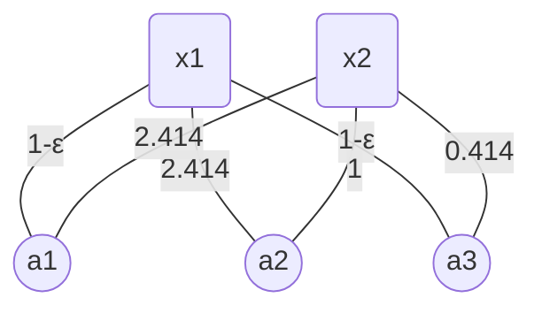

We dedicated to solve the open problem left by Greedy Capture: Is there an algorithm that has better PROP guarantee $2\le\rho\le1+\sqrt2$?

# My Initial Immature Idea

Do some fine-tuning on results of Greedy Capture.

## Pseudo code

1. $X\gets$ Greedy Capture$(\mathcal N,\mathcal M,k)$
2. $N\gets\empty$ // $N$ denotes "free" data points
3. while $\exist$ 2-approximate Block Coalition
   - $N_{bc}\gets$ all data points in that 2-approx Block Coalition
   - $X_{bc}\gets$ all cluster centers associated with any data points in $N_{bc}$
   - $N_{\text{affect}}\gets$ all data points associated with any cluster centers in $X_{bc}$
   - $N\gets N\cup(N_{\text{affect}}\diagdown N_{bc})$
   - $x^*\gets$ cluster center of 2-approximate Block Coalition
   - $X\gets X\diagdown X_{bc}$
   - $X\gets X\cup\{x^*\}$
4. return $X$

Idea is straightforward, directly eliminate 2-approx Block Coalition.

But how to continue, we need to rerun the Greedy Capture at some point.

# Improve the Idea

Instead of using Greedy Capture as black box, we do some modification in it.

## "Fine-tuning" Greedy Capture

In the while loop of Greedy Capture, we audit whether there exist 2-approx Block Coalition.

If there is one, we open the corresponding cluster center $x^*$, and fix all $\lceil n/k\rceil$ point in the Block Coalition.

Set the fixed radius $r_{bc}$, denoting the distance from cluster center of BC to the $\lceil n/k\rceil$-th nearest data point.

Open that cluster center.

Then run the Greedy Capture **from the scratch** neglecting all fixed point. We don't synchronously increase $r_{bc}$ until $\delta$ reaches $r_{bc}$.

Also auditing the 2-approximate in that Greedy Capture, if there are block coalition related to any point in cluster $x^*$, we do the same recursively.

## Pseudo Code

Fine-tuning Greedy Capture$(\mathcal N,\mathcal M,k,r_{bc},x^*)$

Input: $\mathcal N,\mathcal M,k,r_{bc},x^*$ // $r_{bc}$ denotes the fixed radius for 2-block coalition, $x^*$ denotes the center of 2-block coalition

1. $X\gets\empty,\Delta=(\delta_1,\delta_2,\cdots,\delta_m)\gets(0,0,\cdots,0),N\gets\mathcal N$

2. $X\gets X\cup\{x^*\},\delta_{x^*}\gets r_{bc}$

3. while $N\neq\empty$ do

   - Smoothly and synchronously increase $\Delta\diagdown\delta_{x^*}$

   - If $\delta$ for other surpass $\delta_{x^*}$, increase $\delta_{x^*}$ also.

   - while $\exist x\in X$ s.t. $|B(x,\delta_x)\cap N|\ge1$

     - $N\gets N\diagdown B(x,\delta_x)$

   - while $\exist x\in\mathcal M\diagdown X$ s.t. $|B(x,\delta_x)\cap N|\ge\lceil n/k\rceil$ do

     - $X\gets X\cup\{x\}$
     - $N\gets N\diagdown B(x,\delta_x)$

   - while $\exist x'\in\mathcal M\diagdown X$ s.t. $x'$ is the center of a 2-block coalition

     - $x^*\gets x'$

     - $r_{bc}\gets\lceil n/k\rceil$-th nearest distance from $x^*$
     - return Fine-tuning Greedy Capture$(\mathcal N,\mathcal M,k,r_{bc},x^*)$

4. return $X$

# Important: DOES IT WORK?

It is obvious that if the algorithm terminates, then we can find 2-approximate PROP clustering.

## Running on the Example

On the example where no matter how the clustering is, the PROP approximation can not be better than 2. The algorithm exactly returns 2-PROP clustering.

On the example in which $1+\sqrt2$ is the lower bound for Greedy Capture, The algorithm returns exactly PROP clustering.

Two symmetry parts, $n=6,m=4,k=3$.

Consider one part that we only assign one cluster.

- First the algorithm open $x_1$ by Greedy Capture.
- Fine-tuning part finds that $x_2$ and $a_2,a_3$ are a 2-approximate block coalition, then fixes them, rerun the Greedy Capture from the scratch.
- Finally, $x_1$ are no longer opened. It is exactly PROP clustering.

## Questions

There are a few question need to be answered.

:question:How to prove that the algorithm always terminate?

:question:Can this algorithm always find the best PROP clustering among all $\left( \begin{array}{c}m\\k\end{array} \right)$ possible clustering?