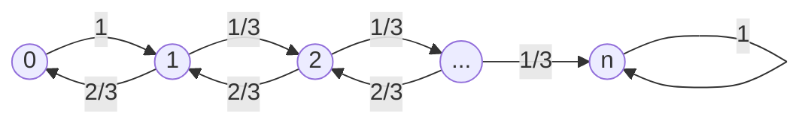

Lecture notes by Elias Koutsoupias from Oxford

# Markov Chains

## Definitions

A *discrete-time finite Markov chain* is a sequence of random variables $X=X_0,X_1,X_2,\cdots$ taking values in a finite set of states $\{1,2,\cdots,n\}$ s.t. $\forall t\in\mathbb N:$
$$
\Pr(X_{t+1}=j|X_t=i)=Q_{i,j},
$$
where $Q=(Q_{i,j})$ is an $n\times n$ stochastic *transition matrix*.

$X_t$ represents the state of the Markov chain at time $t$ and the matrix $Q$ encodes the state-to-state transition probabilities. The characteristic property of a Markov chain is that the distribution of $X_t$ depends only on $X_{t-1}$. The conditional probability above is independent of the time $t$.

The $t$-step transition probabilities are given by the power matrix $Q^t$, i.e.,
$$
\Pr(X_{s+t}=j|X_s=i)=Q_{i,j}^t,
$$
$\forall s,t\in\mathbb N$. Thus,
$$
\Pr(X_t=j)=\sum_{i=1}^nQ_{i,j}^t\cdot\Pr(X_0=i).
$$
A Markov chain is completely determined by the distribution of $X_0$ and the transition matrix $Q$.

A Markov chain can be represented as a weighted directed graph whose vertices are the states of the chain and in which there is an edge $(i,j)$ of weight $Q_{i,j}$ whenever $Q_{i,j}\gt0$. We define the weight of a path to the product of the weights of the edges along the path, i.e. the probability to take the path. Then the sum of the weights of all length-$k$ paths $i$ to $j$ is $Q_{i,j}^k$.

The term *random walk* usually refers to the random process in which a particle moves on a graph, selecting the next node uniformly at random from the adjacent nodes. It is the special case of a Markov chain when for every state $i$ all probabilities $Q_{i,j}$ for $j\neq i$ are **equal** and $Q_{i,i}=0$.

A *lazy random walk* is similar but $Q_{i,i}=1/2$.

## Randomized 2-SAT

Given a 2-CNF formula, either find a satisfying assignment or determine that no such assignment exists.

> CNF aka conjunctive normal form，合取范式，形如 $()\land()\land()$
>
> ==2==-CNF 就是 $()\land()\land()\cdots\land()$，括号内里面是==两==个布尔变量的析取。
>
> DNF aka disjunctive normal form，析取范式，形如 $()\lor()\lor()$

2-SAT is solvable in polynomial time (in fact linear time).

There is a polynomial time randomized algorithm for 2-CNF formulas whose analysis is based on a random walk.

### Pseudo-code

Randomized 2-SAT$(\varphi)$

- Pick a random assignment
- Repeat $2n^2$ times or until a satisfying assignment is found
  - Pick an unsatisfied clause $C$
  - Pick a literal in $C$ uniformly at random, and flip its value
- Return current assignment if satisfying, else return unsatisfiable

### Analysis

If the $\varphi$ is not satisfiable then the algorithm returns unsatisfiable. However, if $\varphi$ is satisfiable then the algorithm might not find a satisfying assignment. We analyze the probability that the algorithm gives correct answer.

Consider $\varphi$ is satisfiable. Let $S$ be a particular assignment that satisfies $\varphi$.

Then we bound the probability that algorithm finds $S$. If $\varphi$ is not satisfied by an assignment $A$ there must be an unsatisfied clause $C$. Observe that one or both literals of $C$ must have different truth values under $A$ and $S$. **Thus if we flip a random literal in $C$ then the probability that we increase the agreement between $A$ and $S$ is either $1/2$ or $1$.**

Writing $A_t$ for the assignment after $t$ iterations of the main loop and $X_t$ for the number of variables in which $A_t$ agrees with $S$, we have
$$
\Pr(X_{t+1}=1|X_t=0)=1\\
\Pr(X_{t+1}=i+1|X_t=i)\ge1/2,i\in\{1,\cdots,n-1\}\\
\Pr(X_{t+1}=i-1|X_t=i)\le1/2,i\in\{1,\cdots,n-1\}\\
\Pr(X_{t+1}=n|X_t=n)=1
$$

If we replace inequalities with equations, then $X$ becomes a Markov chain on the state space $[n]$. The Markov chain of this process is:

The chain describes the movement of a particle on a line: it is an example of a *one-dimensional random walk with one reflecting and one absorbing barrier*.

The expected time until $X_t=n$ is an upper bound on the expected number of steps for the 2-SAT algorithm to find $S$.

Let $h_j$ be the expected time for $X$ to first reach $n$ starting at $j$. Then we have
$$
h_n=0\\
h_0=1+h_1\\
h_j=1+\frac{h_{j-1}}{2}+\frac{h_{j+1}}{2},j\in\{1,\cdots,n-1\}
$$
This is a linear system of equations in $n+1$ unknowns.

By some deduction, we have $h_j=h_{j+1}+2j+1$. Combining with $h_n=0$, we get that $h_j=n^2-j^2$. Thus $h_j\le n^2\forall j$.

Let $T$ denote the number of steps for the 2-SAT algorithm to find assignment $S$ starting from some arbitrary assignment. By Markov's inequality, we have
$$
\Pr(T\ge2n^2)\le\frac{\mathbb E[T]}{2n^2}\le \frac{n^2}{2n^2}=\frac{1}{2}
$$
Theorem: If $\varphi$ is satisfiable then the 2-SAT algorithm returns a satisfying assignment with probability at least $1/2$. If $\varphi$ is unsatisfiable then the 2-SAT algorithm is always correct.

The failure probability can be decreased to $2^{-N}$ by repeating the loop $2Nn^2$ instead of $2n^2$ times.

## Randomized 3-SAT

Extending the randomized algorithm for 2-SAT to 3-SAT.

3-SAT is NP-complete. We can use $O(2^n)$ exhaustive search to solve it.

Suppose a given 3-CNF formula $\varphi$ has a satisfying assignment $S$. Let $A_t$ be the assignment after $t$ steps and let $X_t$ denote the number of propositional variables in which $A_t$ agrees with $S$. Similarly,
$$
\Pr(X_{t+1}=j+1|X_t=j)\ge1/3\\
\Pr(X_{t+1}=j-1|X_t=j)\le2/3
$$
Then by replacing $\le\ge$ into $=$, we turn the process $X$ into Markov chain:

The expected time for the resulting chain to reach state $n$ is an upper bound for the expected time of the algorithm to find a satisfying valuation.

**In this case, there is twice likelihood to move away from $n$ as to move towards $n$**.

Let $h_j$ denote expected number of steps to reach $n$ when starting from state $j$. Then we have the following system of equations
$$
h_n=0\\
h_j=\frac{2h_{j-1}}{3}+\frac{h_{j+1}}{3}+1\\
h_0=h_1+1
$$
By solving this linear system, we get $h_j=h_{j+1}+2^{j+2}-3$ for all $j$.

With $h_n=0$ this leads to $h_j=2^{n+2}-2^{j+2}-3(n-j)$.

The above bound shows that the expected number of flips to find $S$ is at most $O(2^n)$. This bound is useless. However, we can improve the performance of this procedure by adapting **random restarts** into search. A random truth assignment leads to a binomial distribution over the states of the Markov chain $X$ centered around the state $n/2$.

Since Markov chain has a tendency to move towards state $0$, after running it for a little while we are better off restarting with a random distribution than continuing to flip literals.

After random restart, by Chernoff bounds, the current assignment differs from $S$ is approximately $n/2$ positions with high probability.

There is an algorithm trying to find a satisfying assignment in $N=O((4/3)^n\sqrt n)$ phases. where each phase starts with a random restart and consists of $3n$ literal flips.

### Pseudo-code

Randomized 3-SAT$(\varphi)$

- Repeat $N$ times or until a satisfying assignment is found
  - Pick a random assignment
  - Repeat $3n$ times or until a satisfying assignment is found
    - Pick an unsatisfied clause $C$
    - Pick a literal in $C$ uniformly at random, and flip its value
- Return current assignment if satisfying, else return unsatisfiable

Theorem: If $\varphi$ is satisfiable then the 3-SAT algorithm returns a satisfying assignment with probability at least $1/2$. If $\varphi$ is unsatisfiable then the 2-SAT algorithm is always correct.

> Let $q_j$ be the probability to reach position $n$ with $3n$ steps starting from position $n-j$. We have
> $$
> q_j\ge C_{3j}^j(2/3)^j(1/3)^{2j},
> $$
> since this is the probability to make exactly $2j$ right moves and $j$ left moves in the first $3j\le3n$ steps.
>
> By **Stirling's formula**:
> $$
> \sqrt{2\pi m}(\frac{m}{e})^m\le m!\le2\sqrt{2\pi m}(\frac{m}{e})^m,
> $$
> we have
> $$
> C_{3j}^j=\frac{(3j)!}{j!(2j)!}\\
> \ge\frac{c}{\sqrt j}(27/4)^j\\
> (c=\frac{\sqrt3}{8\sqrt\pi}).
> $$
> Thus when $j\gt0$,
> $$
> q_j\ge C_{3j}^j(2/3)^j(1/3)^{2j}\\
> \ge \frac{c}{\sqrt j}(27/4)^j(2/3)^j(1/3)^{2j}\\
> \ge\frac{c}{\sqrt j}\frac{1}{2^j}.
> $$
> The probability of success drops exponentially with the distance $j$ between the initial random assignment of the phase and the satisfying truth assignment. But by Chernoff bounds, the probability that this distance is away from $n/2$ also drops exponentially.
>
> Having established a lower bound for $q_j$ we now obtain a lower bound for $q$, the probability to reach state $n$ with $3n$ steps in case the initial state of the random walk is determined by a random assignment. We have
> $$
> q\ge\sum_{j=0}^n\Pr(\text{walk starts at }n-j)\cdot q_j\\
> \ge\frac{1}{2^n}+\sum_{j=1}^nC_n^j(1/2)^n\frac{c}{\sqrt j}\frac{1}{2^j}\\
> \ge\frac{c}{\sqrt n}(1/2)^n\sum_{j=0}^nC_n^j(1/2)^j\\
> =\frac{c}{n}(3/4)^n.
> $$
> The number of phases to find a satisfying assignment is a geometric random variable with parameter $q$, so the expected number of phases to find a satisfying assignment is $1/q$. Thus the algorithm finds a satisfying assignment with probability at least $1/2$ after $N=2/q$ phases.

# Stationary Distributions

## Definition

Let $X$ be a Markov chain with transition matrix $Q$. A probability distribution $\pi$ on the set of states is called *stationary distribution* of $X$ if
$$
\pi=\pi Q.
$$
Given states $i,j$ of a Markov chain, the **hitting time** $H_{i,j}$ is a random variable giving the number of steps to visit state $j$ starting from state $i$. Formally we have
$$
H_{i,j}=\min\{t\gt0:X_t=j|X_0=i\}.
$$
We define $h_{i,j}=\mathbb E[H_{i,j}]$ to be the mean hitting time.

In general $h_{i,j}$ may be infinite. Certainly $h_{i,j}=\infty$ if $j$ is not reachable from $i$ in the underlying graph, or, if $i$ can reach a state $k$ from which $j$ is no longer reachable. We therefore restrict attention to Markov chains whose underlying graph consists of a single strongly connected component. We call such chains **irreducible**.

We can still have $h_{i,j}=\infty$ in an irreducible chain.

Consider Markov chain $X$ with set of states $\{1,2,3,\cdots\}$ and transition matrix $Q$, where $Q_{i,i+1}=i/(i+1)$ and $Q_{i,1}=1/(i+1)$. Starting at state $1$, the probability not to have returned to state $1$ with $t$ steps is
$$
\prod_{j=1}^t\frac{j}{j+1}=\frac{1}{t+1}.
$$
Thus we return to state $1$ almost surely, but the expected return time is
$$
h_{1,1}=\mathbb[H_{1,1}]=\sum_{j=1}^\infty\Pr(H_{1,1}\ge j)\\
=\sum_{j=1}^\infty\frac{1}{j+1}=\infty
$$
In finite irreducible Markov chain, the mean hitting time between any pair of states is always finite.

Theorem: For any pair of states $i,j$ in a finite irreducible Markov chain, $h_{i,j}\lt\infty$.

> Let $d$ be the diameter of the underlying graph, let $\epsilon\gt0$ be the smallest positive entry of the transition matrix $Q$. Then for any pair of states $i,j$, if the chain is started in $i$ then it visits $j$ within $d$ steps with probability at least $\epsilon^d$.
> $$
> h_{i,j}=\mathbb E[H_{i,j}]\\
> =\sum_{t=1}^\infty\Pr(H_{i,j}\ge t)\le\sum_{t=1}^\infty(1-\epsilon^d)^{\lfloor t/d\rfloor}\lt\infty.
> $$

A finite irreducible Markov chain has a unique stationary distribution.

Theorem: A finite irreducible Markov chain has a unique stationary distribution $\pi$ where $\pi_j=1/h_{j,j}$ for each state $j$.

Stationary distribution represents a *time average*. On average the chain visits state $j$ every $h_{j,j}$ steps, and thus spends proportion of time $\pi_j=1/h_{j,j}$ in state $j$. We expect that the stationary distribution is also a *space average*, i.e., the distribution of $X_t$ converges to $\pi$ as $t$ tends to infinity. However, in general this need not be true.

Definition of *period*: The period of a state $i$ in a Markov chain is defined to be $\gcd\{m\gt0:Q_{i,i}^m\gt0\}$. A state is *aperiodic* if it has period $1$. A Markov chain is aperiodic if all states are aperiodic.

A Markov chain is irreducible and aperiodic iff there exists some power of the transition matrix $P$ with all entries strictly positive.

Theorem: Consider a finite, irreducible, aperiodic Markov chain with stationary distribution $\pi$. Then $\lim_{n\rightarrow\infty}Q^n$ is the matrix
$$
Q^\infty=\left[
\begin{array}{cc}
\pi_1&\pi_2&\cdots&\pi_n\\
\pi_1&\pi_2&\cdots&\pi_n\\
\cdots&\cdots&\cdots&\cdots\\
\pi_1&\pi_2&\cdots&\pi_n\\
\end{array}
\right]
$$
If follows that for any initial distribution $x$ we have $xQ^b\rightarrow xQ^\infty=\pi$ as $n\rightarrow\infty$, i.e., the chain converges to the stationary distribution from any starting point.

## Random walks on undirected graphs

Let $G=(V,E)$ be a finite, undirected and connected graph. The degree of a vertex $v\in V$ is the number $d(v)$ of edges incident to $v$. A random walk on $G$ is a Markov chain modeling a particle that moves along the edges of $G$ and which is equally likely to take any outgoing edge at a given vertex/

Formally a random walk on $G$ has set of states is $V$ and for each edge $\{u,v\}\in E$ the probability to transition from $u$ to $v$ is $1/d(u)$.

Claim: A random walk on $G$ is aperiodic iff $G$ is not bipartite.

Theorem: A random walk on a connected graph $G$ has a **unique stationary distribution** $\pi$, where
$$
\pi_v=\frac{d(v)}{2E}.
$$

> 所有点的度数之和等于 $2|E|$.
> $$
> (\pi P))_u=\sum_{v\in N(u)}\frac{d(v)}{2|E|}\frac{1}{d(v)}=\frac{d(u)}{2|E|}=\pi_u\forall u\in V
> $$

Corollary: Let $h_{u,v}$ denote the expected number of steps to go from vertex $u$ to vertex $v$. Then for any vertex $u$ we have
$$
h_{u,u}=\frac{2|E|}{d(u)}
$$
Theorem: If $u,v$ are adjacent then $h_{v,u}\lt 2|E|$.

> omitted.

Theorem: The cover time of a connected graph $G$ with $n$ nodes and $m$ edges is at most $4nm$.

> omitted

## s-t connectivity

We bound on the cover time of random walks to design an impressively simple space efficient algorithm for the fundamental problem of s-t connectivity. In this problem we are given an undirected graph with $n$ nodes, not necessarily connected. We are also given two nodes $s,t$ and we want to find out whether $s,t$ are connected.

### Pseudo-code

s-t connectivity$(G,s,t)$

- start a random walk from $s$
- If $t$ is reached in $4n^3$ steps then return reachable else return unreachable

No false positives in the algorithm.

By Markov's inequality, the algorithm outputs a path from $s$ to $t$ with probability $1/2$.

The algorithm only needs to store a constant number of vertex-addresses at any one time.

If follows that we can decide reach-ability in undirected graph in $O(\log n)$ space using randomization.

