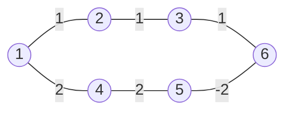

Limitations of Dijkstra: negative weight. To address this, recap Bellman-Ford algorithm.

Example why Dijkstra fails in negative weight case:

The shortest path from 1 to 6 should be $2$.

If we run Dijkstra on this graph, the output would be $3$.

# Bellman-Ford

## Pseudocode

Initialization: $d(s,s)=0$, $d(s,v)=\infty\forall v\neq s$.

Repeat n-1 times, do:

- Go through all edges, update $d(s,v)$ if we can improve it: If $d(s,v)>d(s,u)+weight(u,v)$, we update. "RELAX"

Go through all edges one more, if there is still improvement, output "Negative Cycle".s

## Analysis

In the $i$-th iteration, we will find all shortest path consist of $\leq i$ edges.

$n-1$ times are enough:

> Considering we are constructing the shortest-path-tree with at most $n$ node. If there is a shortest path consists of $n$ edges, it would contradict the tree property.

Time complexity: $O(|V||E|)=O(mn)$.

# All Pair Shortest Path

## Trivial Ideas

Run Dijkstra+Fibonacci $n$ times on each node: $O(mn+n^2\log n)$

Run Bellman-Ford $n$ times on each node: $O(mn^2)$

## Min-Plus Matrix Multiplication

Consider two matrix $A^{n\times n},B^{n\times n}$. Define min-plus matrix multiplication $C^{n\times n}=A^{n\times n}\otimes B^{n\times n}$ s.t., for all $1\leq i,j\leq n$, $C_{i,j}=\min_{1\leq k\leq n}\{A_{i,k}+B_{k,j}\}$.

Time: $C_{i,j}=\min_{1\leq k\leq n}\{A_{i,k}+B_{k,j}\}$ takes $O(n)$ times. We need to execute this on $O(n^2)$ pairs. So $O(n^3)$ in total.

## APSP Solution

Similar to Bellman-Ford, in $i$-th loop we consider finding all shortest paths consist of $\leq i$ edges.

Let $\mathcal L^1=W$ s.t. $\mathcal L_{i,j}=\begin{cases}0\text{ if }i=j\\w_{i,j}\text{ if }(i,j)\in G\\\infty\text{ otherwise}\end{cases}$.

$\mathcal L^1$ contains all shortest paths consist of $\leq 1$ edges.

$\mathcal L^2=\mathcal L^1\otimes \mathcal L$ contains all shortest paths consist of $\leq 2$ edges.

...

$\mathcal L^{n-1}=\mathcal L^{n-2}\otimes\mathcal L$ contains all pair shortest paths (consist of $\leq n-1$ edges)

## Analysis

The min-plus multiplication takes $O(n^3)$ time. We need to execute the multiplication $O(n)$ times. So overall, APSP solution by min-plus multiplication takes $O(n^4)$ time.

Can we do better? Yes!

Using exponential by square, we can reduce the number of min-plus multiplication from $O(n)$ to $O(\log n)$. So overall $O(n^3\log n)$.

# Bonus: Min-Plus Matrix Multiplication

SOTA algorithm: $O(n^3/2^{\Omega(\sqrt{\log n})})$ by Ryan Williams et al, 2014.

Conjecture: There's strong believe that min-plus matrix multiplication cannot be solved in truly sub-cubic time $O(n^{3-\epsilon})$ for any constant $\epsilon > 0$. 