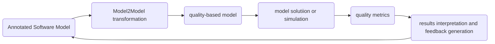

Problem: Quality issues of software

# Software Quality Assessment Process

Modelling, analysis, and refactoring.

# Objectives and Contents of the Lecture

## Objectives

- Understand foundation of stochastic process
- Quatitative analysis of stochastic process

## Contents

- Stochastic process
- Markov Chains
- LAB on discrete time Markov Chains
- Petri Nets
- LAB on generalized stochastic Petri Nets

# Stochastic Process

Stochastic process is a collection of random variables representing the evolution of a system.

Counterpart to *deterministic*.

In Computer Science, probabilities can be

- Randomized algorithms
- Unreliable or unpredictable system behaviors
- System performance and dependability
- Complex systems

## Recap Some Basic Notions

Experiments, sample spaces, events, probability measures, random experiment, random variable

Cumulative distribution function (CDF) $F(x)=\Pr\{X\leq x\}$.

## Some Probability Distributions

- Uniform distribution
- Normal distribution: $\mu,\sigma^2$
- Binomial distribution
- Poisson distribution
- Exponential distribution

