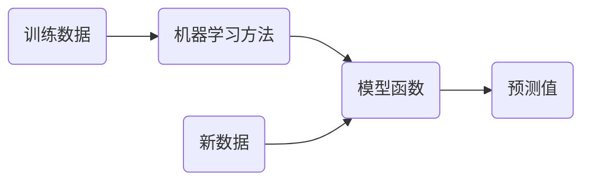

# 智能计算系统 第二章 神经网络基础
## 2.1 从机器学习到神经网络（上）
### 包含关系
深度学习$\subset$神经网络$\subset$机器学习$\subset$人工智能
### 机器学习
- 机器学习是对能通过经验自动改进计算机算法的研究
- 机器学习是用数据或以往的经验，以此提升计算机的能力

典型的机器学习过程

### 符号说明
输入数据：$x$
真实值：$y$
计算值：$\hat{y}$
模型函数：$H(x)$
激活函数：$G(x)$
损失函数：$L(x)$
标量：$a,b,c$
向量：$\textbf{a,b,c}$
矩阵：$\textbf{A,B,C}$

## 2.2 从机器学习到神经网络（下）
### 线性回归
一个点可使用一条直线来拟合
$H_w(x)=w_0+wx$
多变量线性回归模型
$H_w(x)=\Sigma_{i=0}^{n}w_ix_i=\hat{\textbf{w}}^{T}\textbf{x}$
模型预测值$\hat y$和真实值$y$之间存在误差
$\epsilon = y-\hat{y}=y-\hat{\textbf{w}}^{T}\textbf{x}$
ε满足N(0,$\sigma^2$)的高斯分布。

$$
p(\epsilon)=\frac{1}{\sqrt{2\pi\sigma}}exp(-\frac{(\epsilon)^2}{2\sigma^2})\\
p(y|\textbf{x};\hat{\textbf{w}})=\frac{1}{\sqrt{2\pi\sigma}}exp(-\frac{(y-\hat{\textbf{w}}^{T}\textbf{x})^2}{2\sigma^2})\\
$$

损失函数

$$
L(\hat{\textbf{w}})=\frac{1}{2}\sum_{j=1}^m(H_w(x_j)-y_j)^2=\frac{1}{2}\sum_{j=1}^m(\hat{\textbf{w}}^{T}\textbf{x}-\textbf{y}_j)
$$

寻找参数$\hat{\textbf{w}}$,使得$L(\hat{\textbf{w}})$最小。
- 初始先给定一个$\hat{\textbf{w}}$，如$\textbf{0}$向量或随机向量
- 沿着梯度下降的方向进行迭代，使更新后$\hat{\textbf{w}}$，如$\textbf{0}$不断变小。
- $\hat{\textbf{w}}=\hat{\textbf{w}}-\alpha\frac{\partial L(\hat{\textbf{w}})}{\partial \hat{\textbf{w}}}$
- α称为学习率或步长
- 迭代直到找到使得$L(\hat{\textbf{w}})$最小的$\hat{\textbf{w}}$。从而获得回归模型参数。

人工神经网络
人工神经元
生物神经元和人工神经元的关系类似于老鼠和米老鼠的关系。
### 感知机模型
$H(x)=sign({\textbf{w}}^{T}\textbf{x}+b)$对应一个超平面S:${\textbf{w}}^{T}\textbf{x}+b=0$，模型参数是$(\textbf{w},b)$，将线性可分的数据集中所有样本点正确的分为两类。
$sign(x)=±1$，x大于等于0为正，x小于0为负。
#### 寻找损失函数
找到超平面S表达式。
假设误分类的点为数据集M，使用误分类点到超平面的总距离来寻找损失函数。（直观来看，总距离越小越好）
样本点 ${\textbf{x}_j}$ 到超平面 S 的距离：
- $d=\frac{1}{||\textbf{w}||}|{\textbf{w}}^{T}\textbf{x}_j+b|$

||w||是 w 的 L2 范数。
误分类点满足条件：
- $y_j({\textbf{w}}^{T}\textbf{x}_j+b)>0$

去掉点 ${\textbf{x}_j}$ 到超平面 S 的距离的绝对值
- $d=-\frac{1}{||\textbf{w}||}y_j|{\textbf{w}}^{T}\textbf{x}_j+b|$

所有误分类点到超平面 S 的总距离为
- $d=-\frac{1}{||\textbf{w}||}\sum_{x_j∈M}y_j|{\textbf{w}}^{T}\textbf{x}_j+b|$

由此找到感知机的损失函数
- $L(\textbf{w},b)=-\sum_{x_j∈M}y_j({\textbf{w}}^{T}\textbf{x}_j+b)$

我们希望这个损失函数越小越好。损失函数极小化的最优化问题可使用：随机梯度下降法
## 2.3 神经网络训练的基本原理
### 两层神经网络-多层感知机
输入、隐层（可附加偏置层）、输出层
#### 浅层神经网络的特点
需要数据量小、训练快，其局限性在于对复杂函数的表示能力有限，针对复杂分类问题其泛化能力受到制约。
### 多层神经网络网络
- 算法：优化算法层出不穷（学习算法>BP算法>预训练，Dropout等方法）
- 大数据：数据量不断增大
- 计算能力：处理器计算能力不断提升（晶体管、CPU、集群/GPU、智能处理器）

随着网络层数增加，每一层对于前一层次抽象表示更深入，每一层神经元学习到的是前一层神经元更抽象的表示。
通过抽取更抽象的特征来对食物进行区分，从而获得更好的分类与分类能力。
### 神经网络的模型训练
- 使得参数尽可能的与真实的模型逼近。
- 正向传播根据输入，经过输入、激活函数计算出隐层，将输入的特征向量从低级特征逐步提取为抽象特征，直到得到最终输出结果。
- 反向传播是根据正向传播的输出结果和期望值计算出损失函数，再通过链式求导，最终从网络后端逐步修改权重使输出和期望值差距变道最小的过程。

Sigmoid函数作为激活函数
$h=\frac{1}{1+e^{-v}}$
具体的训练过程
正向传播
1. 初始化权重矩阵（可全0全1或随机）
2. 输入到隐层计算
   将输入和权重矩阵1相乘，加上偏值bias得到结果v，再将得到的结果v送到激活函数h里面计算，得到隐层计算结果。
3. 隐层到输出层计算
   将隐层计算结果与权重矩阵2相乘，加上偏值bias得到结果z，在将z送入激活函数h里面计算，得到$\hat y$。

计算误差，使用方差计算。
反向传播：减少误差
1. 根据偏导数链式求导法则推导。算出每个参数 ω 对结果影响的大小。
   $$
   \frac{\partial L(\textbf{W})}{\partial \omega}=\frac{\partial L(\textbf{W})}{\partial\hat y_1}\frac{\partial\hat y_1}{\partial z_1}\frac{\partial z_1}{\partial \omega}
   $$
2. 修改 ω，α为学习率
   $\omega=\omega-\alpha\frac{\partial L(\textbf{W})}{\partial \omega}$

如此反复迭代进行训练，从而不断缩小计算值和真实值的误差。
## 2.4 神经网络的设计原则
训练完了结果不理想，怎么办？
- 调整网络拓扑结构
- 选择合适的激活函数
- 选择合适的损失函数
### 网络的拓扑结构
神经网络的结果一般为：输入×隐层×输出层
输入：神经元个数=特征维数
输出层：神经元个数=分类类数
隐层
- 隐层数量
- 隐层神经元个数
- 隐层结点作用是提取输入特征中的隐藏规律，每个结点都赋予一定权重
- 节点数太少则获取信息能力太差，无法反映数据集的规律；若节点数太多，过拟合噪声，导致模型泛化能力差。
### 激活函数
输入数据经过加权求和后，还需要代入激活函数activation function
引入非线性因素，使神经网络可以任意逼近任何非线性函数
需要具备的性质
- 可微：要基于梯度去求导
- 单调性
- 输出值的范围限制（要有限）

#### sigmoid 函数
$\sigma(x)=\frac{1}{1+e^{-x}}$
- 最常见的非线性激活函数
- 能把输入的连续实值变为0到1之间

缺点
- 非0均值的输出，导致w计算的梯度始终都是正的
- 计算机进行指数运算速度较慢
- 饱和性问题以及梯度消失现象（当层数过多时，链式求导结果趋近于0，学不动）
#### tanh 函数
解决非0均值的问题
$tanh(x)=\frac{e^x-e^{-x}}{e^x+e^x}=2sigmond(2x)-1$
与sigmoid相比，tanh是0均值的
但是还是没解决饱和性问题和梯度消失问题
#### ReLU 函数
$ReLU(x)=max(0,x)$
- 缓解了梯度消失问题
- ReLU有可能会死掉，如果学习率过大，BP为负。
- 输出范围是无线的
#### PReLU/Leaky ReLU 函数
$f(x)=max(\alpha x,x)\ \ \alpha∈(0,1)$
改进ReLU，在负数区域内，Leaky ReLU有一个很小的斜率，避免ReLU死掉的问题
PReLU中α可调
#### ELU 函数
$x>0\ f(x)=x$
$x≤0\ f(x)=\alpha(e^x-1)$
融合sigmoid和ReLU函数
- α为可调参数，控制ELU在负值区间饱和位置
- ELU输出均值接近于0，收敛速度快
- 线性部分使得ELU能够缓解梯度消失问题，左侧软饱和能让ELU对输入变化或噪声更鲁棒，避免神经元死掉
### 损失函数
$L(\textbf{w})=f(H_w(x),y)$
#### 均方差损失函数
$L=\frac{1}{2}(y-\hat y)^2$
若使用sigmoid作为激活函数，则神经元输出接近于1是，梯度趋近于0，出现梯度消失，导致BP参数更新慢，学习效率下降。
解决均方差损失函数+sigmoid激活函数导致“八字不合”的问题
> 引入交叉熵损失函数。把均方差换成交叉熵损失与sigmoid结合可解决输出层神经元学习率缓慢的问题
#### 交叉熵损失函数
$L=-\frac{1}{m}\sum_{x∈D}\sum_iy_i\ln(\hat y_i)$
m为训练样本总数，i为分类类别
二分类的交叉熵损失函数为
$L=-\frac{1}{m}\sum_{x∈D}(y\ln(\hat y)+(1-y)ln(1-\hat y))$
如此，在BP链式求导时，sigmoid导数会被约掉，解决了梯度消失问题
#### 损失函数的特性
- 同一算法的损失函数不是唯一的
- 参数为(w,b)
- 损失函数可以评价网络模型的好坏，越小说明模型和参数约符合训练样本
- 是一个标量
- 对参数要可微
## 2.5 过拟合和正则化
欠拟合：训练的特征少，你和函数无法满足训练集，误差较大。
过拟合：训练的特征维度过多，使得拟合的函数很完美接近训练数据集，但泛化能力差，对新数据预测能力不足。
解决办法：**正则化**
### 定义
- 在测试集上的预测效果叫做泛化
- 过拟合指模型过度接近训练的数据，导致在训练集上误差很低，在测试集上误差很大
- 神经网络层数越多，参数越多，表示能力越强就越容易出现过拟合现象。
- 参数范数惩罚、稀疏化、Bagging集成、Dropout、提前终止、数据集扩增等正则化方法可以有效抑制过拟合
### 正则化思路
加入惩罚参数
目标函数过拟合，对过拟合的项乘上趋近于0的权重降低其对结果的影响。

$L^2$ 正则化、$L^1$ 正则化
### Bagging 集成方法
训练不同的模型共同决策测试样例的输出。
Bagging可以多次重复使用同一个模型、训练算法和目标函数进行训练
可从原始数据集中重复采样获取，数据集大小与原始数据集保持一致
### Dropout 正则化
在训练过程中随机删除一些隐层单元。
## 2.6 交叉验证
保证鲁棒性，防止过拟合
使用交叉验证能够评判各模型的鲁棒性。
### 划分测试集和训练集
缺点：最终模型与参数的选取极大程度依赖于划分方法，只有部分数据参与了模型的训练
### Leave-one-out 交叉验证
每次只取出测试集一个元素，而其它n-1个元素用于训练模型和调参。最终得到n个模型，n个MSE，将n个MSE取平均得到test MSE
缺点：计算量过大，耗时长

### k-fold 交叉验证
测试集平均分成k份，每次用其它k-1份数据当作训练集训练模型，得到k个MSE，将这k个MSE求均值得到test MSE。
比leave-one-out交叉验证计算量低。
