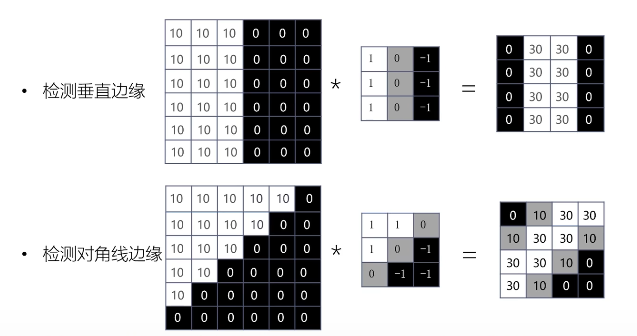

# 智能计算系统 第三章 深度学习
人获得的输入80%以上是视觉输入
剩下的听觉输入属于序列化的输入信息
## 3.1 适合图像处理的卷积神经网络
计算机视觉
- 输入图像大小32\*32，输入数据量32\*32\*3=3072。
- 隐层神经元100个，第一层权重为3072*100=307200
- 实际场景中往往需要更大的输入，权重数量级大于10^9，导致**过拟合**
- **神经网络**可以有效减少权重数量

CNN中，用局部连接取代全连接，减少权重数量
CNN中，若干输出层神经元可以共用一组权重，进一步减少权重数量。
例子VGG16
- 卷积层 conv
- 池化层 max pool
- 全连接层 FC，分类主要靠全连接层
- Softmax
### 卷积层
- 检测复杂边缘
- 将权重作为参数，在训练中学习
- **局部连接，权重共享**

卷积运算
$y(n)=\Sigma_{i=-\infty}^\infty x(i)h(n-i)=x(n)*h(n)$
- 多输入特征图单输出特征图卷积运算
  - 不同的过滤器可检测不同特征

卷积层如何检测特征

边界扩充padding
- 扩大输入图像/特征图的尺寸并填充像素
- 防止深度网络中图像被动持续减小
- 强化图像边缘信息

卷积步长 stride
- 滑动滤波器时每次移动的像素点个数
- 与 pad 共同确定输出图像尺寸
### 池化层
- Pooling
  - Max Pooling/ Avg Pooling/ L2 Pooling
  - 主动减小图片尺寸，从而减小参数的数量和计算量，控制过拟合
  - 不引入额外参数
### 全连接层
- Fully Connect
  - 卷积层和池化层构成特征提取器，全连接层为分类器
  - 将特征提取得到的高维特征图映射成一维特征向量，该特征向量包含所有特征信息，可转化为各个类别的概率
- Softmax
  - 作为网络的最后一层，对输出进行归一化，输出分类概率
  - 凸显其中最大的值并一致远低于最大值的其它分量
  - Softmax层输入和输出规模相同
  - 公式：$f(z_j)=\frac{e^{zj}}{\sum_{i=0}^ne^{z_i}}$
### 卷积神经网络的结构
- 常见卷积神经网络由卷积层、池化层和全连接层构成。
- 具体结构：
  $input\rightarrow N Convs(relu)\rightarrow M个Pool\rightarrow K FCs(relu)\rightarrow FC/softmax\rightarrow $输出结果
- 为何选择深而非广的网络结构
  - 可以从局部到整体“理解”图像
  - 减少权重数量
## 3.2 基于 CNN 的图像分类算法
### AlexNet
- 使用 ReLU 激活函数：训练中收敛速度更快
- LRN 局部归一化：提升较大响应，抑制较小响应
  - 对图像每个位置，提升高响应特征，抑制低响应特征
  - 减少高激活神经元数量，提高训练速度，抑制过拟合。
- MaxPool：避免特征被平均池化模糊，提升特征鲁棒性
- Dropout：随机舍弃神经元，避免过拟合
  - 随机丢弃部分神经元，反向传播时不更新该神经元相关权重
  - 被舍弃神经元相关的权重保留，另一批样本输入时继续使用该神经元相关的权重
  - 防止训练数据中复杂的co-adaptation，抑制过拟合

成功原因
- 使用多个卷积层，有效提取图像特征
- ReLU帮助提高训练速度
### VGG
Very Deep Convolutional Networks for Large-Scale Image Recognition
- 由简单到复杂的网络结构，先训练简单的网络，训练好后以此为基础增添网络层数
- Conv
  - 所有卷积层filter/stride/pad相同
  - filter=3*3，stride=1，pad=SAME
- Maxpool
  - 所有池化层filter大小/stride/pad相同

- 规整的卷积-池化结构
  - 多层小卷积比单层大卷积效果好
  - 感受野相同，多层网络权值更少

#### VGG 成功原因
- 更深的神经网络，更多的卷积层和非线性激活函数，提升分类准确率
- 使用规则的多层小卷积代替大卷机，减少参数数量，提高训练收敛速度
- 部分网络层参数的预初始化，提高训练收敛速度
### Inception 系列
2015年的工作，GoogleNet提出inception结构。
#### Inception v1
- Inception 模块
  - Naive version：叠加多种尺寸的卷积层和池化层，获得不同尺度的特征，提高网络对不同尺寸特征的适应性
  - Dimension reduction：使用1*1的卷积层来减小维度，新城瓶颈层，减少参数
- 1*1卷积
  - 跨通道聚合，进一步可以起到升降维的作用，减少参数
  - 相当于在输入和输出之间做了一个特征上的全连接，提取分线性特征。
- Softmax 辅助分类网络
  - 训练时，让中间某一层输出经过 softmax 得到分类结果，并按较小的权重加到最终分类结果中，相当于模型融合。防止多层神经网络训练过程中梯度消失
  - 推理时，softmax 辅助分类网络会被去掉。

#### BN-Inception
- BatchNorm
  - nomalize
    - 将激活层输入调整为标准正态分布
    - 激活层输入分布在激活函数的敏感部分，输入有小变化就能使激活函数有较大的反应，避免梯度消失，加快训练速度
  - Scale and shift
    - 标准化后输入使得网络的表达能力下降
    - 为保持网络的表达能力，增加两个可训练参数
  - 效果
    - BN 可代替 LRN/Dropout/L2 Normalization
    - 提高收敛速度、训练速度
    - 可选择更高的学习率，方便调参。
#### Inception-v3
Factorization 思想
- 将3*3卷积拆分成1\*3和3\*1卷积
- 减少参数数量，同时通过非对称卷积结构拆分增加特征多样性。

网络结构
- 将GoogleNet中7\*7卷积拆分成3\*3卷积
- 卷积层和辅助分类器的全连接层做BN
### ResNet
2015 Deep Residual Learning for Image Recognition
发现：层数越深，错误率越高
- 不是因为梯度消失
- 不是因为过拟合
- 是因为**神经网络退化**：收敛到极值而不是最值点，误差大

为了避免神经网络退化，引入残差的概念。
- 普通网络：直接使用多项式拟合输出
- 残差网络：建立在 BN 上，使用多项式拟合差值
- 优点：在解附近时权重的反应更灵敏，更容易学习获得最优解。
- 训练的是结果和输入的差值。在求偏导时，由于函数中包含一项x，至少包含1

将残差块应用到普通网络
- 改造 VGG 得到 plain-network
- 全部由卷积层构成

增加跳转连接得到resnet
## 3.3 基于 CNN 的图像检测算法
分类、定位+分类、物体检测
### 评测指标
#### 交并比 IoU
$IoU=\frac{A∩B}{A∪B}$
用于衡量定位准确度，一般IoU>0.5认为定位成功
#### 平均精度均值 mAP
召回率/查全率：N个样本里选对的k个样本占总的M个正样本的比例k/M
精度/查准率：N个样本里选对k个正样本的比例k/N
选择样本数N越多，召回率越高，查准率越低
| 测试结果 | 实际情况 | 实际情况 |
| :---: | :---: | :---: |
| 正反 | 正例P | 反例N |
| 正例P | 真正例TP | 假正例FP |
| 反例N | 假反例FN | 真反例TP |
$Recall=\frac{k}{M}=\frac{TP}{TP+FN}$
$Precision=\frac{k}{N}=\frac{TP}{TP+FP}$
- 用于衡量模型在测试集上检测精度的优劣程度
- 综合考虑检测结果的召回率/查全率和精度/查准率，mAP值越高表示检测结果越好
### 基于CNN的图像检测方法
两步走的方法：R-CNN系列
一步走方法：YOLO和SSD
#### R-CNN
R-CNN mAP = 53.3% 50s
Fast R-CNN = 65.7% 2s
Faster R-CNN = 67.0% 0.2s
主要步骤
- 候选区域提取：Selective Search
- **特征提取**：将候选区裁切缩放为固定大小，再用Alexnet提取图像特征
  - 类似于归并的方法
- **线性分类**：用特定类别的线性SVMs对每个候选区域做分类
- **边界框回归**：用线性回归修正边界框的位置和大小，其中每个类别单独训练一个边界框回归器

缺点
- 重复计算：对两千多个候选框做CNN，计算量很大，而且有很多重复计算
- SVM模型：标注数据足够时不是最好的选择
- 多个步骤：候选区域提取、特征提取、分类、回归都需要单独训练，大量中间数据需要保存
- 检测速度慢
#### Fast R-CNN
ROI-Pooling
- 目的：将不同ROI对应的卷积特征图转换为固定大小的特征图，提高图像处理速度。

改进之处：
- 直接对整张图做卷积，不再对每个候选区域做卷积，从而减少大量的重复计算
- 用ROI Pooling对不同候选框的特征进行尺寸归一化
- 将边界框回归其放进网络一起训练，每个类别对应一个回归其
- 用softmax代替SVM

缺点
- 候选区域仍然使用selective search，目标检测大部分时间花在这上面了
#### Faster R-CNN
候选区域也用神经网络做（RPN）
RPN的目的：减少selective search运算量
RPN步骤
- 经过3*3卷积，使每个点对应256维或512维特征向量
- 分两路：一路用来判断候选框时前景还是北京，先将卷积特征reshape成一维向量，然后做softmax判断是前景还是北京，然后reshape回二维feature map；另一路用bbox regression来确定候选框的位置
- 两路计算结束后，计算得到前景候选框，再用NMS去除冗余候选框，最后输出候选区域

关于anchor box
- 对每个位置，考虑九个特定大小的候选框，这些候选框称为anchors
- RPN中，feature map每个位置输出2k个得分，分别表示该位置的k个anchor为前景/背景的概率；同时每个位置输出4k个框位置参数，用四维坐标 (x,y,w,h) 表示anchor的位置
### YOLO
you only look once
45帧/秒
具体实现
- 将输入图像分为S*S个各自，每个格子预测B个Bounding box，每个bbox包含五个预测值x y w h和confidence
- x y w h 表示bbox位置和大小。且被归一化到 (0,1)
- confidence 置信度分数综合考虑了当前bbox内存在目标的可能性Pr以及预测目标位置的准确性IoU。定义为：
  $confidence=Pr(Object)*IOU_{pred}^{truch}$
  $Pr(Object)=1(if\ obj\ exist\ in\ that\ cell)\ or\ 0(if\ not)$
#### YOLO网络结构
- 基于GoogleNet
- 激活函数用的Leaky ReLU
#### YOLO 优缺点
优点
- 检测速度快。Titan X上45FPS，Fast YOLO能有155FPS
- 背景误判少。回归前全连接，训练测试都对每个cell使用全局信息预测，不容易把背景误认为目标。
- 泛化性好。能学习到目标的泛化表示，迁移到其它领域

缺点
- 邻近物体检测精度低，每个cell只预测两个bbox和一个分类，如果多个物体中心都在同一cell内，检测精度低
- 损失函数过于简单，用坐标和分类的MSE作为损失函数不合理
- 训练不易收敛，直接预测bbox位置，相较于预测物体的偏移量，模型收敛不稳定。

YOLO后面有许多改进v2 v3 v4，最新的是v5版本
### SSD
2016
基于YOLO直接回归bbox和分类概率的one-stage检测法，结合Faster R-CNN中anchor-box思想产生先验框，并且采用特征金字塔进行多尺度预测，在满足检测速度快的同时，大大提高了检测准确度
- CNN网络一般前面特征图比较大，后面逐渐采用stride=2的卷积或pool来降低特征图大小。在大的和小的特征图都提取anchor box来做检测，可找到最合适的anchor box尺寸，提高检测准确度
- 比较大的特征图可以用来检测相对较小的目标，而小的特征图负责检测大目标
- 同时对多层特征图上的默认框计算IOU，可以找到与真实框大小和位置最接近的框，能达到最好的精度
## 3.4 序列模型：循环神经网络
任务：理解文字、语音、视频
方法：循环神经网络
任务特点：按时序输入的数据之间不是相互独立的，前后数据之间有相关性，所以网络要有存储信息的能力
主要应用场景：机器翻译、图片描述、视频标注、视觉问答等
循环神经网络RNN通过使用带自反馈的神经元，能够处理任意长度的序列
$h^{(t)}=f(Wh^{(t-1)}+Ux^{(t)}+b)$，f是非线性激活函数，常用tanh或ReLU。
### RNN网络结构
- 时序sequence：序列数据，前后输入数据不独立，相互影响
- 循环recurrent：对每个输入操作都是一样的，循环往复地重复这些相同操作，每时刻都有相同参数W和U
- 记忆memory：隐藏层中捕捉了所有时刻t之前的信息，理论上记忆内容可以无限长。

支持多种输入输出结构
- 正向计算过程
- 反向传播BPTT，将神经网络展开后做梯度下降

梯度爆炸/梯度消失
RNN实际上智能学习到短期的依赖关系
解决方法：LSTM、GRU等算法
## 3.5 序列模型：长短期记忆模型
人脑实际上就是长短期记忆模型
LSTM long short term memory networks
加入
- 遗忘门：记住前一时刻单元状态的多少内容
- 输入们：写入多少输入到当前单元
- 输出门：输出多少当前单元状态

LSTM变体优化
- 窥孔连接
- 耦合输入门和遗忘门：不单独决定遗忘和新增信息，在输入时一起做决定。

### GRU
gated recurrent unit
更新门
重置门
隐藏状态更新
## 3.6 生成对抗网络 GAN
解决人工智能样本不足的问题
神经网络的无监督学习
- 损失函数学习得到，网络学习到的是数据的分布

2014年提出GAN
解决问题：从训练样本中学习出新样本，为无监督、预测学习提供算法框架
### 生成对抗网络GAN
- 生成器：找出关测数据内部的统计规律，尽可能生成以假乱真的样本，是判别网络的输出接近0.5，难以区分真假
- 判别器：判断输入数据是来自样本集还是生成样本集。如果输入是真样本，输出接近1，如果输入是生成样本，输出接近0

训练过程
- 优化判别器D。优化目标：输入真样本x时，输出接近1；输入生成样本时，输出接近0
- 优化生成器。优化目标：生成的假样本，被判别器判别接近1
- GAN训练是极小极大博弈问题（零和博弈）
- 有一个整体的损失函数，而不需要对生成网络和对抗网络分别制定具体的损失函数，有较强的通用性

问题
- 梯度消失：当判别器以高置信度成功判断生成器生成样本为假样本时，生成器梯度会消失。
  解决方法：修改生成器函数
- 模式崩溃：生成器只生成几种模式的样本，生成样本缺乏多样性
  - 产生原因：GAN损失函数使判别器假样本的惩罚是巨大的，一旦生成的某一类假样本成功骗过判别器，生成器就趋向于生成相似的样本
  - 应对方法：采用更平滑的损失函数，参见Wasserstein GAN
GAN结构
- 卷积GAN
- 条件GAN
- 集成推理模型的GAN
- 对抗自编码器
## Driving Example
图片风格迁移
把一张照片转化成梵高风格的画
给定一张风格图像a和一张内容图像p
风格图像经过CNN生成feature maps组成风格特征集A；内容图像p通过CNN生成的feature maps组成内容特征集
算出损失函数，调整原始图像
最终目标是，内容特征和p接近，风格特征和a接近

内容损失函数
- 只取conv4单层特征来计算内容损失
- 计算内容图片特征和噪声图片特征之间的欧氏距离

风格损失函数
- 取conv1-conv5共五层的特征计算风格损失
- 使用相关矩阵来表示图像的风格
