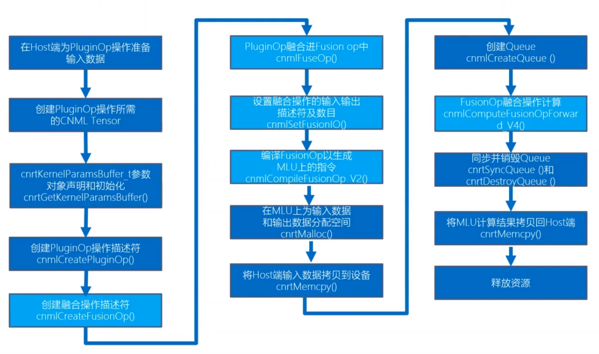

# 智能计算系统 第八章 智能编程语言
本章内容定位：智能算法的实现
## 8.1 为什么需要智能编程语言
语义鸿沟、硬件鸿沟、平台鸿沟
### 语义鸿沟
以卷积运算为例
c++标量计算需要7重循环
python需要写4重循环
tensor类型只需要一行代码
### 硬件鸿沟
- 智能计算硬件在控制、存储、计算等方面有独特性
- 传统编程语言难以有效描述上述硬件的特点
- 不同层次编程语言和硬件特性带来的性能影响
- 存储逻辑上一般采用程序员可见的Cache，而不是普通平台上对于程序员透明的 Cache。
- 计算逻辑上提供了面向智能计算的定制运算单元，精度损失可以忽略
### 平台鸿沟
功能可移植性：采用特定平台专用语言所编写的程序能够在别的平台上正常运行
- 矩阵乘法的例子调用了 AVX 的 intrinsic 函数在 ARM 上无法运行

性能可移植性：在特定平台上优化好的程序，在辛的硬件平台上仍然保证有较高的执行效率
理想的 编程语言需要抽取不同硬件平台的共同特性，并在此基础上提取性能关键特征作为语言特性提供给用户
## 8.2 智能计算系统抽象架构
### 抽象硬件架构
层次化的智能计算系统抽象硬件架构
- 每一层都包含存储单元、控制单元和若干个计算单元
- 每个计算单元又进一步分解为子控制单元、子计算单元和子存储单元三部分，整个系统以这样的方式递归构成
- 最底层，每个叶节点是具体的加速器
### 典型智能计算系统
多卡的 DLP 服务器抽象为五个层次：服务器级、板卡级、芯片级、处理器簇级和处理器核级
==可以方便通过增加各层次的规模来提升整个系统算力==
### 控制模型
指令是实现对计算核存储进行控制的关键。需要考虑典型的计算模式，提炼最具代表性的操作，并进行针对性设计
对智能算法的抽象
- 控制
- 数据传输
- 计算：标量、向量和矩阵运算
- 逻辑操作：标量和向量运算

关注计算和存储的交互：尽可能将计算和存储并行，例如可以控制计算和访存的指令分开再不同的队列中发射执行，以提高并行度
### 计算模型
定制运算单元和并行计算架构
定制运算单元
- 可用低位宽运算单元节省能耗
- 不同的应用对具体精度要求不同
#### 定制运算单元
#### 并行计算架构
任务切分与同步
### 存储模型
智能应用中存在大量数据密集的内存访问，因此合理地组织存储层次单元和计算单元童谣重要，需要两者协同设计以平衡计算与访存，实现高效的智能计算
- 分为本地存储和全局存储
## 8.3 智能编程模型
### 异构编程模型
通用处理器：主机端，负责控制和调度
领域处理器：设备端，负责大规模的并行计算或专用计算任务
二者协同完成计算任务
#### 分类及流程
分类：构建全新的异构并行编程、对现有编程语言进行异构并行扩展
流程
- 整体采用分离式编程方式：主机端代码和设备端代码
#### 编译器支持
编译器支持是异构并行编程模型的核心
- 任务划分
  编译器只负责底层的任务划分，提供并行编程接口，方便程序员定义和划分任务
- 数据分布
  需要根据算法和硬件架构的特点，通过合适的数据分布直到后续编译和运行时优化
- 数据通信
  由于设备端通常由多级存储空间、编译器需要支持这种地址空间声明，以方便程序员显式控制存储数据的地址空间
- 并行同步
  设备端一般要求感知多个核的并行处理，因此需要提供对同步机制的支持
#### 运行时支持
完成任务映射及调度，即任务具体再哪个设备或计算单元上以何种顺序执行
分为主机端（控制和串行）、设备端（计算和并行）
### 通用智能编程模型
#### Kernel 定义
定义在设备端 DLP 上的核心计算任务
与异构编程模型中的概念一致，DLP 上执行的任务叫 Kernel，资源允许情况下 DLP 可以同时执行多个并行的 Kernel
- 每个 Kernel 有一个入口函数
- Kernel 启动需要调用运行时 API
- 设备端程序默认的函数类型：Device 函数
#### 编译器支持
指定 DLP 上的核心计算任务如何高效地翻译成目标代码
任务划分
- 并行内建变量
  - 硬件：维度、序号、coreDim、coreId
  - 任务：taskDim、taskId
  - 表示 Kernel 启动 task 的规模，由 xyz 三个维度
- 任务调度类型
  - 表示 Kernel 运行调度时需要的硬件核
  - BLOCK 类型：Kernel 为单核任务，按单核进行调度
  - UNIONx 类型：Kernel 为多核并行任务，x可以为1、2、4

数据通信
- 隐式数据管理：GPR 标量数据，由编译器隐式插入load和store指令
- 显示数据管理
  - DRAM/NRAM/WRAM/SRAM 间向量及张量数据
  - 主机-DLP 间 DRAM 数据

同步支持：为并行计算架构提供支持
抽象硬件架构中有 Chip-Cluster-Core 层次结构，可以提供至少两种不同类型的同步操作
- _\_sync\_all：同步执行所有的核
- \_\_sync\_cluster：同步一个 Cluster 内部的所有核

内建运算：为用户编程提供支持，提高开发效率
- 通用智能编程语言实现内建函数接口，分别对应卷积核全连接等典型神经网络运算
- C/C++ 语言的扩展，深度学习处理器端 Kernel 程序编写时可以调用这些接口，通过编译器将这些接口翻译为底层硬件指令
- 通过智能编程模型直接实现了神经网络计算的内建接口，能更好支持智能应用
#### 运行时支持
指定 DLP 的核心计算任务以何种方式映射到计算单元
任务调度单位（BLOCK/UNIONx）
- 以调度单位将 Kernel 中的任务再时间或空间维度展开
  - BLOCK：单核调度，当一个核空闲时，调度任务执行
  - UNION1：调度时需要1个cluster，当有一个cluster空闲时，调度任务执行
  - UNION2：调度时需要2个cluster，当有两个cluster空闲时，调度任务执行
- 队列
  - 管理需要执行的任务，队列既可以单独工作，也可以协同工作
  - 运行时不断把任务放到队列中，一旦硬件计算资源有空闲，就从队列中取出一个任务执行
### 智能编程模型实例：BANG 异构编程
BANG 语言时针对 MLU 硬件提出的编程
- 提供通用的异构编程模型
- 提高高效的编程接口，充分发挥底层硬件特性
- 基于 C/C++ 的扩展
#### 流程
分离式，主机端和设备端分离式编程，分离式编译，最后连接成一个可执行程序
设备端使用 BANG 语言特定的语法规则和接口进行编程
#### 编译与链接
分离的方式
- MLU 端程序采用编译器 CNCC 进行编译，得到 MLU 程序的目标文件
- Host 端程序采用普通的 C/C++ 编译器进行编译，得到 Host 程序的目标文件
- 最后使用 Host 端链接器将 MLU 与 Host 程序的目标文件及 CNRT 库，链接成 Host 端的可执行文件
## 8.4 智能编程语言基础
### 语法概述
智能编程语言考虑基于过程式语言
- 减少学习成本
- 参考 C/C++，定义的智能编程语言童谣具有数据和函数两个基本要素
### 数据类型
int8_t, uint8_t, int16_t, uint16_t, int32_t, uint32_t, half(2 byte), float, char, bool, 指针
### 宏、常量与内置变量
- 宏和常量，宏不仅可以定义常量数据，也可以定义一段代码，常量时不可修改的数据，只能再初始化时被赋值
- 内置变量，编程语言本身包含的常量和变量，不需用户定义即可直接使用
### IO 操作语句
不同层次的智能处理器节点有格子的本地存储，需要提供不同存储层次间的数据搬移
- 针对多种片上存储和设备内存，可以有多种不同的数据搬移操作类型
### 标量计算语句
标量即单个数据运算
- 运算符号
- 内建函数

由编译器映射到标量计算单元，吞吐不如张量运算，但具有良好的通用性和灵活性
### 张量计算语句
通过内建函数直接映射到张量计算单元
直接对精度类型和语义类型等数据直接进行操作
### 控制流语句
分支、循环、同步语句
### 张量计算语句实例：BANG 数学库
- 将 MLU 的数学类和神经网络类指令封装成库函数
- BANG 数学库函数时 MLU 架构上进行高性能编程的关键

- 使用约束：张量计算通常是对批量数据进行操作
  - 源和目的都是 NRAM 上的数据
  - 数据的长度必须是 128 的证书倍
  - 源和目的地址必须按 64 位对齐
## 8.5 智能应用编程接口
### Kernel 函数接口
为了充分利用并行资源，需要再 Kernel 内部对任务进行有效切分，同时再主机端配置和调用相应的 Kernel 函数接口
任务切分的内置变量
- coreDim 核维数
- coreId 核序号
- clusterDim 簇维数
- clusterId 簇序号
- taskDim 任务维数
- taskId 任务序号

主机端 Kernel 函数接口
- 用于将智能编程语言编写的程序加载到深度学习处理器上执行
- GetKernelParamBuffer
- CopyKernelParamsBuffer
- KernelParamsBufferAddParam
- DestoryKernelParamsBuffer
- InvokeKernel
  调用时会有参数主从设备拷贝，所以追求高性能时，要尽可能减少 InvokeKernel 次数
### 运行时接口
包括==设备管理、队列管理核内存管理==接口
设备管理：主要涉及初始化、设备设置、设备销毁等操作
- init
- GetDeviceCount
- GetDeviceHandle
- SetCurrentDevice
- Destroy

队列管理
- 队列具有一下属性
  - 串行性：内部串行
  - 异步性
  - 并行性：不同的队列可以并行
- CreateQueue
- SyncQueue
- DestroyQueue

内存管理
主机端内存管理、设备端内存管理和主机与设备端内存拷贝
- hostMalloc
- hostFree
- devMalloc
- devFree
- Memcpy
### 编程接口实例：BANG 程序
#### BANG 单核向量加法
#### BANG 多核向量加法
#### BANG 矩阵乘法
#### 涉及 CNRT 的编程接口：包括 Kernel 控制和运行时接口等
## 8.6 智能应用功能调试
### 功能调试接口
- \_\_assert(bool flag)
- \_\_abort()
- exit(int status)
- \_\_bang\_printf("str",arg)
- \_\_breakdump\_scalar/vector()

标量调试
BANG 用户可通过\_\_breakdump\_scalar函数打印标量值。语义时将一组用户指定的标量变量打印到文件dumpscalar\_data中并终止当前核上程序运行
向量调试
格式化输出\_\_bang\_printf
### 功能调试工具
面向智能编程语言 BCL 的调试器
整体流程：调试前准备、调试器托管、状态查看及错误分析
## 8.7 智能应用性能调优
### 性能调优方法
核心如何充分利用大规模并行计算单元
- 使用片上存储
- 张量计算
  将大量标量计算合并为张量计算，充分利用硬件的张量计算单元，提升程序的运行速度
- 多核并行
  将一个计算任务拆分到多个核上并行计算，进一步提升程序性能
### 性能调优接口
再程序中使用性能调优接口，帮助识别程序执行过程的瓶颈
识别瓶颈的过程
- 找到耗时长的部分——*通知接口*
- 在通过硬件计数器分析硬件执行特征——*硬件计数器接口*
  通过提供硬件计数器值的获取接口，方便开发者对程序的行为进行细粒度的剖析和优化
  关键代码段前后插入硬件计数器接口，获取的信息包括 NRAM 对应运算部件计算量、DRAM 读数据量、DRAM 写数据量
### 性能调优工具
在程序外部监控程序的运行状态，分析其执行瓶颈，找到优化空间
- 应用级性能剖析工具
  - 采用 record 命令来运行可执行程序并生成相应的性能分析报告
  - 采用 report 或者 reply 命令查看性能分析报告，获取包括执行实践、调用关系以及性能计数器等信息
- 系统级性能监控工具
  主要利用驱动通过读取寄存器方式来收集硬件的静态和动态信息
## 8.8 基于智能编程语言的系统开发
### 轻量级高性能算子开发
高性能库（如MKL、cuDNN、CNML等）提供了常见算子在特定平台上高性能实现，方便用户以 API 形式直接调用
1. 使用智能编程语言实现自定义算子
2. 使用智能编程语言编译器自定义算子
3. 使用高性能编程接口集成自定义算子及网络拓扑
4. 使用主机端编译器编译链接相关文件
5. 运行

关键：**Kernel 代码逻辑的开发与优化、高性能库算子接口 API 使用**
#### 算子集成 API 介绍
典型高性能库中自定义算子集成的主要 API，主要包括自定义算子的创建、前向计算和销毁等接口
数据的准备和编译阶段：完成算子创建、执行编译
融合算子集成
- 减少中间数据片外交换，提高性能
- 主要在 FusionOp 中插入多个算子，包括库中已有算子，以及新增加的自定义算子，然后进行同一的编译优化
#### 算子开发实例
实现自定义向量 Power 算子
- 编写 Kernel 代码逻辑
- 作为基础算子集成
  - 创建自定义算子 CreateCustomizedOp
  - 编译自定义算子 CompileBaseOp
  - （数据拷贝、分配操作）
  - 创建队列并通过 ComputeCustomizedOp 完成计算
- 作为融合算子集成（以Conv+Power+ReLU 进行融合）
  - 创建 Conv、Power、ReLU 算子
  - 创建融合算子并进行编译
  - （数据拷贝、分配操作）
  - 完成融合算子计算
### 实践：基于 BANG 的高性能库算子开发
以 BANG 和 CNML 为例详细介绍高性能算子的开发实践
自定义算子接口的具体实例：CNML
#### PluginOp
- PluginOp 接口主要在软件栈的 CNML 层提供，将用户用 BNAG 实现的算子插入到 CNML 库中
- 自定义的算子可以与 CNML 中已有算子实现执行逻辑同一，从而利用 CNML 的特性（融合执行、离线指令生成等）
#### PluginOp API 介绍
- CNML 接口
  - cnmlCreatePluginOp()
    创建一个新的 PluginOp 描述符
  - cnmlComputePluginOpForward_V4()
    在指定设备上执行 PluginOp 操作
- CNRT 接口
  - cnrtGetKernelParamsBuffer()
  - cnrtKernelParamsBufferMarkInput()
  输入数据地址指针占位
  - cnrtKernelParamsBufferMarkOutput()
  输出数据地址指针占位
  - cnrtKernelParamsBufferMarkStatic()
  静态数据地址指针占位
  - cnrtKernelParamsBufferAddParam()
  增加常量参数
  - cnrtDestoryKernelParamsBuffer()
  销毁变量
#### PluginOp 集成
##### 基础算子集成

##### 融合算子集成

### 编程框架算子开发
TensorFlow 集成自定义算子
1. 为新的自定义算子进行注册
2. 为新的自定义算子编写前向传播接口函数
3. 根据新的自定义算子接口编写定制算子底层实现
4. 完善 Bazel Build 和头文件，并重新编译 TensorFlow 源码
### 实践：基于 BANG+CNML+Tensorflow 系统开发与优化
以典型的目标检测网络 Faster R-CNN 为例，阐述完整的系统级开发与优化方法及流程
Faster R-CNN 是典型的两阶段检测网络，提出了 RPN 层来解决传统检测网络中生成检测框耗时的问题，通过 RPN 层来直接生成检测框，极大地提升了检测网络性能
Faster R-CNN 网络主要流程
- 主干网络：VGG、ResNet 或 Inception 系列作为主特征提取的主干网络。提取出来的网络特征被后续的 RPN 层和分类网络共享
- 区域候选网络 RPN：用于生成检测候选框，结合预设在每个特征点的 Anchor。该层通过 softmax 判断每个 Anchor 属于正样本或负样本，再利用位置回归得到较为精确的 Region Proposals。==此处为网络的第一阶段==
- 兴趣区域池化 ROI Pooling：该层以特征图和 RegionProposals 为输入，把每个 Proposal 映射到对应的特征图中，并去除该特征进行池化得到相同的尺寸，送入后续分类层
- 分类层：该层对 ROI Poolinig 处理后的特征图进行类别判断和位置回归修正，得到最终类别和位置。此处为网络的第二阶段

优化思路：减少网络中 CPU 运算，通过自定义算子实现再 DLP 上运行，减少数据拷贝，利用 DLP 并行算力
#### 使用 BANG 进行自定义算子开发和优化的主要流程
1. 分析网络中暂不支持操作的位置和功能，明确要开发的自定义算子
2. 采用 BANG 实现和优化分析出来的自定义算子
3. 采用 CNML 自定义算子接口将新开发的自定义算子集成到 TensorFlow 框架中并重新编译
4. 采用集成了自定义算子的 TensorFlow 对替换后的网络模型进行性能和精度验证
#### 融合算子开发
观察到 Faster R-CNN 在 CPU 上执行的部分主要是两个阶段后的处理部分，针对两阶段后处理开发相应的融合算子
