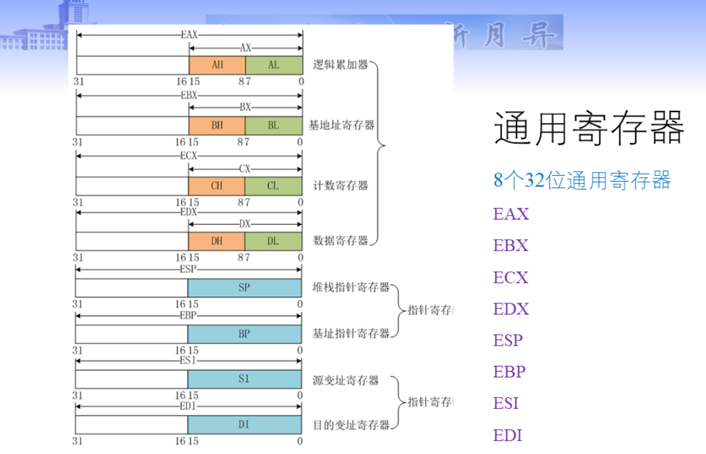
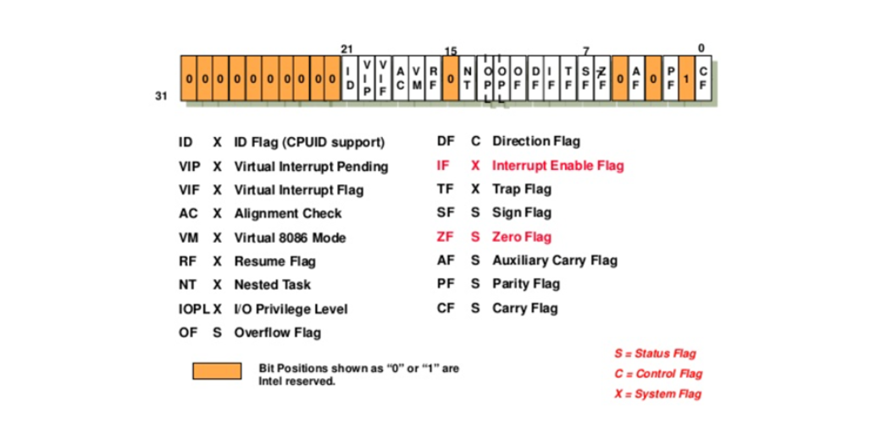
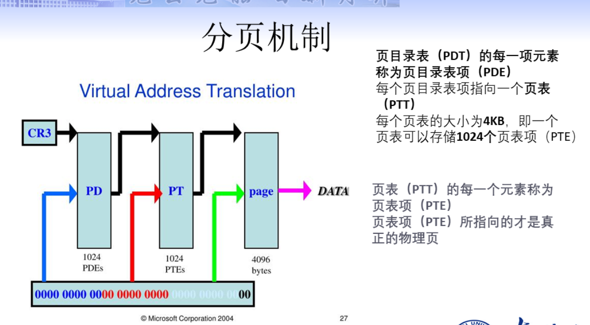

# 汇编语言与逆向技术基础 二、IA-32 处理器体系结构

## 本章知识点

- 计算机体系结构
- IA-32 处理器体系结构
- IA-32 的内存管理

## 计算机体系结构

### 计算机基本概念

- 计算机基本结构
- 指令执行周期
- 内存的读取
- 程序如何运行的

### 计算机基本结构

寄存器、ALU、CU、时钟、内存存储单元、输入输出设备

数据总线、地址总线、控制总线（由前两个总线实现）

- 中央处理器 Central Processor Unit，进行计算和逻辑操作的地方
  - 寄存器 Register：数据存储，数量有限
  - 时钟 Clock：同步 CPU 内部操作
    - 每个时钟周期 CPU 完成一步操作
    - 时钟频率 = 1/时钟周期
    - 时钟频率反映了 CPU 速度的快慢
    - 软件优化
  - 控制单元 CU：控制机器指令的执行步骤
  - 算术逻辑单元 Arithmetic Logic Unit：算术运算、逻辑运算
- 内存存储单元
  - Memory storage unit 存放指令和数据的地方
  - 核心频率 133MHz~200MHz
- 总线 Bus
  - 数据总线 data bus
  - 地址总线 address bus
  - 控制总线 control bus
  - MHz

### 指令执行周期

- 单条机器指令的执行包括一系列操作

  - 取指令（需要访存）：指令指针 IP
  - 解码：控制单元 CU 确定执行什么操作
  - 取操作数（需要访存）：从内存读操作数
  - 执行：算术逻辑单元 ALU
  - 存储输出操作数（需要访存）：向内存中写入

  一般来说，执行一次机器指令需要访存3次。

## IA-32 处理器体系结构

- IA-32（Intel Architecture 32-bit）英特尔32位体系结构
  - 1985年 80386 CPU 首先使用
  - 32 位内存地址
  - 32 位数据操作数

### 工作模式

- 实地址模式 Real-Address Mode
  - 16 位，8086 程序设计环境
  - 20 条地址线
  - 储存空间 1MB（$2^{20}$ bit​）

- 保护模式 Protected Mode
  - 32 位，IA-32 程序设计环境
  - 虚拟 8086 模式：执行 8086 程序
  - **多任务**操作系统
  - 程序有独立的 4GB 内存存储空间（$2^{32}$ bit​）

### 地址空间

- IA-32 CPU 4GB 地址空间
  - 32位的寻址上限
- 8086只有 1MB 地址空间

### 寄存器

- 寄存器是 CPU 内部的高速存储单元

  - 比内存的访问速度快很多
  - 优化循环结构执行速度，把循环计数变量放到寄存器中。

- 通用寄存器 8个32位通用寄存器

  EAX, EBX, ECX, EDX, ESP, EBP, ESI, EDI

### 段寄存器

- CS 代码段

- SS 栈段
- DS 数据段
- ES （额外）数据段
- FS 数据段（异常处理）
- GS 数据段

### EFLAGS 寄存器

- 零标志 ZF：若算数结果或逻辑运算结果为0，将其置1，反之清零
  - xor eax, eax
  - jz

- 进位标志 CF：在无符号算数运算的结果的最高有效位若发生进位或借位，则将其置1，反之清零。
  - add eax, 0xffffffff
  - jc
- 溢出标志 OF：在有符号算数运算中结果太大或太小并且目的操作数无法容纳时，将其置为一，标志是否溢出
- 符号标志 SF：0 表示结果为正，1 表示结果为负。

- 奇偶标志位 PF：包含偶数个1位，置为1。
- 辅助进位标志 AC：若第三位发生进位，置为1
- 方向标志 DF
- 陷阱标志 TF：将该位设置为 1 以允许单步调试模式，清零则禁用该模式

### 指令指针

- 指令指针寄存器 EIP 存放下一条指令的内存地址
- 跳转指令可以修改 EIP

## IA-32 的内存管理

- IA-32 保护模式的内存管理比实地址模式要复杂
  - 多任务
  - 多用户
  - ==段模式、页模式==
  - 页模式是基于段模式的，通常称为==段页式==

### 平坦模式 FLAT

- 每个程序有独立的 4GB 虚拟地址空间
  - 数据，指令，数据<->指令
- 虚拟地址到物理地址的转换是透明的

### 段管理

- 一般保护模式的程序有三个段
  - 代码段 CS
  - 数据段 DS
  - 堆栈段 SS

- 段是一块内存空间

- GDT 全局描述符表
  - 整个系统只有一个 GDT 64bit
  - Intel 提供了一个寄存器 GDTR 来存放 GDT 的入口地址
- LDT 局部描述符表
  - 每个程序都有自己的 LDT
  - IA-32 为 LDT 的入口地址也提供了一个寄存器 LDTR
  - 任何时刻只有一个任务允许，所以LDTR只有一个

### 分页机制

