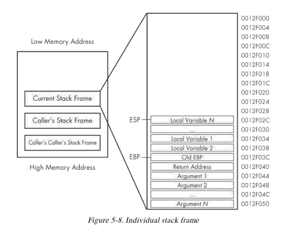

# 汇编语言与逆向技术基础 九、C 语言程序逆向分析

## 知识点

- 识别函数
- 识别变量、数组、结构体
- 识别IF分支结构
- 识别switch结构
- 识别循环结构

## 识别函数

### 启动函数

在编写Win32应用程序时，在源码里都有一个WinMain函数。

Windows程序的执行并不是从WinMain函数开始的，而是先执行启动函数

- 首先执行启动函数的代码，启动函数是编译器生成的

- 启动函数初始化进程完成后，才会执行WinMain函数

C/C++程序运行时，启动函数的作用基本相同

- 检索指向新进程的命令行指针
- 检索指向新进程的环境变量指针
- 全局变量初始化
- 内存栈初始化

当所有的初始化操作完成后，启动函数就会调用应用程序的进入点函数(main和WinMain )。

程序通过CALL指令来调用函数，在函数执行结束后，通过RET指令返回调用程序继续执行

### 函数  

函数的参数如何传递、局部变量如何定义、函数如何返回?

> 程序通过CALL指令来调用函数，在函数执行结束后，通过RET指令返回调用程序继续执行
>
> CALL指令的操作数就是所调用函数的地址或者相对地址(MASM32的link.exe程序)

### 栈

栈是一种后入先出的数据存储结构

函数的参数、局部变量、返回地址等被存储在栈中

**ESP (Extended Stack Pointer) 存储栈顶的内存地址**

**EBP (Extended Base Pointer) 存储栈底的内存地址**

PUSH指令将数据压入栈顶

POP指令从栈顶取出数据

### 函数调用过程

使用push指令将参数压入栈中。

call memory_location 

- call的返回地址压入栈中

- EIP的值被设为memory_location

push ebp，mov ebp，esp，add esp

- 在栈中分配局部变量的空间

### 栈帧（Stack Frame）

EBP上边是局部变量

EBP下边是函数返回地址和参数

### 函数调用过程

执行函数

恢复局部变量的栈空间

ret指令从栈中读取返回地址，设置EIP

恢复参数占用的栈空间

### 调用约定 Calling Convention

应该从左到右将参数压栈吗？

谁来销毁参数？

在x86平台，函数所有参数的宽度都是32bits

函数的返回值（Return values）的宽度是 32bits， 存储在EAX寄存器中

被调函数callee和主函数caller如何传递参数和返回值的约定

\_\_cdecl和\_\_stdcall

#### __cdecl

- 是C/C++程序的标准函数调用

- 从右到左传参
- 调用函数来维护栈，将被调用函数用的参数弹出栈

#### __stdcall

- 是Win32 API函数的调用约定
- 从右到左传参
- 被调函数来维护栈，被调函数自己将参数弹出栈

# 如何判断这两种call

> 看call之后有没有动esp，如果动了就是cdecl，否则就是stdcall。

## 识别变量、数组、结构体

全局变量

- 可以任意函数访问和修改的变量

局部变量

- 只能在定义该变量的函数内部，访问和修改

### 数组

数组是相同数据类型的元素的集合，它们在内存中按顺序连续存放在一起。

在汇编状态下访问数组一般是通过基址加变址寻址实现的

### 结构体

在c语言中，结构体(struct)是一种数据结构，可以将不同类型的数据结构组合到一个复合的数据类型中

## 识别IF分支结构

## 识别switch结构

Switch结构通常以两种方式被编译

- 使用IF方式

- 使用跳转表

## 识别循环结构

FOR循环是一个C/C++编程使用的基本循环机制。

FOR循环有4个组件：

- 初始化
- 比较
- 指令执行体
- 递增或递减

