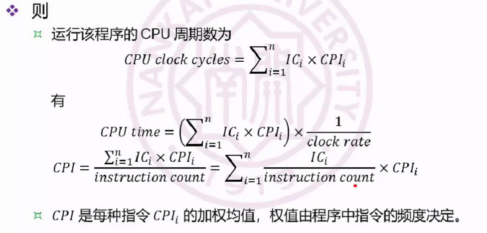

# CA2 量化设计与评估

## 性能度量

- 如何评估计算机系统的性能？

  - 运行时间：运行程序有多快
  - 吞吐量：每天能运行多少程序？

  ......

- 对比两台计算机的性能

  - 计算机 x 比计算机 y 快 n 倍

    $\frac{ExcutionTime(y)}{ExcutionTime(x)}=n$

  - 性能表示为运行时间的倒数，即运行时间越短，性能越高

    $n=\frac{ExcutionTime(y)}{ExcutionTime(x)}=\frac{Performance(x)}{Performance(y)}$

- 挂钟时间

  - 观测到的程序运行时间，也成为响应时间或实耗时间
  - 影响因素
    - 系统负载
    - I/O延迟
    - 操作系统开销

- CPU时间

  - 运行特定程序花费的时间
    - User time：程序本身花费的时间
    - System time：操作系统花费的时间
  - 不包含等待 I/O 和运行其它程序的时间，但包含操作系统运行时间

- 方法：运行 *一段代码* 来比较两台计算机系统的性能

## 代码内容

- 代码内容应该反应对计算机系统的功能需求，与该计算机系统的用途密切相关
- 问题
  - 比较计算机系统性能时，需要运行什么程序
  - 如何使用基准程序来进行评价
- 基准程序 benchmark：生产商用来确定他们所生产计算机系统的相对性能
- 挑战：购买者需要的是与他功能需求相关的基准程序

## 基准程序

### 测量性能的基准程序的最佳候选是实际使用的应用程序

- 购买后计算机系统运行的*就是*测试性能时运行的
- 运行比实际使用的应用程序简单得多的测试程序会导致*性能陷阱*

### 早期基准程序的类型

- 核心 kernel：实际应用程序的关键小片段，如矩阵乘法
- 简单程序 toy programs：节选自初级程序设计作业，如快速排序
- 综合基准 synthetic benchmarks：为了匹配实际应用程序的配置和行为而开发的“假程序”，如 Dhrystone

## 存在的问题

### 基准测试游戏

编译程序的生产者与计算机架构师合谋，使得计算机系统在这些”替身”程序上的表现优于在实际应用程序上的表现

### 运行条件上造假

- 特定基准程序的编译器标志
  - 程序的非法改善
  - 在其它计算机上性能夏季那个
- 是否允许修改源代码
  - 不允许修改
  - 允许修改，但基本上不可能修改
  - 允许修改，但输出结果不变

## 基准程序包

针对各种应用的常用处理器性能测试程序

- 优势：任何一个基准程序的弱点都由其它基准程序来密闭

### 台式机的基准程序

- 处理器密集型：SPEC CPU 2017
- 图形密集型

### 服务器基准程序

- 处理器吞吐量：SPEC rate
- 文件服务器和Java服务器：SPECSFS
- 面向事务处理：TPC基准程序

### 嵌入式基准程序

- EEMBC: **E**lectronic Design News **E**mbedded **M**icroprocessor **B**enchmark **C**onsortium

## 性能结果

测试报告的关键：重复性、再现性

### 汇总测量数据

- 算术均值
  - 各个程序的运行时间的算术均值或加权算术均值
  - 权值的意义？看重哪一部分，就将哪一部分权重加大

### 归一化运行时间：SPECRatio

$SPECRatio_A=\frac{ExcutionTime_{ref}}{ExcutionTime_A}$

$\frac{Performance_A}{Performance_B}=\frac{\frac{ExcutionTime_{ref}}{ExcutionTime_A}}{\frac{ExcutionTime_{ref}}{ExcutionTime_B}}=\frac{SPECRatio_A}{SPECRatio_B}$

### 几何均值

计算几何均值

$GeometricMean=\sqrt[n]{\prod_{i=1}^n sample_i}=\sqrt[n]{\prod_{i=1}^n SPECRatio_i}$

几何均值的性质

- 比值的几何均值=几何均值的比值
- 几何均值的比值=性能比值的几何均值

几何均值的缺点

- 对于工作负载，归一化运行时间的几何均值导致明显的不真实结论
- 几何均值“奖励”简单的改进

## 理想的性能测试步骤

1. 测量实际工作负载
2. 建立实际应用程序与基准程序的相似度
3. 按照相速度确定每个基准程序结果的权值
4. 计算加权算术均值

**关键：了解对计算机系统的真实需求**

## 躲避陷阱

- 从错误的、未知的应用领域选择基准程序
- 使用简单的基准程序
- 与所关心的特性不匹配的基准程序，如关系大容量Cache而选择SPEC基准程序
- 草率地确定基准程序规模
- 草率地抽取或构造基准程序
- 简单案例太多或太少

## 错误观点

- 使用时钟时钟频率或单个基准程序包的性能来判断具有相同指令集体系结构的两种处理器之间的相对性能——性能的比值与频率不是线性的
- 计算机系统的最佳设计是对主要目标优化而不考虑具体时间——上市时间、错误设计概率
- 评估系统性能或性价比时，忽略软件版本——软件费用可能占总成本的“大头”

## 计算机设计的量化原理

### 利用并行性——提高吞吐性能

- 系统级并行性——提高吞吐量性能

  - 扩展性：扩展内存和处理器数目
  - 数据级并行性：使用多存储系统来并行化数据读/写操作

- 指令级并行性——提高性能的关键

  指令流水操作：指令重叠执行

- 数据级并行性——数字化设计细节

  - 组关联Cache使用多个存储体
  - 算术逻辑使用先行进位

### 局部性原理

- 程序倾向于重复使用它们最近使用过的数据和指令
- 局部性类型
  - 时间局部性，如分支指令预测
  - 空间局部性，如Cache块结构

- 计算机系统设计的最重要和最普遍原则是：make the common case fast

- 聚焦常见情形（Common Case）

  - 聚焦能源、资源配置和性能方面的常见情形

    处理器的取指和译码单元

  - 常见情形相比不常见的情形更简单，可以更快完成

- 关键

  - what：确定常见情形是什么
  - how much：优化常见情形可以对性能有多少提升

## Amdahl定律

### 加速比

$SpeedUp=\frac{perf_{Enhancement}}{perf_{w/oEnhancement}}=\frac{ExecTime_{w/oEnhancement}}{ExecTime_{Enhancement}}$

### 定律内容

- 决定因素
  - $fraction_{enhanced}$系统优化前，运行时间中将被优化那部分所占的比例
  - $speedup_{enhanced}$系统优化后，被优化部分的加速比
- 优化后的运行时间
  - $ExecTime_{enhanced}=ExecTime×((1-fraction_{enhanced})+\frac{fraction_{enchanced}}{speedup_{enhanced}})$

### 整体加速比

​			$speedup_{overall}=\frac{1}{((1-fraction_{enhanced})+\frac{fraction_{enchanced}}{speedup_{enhanced}}}$

### 收益递减规则

- 加速比上限

  ​	$speedup_{enhanced}≤\frac{1}{((1-fraction_{enhanced})}$

### 定律的应用

主要用途：比较两个设计方案的优劣

计算公式：$speedup=\frac{1}{(1-f)+\frac{f}{s}}$

- 当$f\rightarrow0,speedup=1$
- 当$f\rightarrow1,speedup=\inf$
- 当$s\rightarrow0$
- 当$s\rightarrow1$

## CPU 性能方程

所有计算机系统组成中都包含一个固定频率的时钟

程序运行所需的CPU时间为

$CPUTime=\frac{CPUClockCyclesForAProgram}{ClockRate}=\frac{IC×CPI}{ClockRate}$

- 指令计数 instruction count， IC 程序运行的指令数目

- 指令周期数（Cycles Per Instruction， CPI），时钟指令数IPC是CPI的倒数

  $CPI=\frac{CPUClockCyclesForAProgram}{InstructionCount}$

- 时钟频率（硬件和组成） CPI（组成和指令集） IC（指令集和编译技术） 均与体系结构特性有关，彼此不是独立的。增强某个部分，会对另外两部分有影响

- 如果
  - 程序有n种不同指令，$IC_i$表示第i种指令的数目
  - $CPI_i$是第i种指令的平均时钟周期数

。。。。。。梦回组成原理

## 确定参数

- 所有方程都包含CPU time，clock rate，IC和CPI

- 指令计数IC
  - 只查看源代码很难确定，因为程序运行路径不可测
  - 可通过运行配置文件，记录完成的指令流
    - 处理器的硬件计数器
    - 检测运行来增减软件计数器
    - 解释器仿真运行
- 指令平均周期数CPI
  - 对于简单系统，可通过查询每种指令实现方式和每种指令的周期数来确定CPI
  - 实际系统复杂得多，处理器在某种情形下会减少指令的周期数，而存储系统也会引入许多延迟周期

## 谬误：应该避免的错误理念和误解

- 多处理器是一颗银弹
  - 银弹：某种策略技术或技巧可以极大提高程序员的生产力
  - 近年来多处理器每代只增加2核，性能改进
- 提升性能的硬件......
- 靳准程序无限期有效

## 陷阱：容易犯的错误

- 所有指数定律都必须结束
- 成为阿姆达尔定律的牺牲品
- 单点失效
- 故障检测降低了可用性

