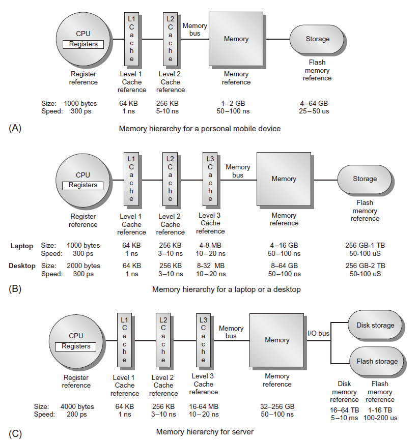

# CA4 存储层次

## 存储层次重要性

- 性能差距：处理器访存的*请求时间*和DRAM访问*延时时间*

## 引言

### 问题

期望拥有无限容量的快速存储器，但是快速存储器的比特价格远远高于慢速存储器的比特价格

### 解决方法：存储层次 memory hierarchy

- 性能和价格之间的权衡
  - 整个寻址空间——慢速大容量存储器
  - 容量越小、速度越快、比特价格越贵的存储器越靠近处理器
- 局部性：时间/空间局部性
  - 保证每次访问的数据都高概率地存储在最快访问速度的物理存储器

### 从处理器来看

- 存储空间的容量：容量最大的物理存储器的存储容量
- 存储空间的速度：速度最快的物理存储器的访问速度

## 典型存储层次

 

## 存储层次的重要性

- 对多核处理器来说，存储层次变得更加重要
- 总峰值带宽随处理器核数目增加而增加
  - intel core i7 处理器每核每周期发出两次访存请求
  - DRAM 带宽远远小于期望值（<10%）
  - 解决途径
    - 多端口，流水Cache
    - 每核两级Cache
    - 片上共享三级 Cache
- 再高端微处理器芯片中，一般 Cache 容量>10MB
  - 消耗大量的芯片面积核功率预算

## Cache

- 当数据在 Cache 中，称为 Cache 命中
- 当数据不在 Cache 中，称为 Cache 未命中
  - CPU停止执行
  - 硬件将未命中的数据块从主存移动到 Cache 中
  - 如果数据不在主存中，则继续到下一个存储层次——虚存中寻找
    - 主存和虚存的关系与cache与主存的关系一样的

## 4 Questions

- 块放置 block placement 数据块放哪里？
- 块辨识 block identification 如何发现想要的数据块
- 块替换 block replacement 在读入新的数据块时替换现有的数据块？
- 写策略 write strategy 如何修改数据？

### 块放置

- 直接映射direct mapped：数据块与位置一一对应（1个位置）

- 全相联fully associative：数据块可以放在任意位置（所有位置）

- 组相联set associative：数据块可以放在几个预定位置（几个位置）

  块地址 mod cache中的组数

- 对于n路组相联，n值越大

  - 实现代价越高，绝大多数cache 采用1路（直接映射），2路，4路组相联

  - 振荡的可能性越低

    振荡：两个块竞争同一个块帧地址，并交替地循环访问

### 块辨识

- 问题：如何在cache中找到对应的数据

- 将存储地址分成三个部分：Tag标志、组的索引、块内偏移量

- 例子：某个计算机系统

  - 地址空间$2^{64}$（64位 地址线）
  - 块大小64字节
  - cache 容量 64 MB（$2^{26}$字节，$2^{20}$块）
  - 采用直接映射方式

  38 bit Tag——20 bit set index选哪一块块——6 bit block offset块内偏移

### 块替换

- 当想要访问的数据块未命中时，cache 控制器必须做出反应
  - 对于直接映射方式，将主存中读取新数据直接覆盖未命中的数据块
  - 对于 n 路组相联方式，必须对 n 个可能的被覆盖数据块位置进行选择
- 三种选择策略
  - 随机：实现容易
  - FIFO先进先出：实现比较困难
  - LRU最近最少使用：cache 容量越大，实现越困难

### 写策略

可参考 https://blog.csdn.net/dark5669/article/details/53895744

- 现象：读操作比写操作多
- 基本原理：提高经常情形——读操作的性能
  - cache 设计者花费绝大多数精力加快读操作，对写操作关注较少
  - 根据 amdahl 定律，写操作太慢，整个系统性能会很差
  - 必须提高写操作性能
- 两种写策略
  - 写透write through：新数据被同时写入cache数据块和低一级存储器
  - 写回write back
    - 如果写命中，则新数据只写入 cache 数据块
    - 如果写不命中，则首先将被替换的数据块“写回”低一级存储器，然后将新数据写入相应的 Cache 数据块
- 脏（dirty）位：表示被替换 cache 数据块是否需要“实际写回”低一级存储器

### 写策略比较

- 写透
  - 实现容易
  - 低一级cache中总保存数据最新版本，简化了数据一致性问题
- 写回
  - 写操作速度取决于cache，很快
  - 多次写操作被捆绑到一起写回低一级存储，效率高

### 写不命中的处理

- 写分配
  - 写不命中时分配 cache 块
  - 数据块分配后是标准的写命中操作
  - 写不命中等价于读不命中
  - 与写回策略配合
- 非写分配
  - 写不命中不分配 cache 块
  - 只更新低一级存储器
  - 只在读不命中时分配 cache 块
  - 与写透策略配合

### 存储层次基础

- 为命中率miss rate：cache 访问中未命中访问的比例

  - 局部未命中率local：在该 cache 中未命中访问的次数与对该 cache 访问总次数之比
  - 全局未命中率global：在该 cache 中未命中访问的次数与处理器发出的访问总数之比

- 平均存储访问时间

  $AccessTime=HitTime_1+MissRate_1*MissPenalty_{L1}$

  $MissPenalty_{L1}=HitTime_2+MissRate_2*MissPenalty_{L2}$

  一级一级迭代

- 每指令未命中

  $\frac{Misses}{Instruction}=\frac{MemAcc}{InsCnt}*\frac{MissAcc}{MemAcc}=MissRate*\frac{MemAcc}{Inscnt}$

  - 优点：独立于硬件实现
  - 缺点：与体系结构无关

- 未命中类型

  - 强制性：对数据块的第一次访问
  - 容量：前期被替换且稍后又被访问的数据块
  - 冲突：程序重复访问处于多个存储地址的不同数据块，而这些数据块恰好映射到 cache 中相同位置
  - 一致性：多个处理器中多个 cache 内容不一致

### 六种基本 cache 优化方法

- 加大数据块容量
  - 减少强制性不命中（数据块块容量大了）
  - 增加容纳能力和冲突不命中，增加不命中惩罚（因为cache 容量固定，块变大了，块数变少了，每块包含的数据内容变多）
- 加大 Cache 总容量
  - 降低未命中率
  - 增加命中时间，增加功耗
- 提高关联性
  - 减少冲突不命中
  - 增加命中时间，增加功耗
- 增加 Cache 级数
  - 减少总的存储器访问时间

- 读操作未命中优先于写操作
  - 减少未命中惩罚
- 避免 Cache 索引中的地址转换
  - 减少命中时间

## 存储器性能和类型

- 性能指标
  - 延时：cache 关心的问题
  - 带宽：多处理器和I/O关心的问题
  - 访问时间：从发出读请求到访问存储字到达间隔的时间
  - 周期时间：不相关存储请求之间的最小间隔时间
- 存储器类型
  - SRAM：低延时，用于存储器芯片上1-3级Cache
    - 功率低
    - 访问时间接近周期时间
    - 6个晶体管
  - DRAM：将芯片组织为许多高带宽的存储体，用于主存。
    - 读操作之后必须重写
    - 必须周期性刷新
      - 8ms刷新一次

### DRAM 内部组成

- 存储体数目上限为 16 （DDR4）
- 数据访问
  - 发出 ACT 命令
  - 打开一个存储体和一行且将该行加载到行缓冲器
  - 根据后续列地址，以任意DRAM宽度传输，或通过起始地址进行块传输
  - 预充电命令关闭存储体和行，为新的访存做好准备

### 存储器性能优化方法

- 对相同行缓存多个列访问
- 同步DRAM（SDRAM）
  - 在DRAM中添加时钟，对指令进行流水操作
  - 关键存储字优先的突发模式
- 更宽的接口
- 双倍数据速率 Double Data Rate
  - 在存储器的上升沿和下降沿均传输数据
- 每个DRAM设备上存在多个存储体（重叠访问）

### Flash 存储器

- 类型：电可擦写可编程只读存储器 EEPROM
- 种类
  - NAND：密度更高，适合大容量非易失存储器
    - 编程速度块，擦除时间短
  - NOR：速度更快
    - 随机存取和对字节执行写操作

