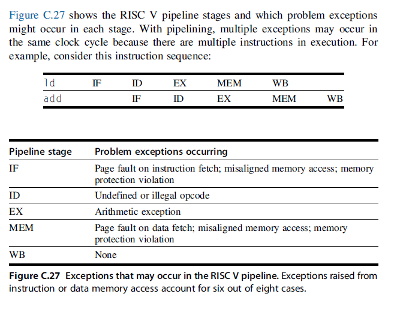
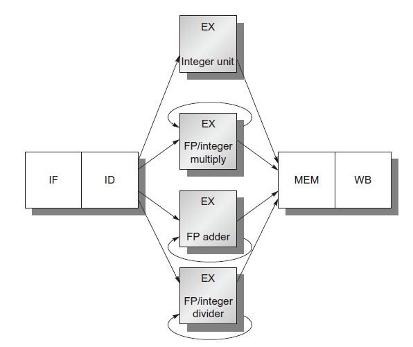

# CA6 流水线技术 (2)

## 流水线控制的实现

- 指令发出：让一条指令从指令译码阶段移动到执行阶段的过程
- 在ID段检测所有数据危害
  - 如果存在危害，则在发出指令之前停止（插入NOP）
  - 同样，确定是否需要向前通道
- 也可以在使用操作数的时钟周期前检测危害或向前通道
  - 如EX和MEM的流水段

## 异常

- 异常：以意想不到的方式改变指令执行顺序
- 问题：指令重叠执行使得难于确定哪条指令可以安全修改处理器状态
- 术语：
  - 中断
  - 故障
  - 异常

## 异常类型

- IO设备请求
- 用户程序调用操作系统服务
- 跟踪指令执行
- 断点（程序员请求中断）
- 整数算数溢出
- 浮点数算术异常
- 页面失效（没在主存中）
- 未对齐内存访问
- 违反内存保护
- 使用未定义或未生效的指令

- 硬件故障
- 电源故障

## 异常的特性

- 异常的特性将决定硬件需要采取的动作
- 同步或异步
  - 如果每次使用相同的数据和内存分配执行程序时，事件都发生在同一位置，则该事件时同步的
  - 除了硬件故障，异步是由处理器和内存之外的失败引起的，一般可以在当前指令完成后再处理。
- 用户请求的或强制的
  - 如果用户任务直接请求，称为用户请求事件。有时可预测，总是可以再指令完成后处理
  - 强制事件是由硬件事件引起的，因为是不可预测的，所以难处理
- 用户可屏蔽的或用户不可屏蔽的
  - 屏蔽用来控制是否响应中断
- 指令内部或指令之间
  - 取决于事件是否发生在指令执行过程中来阻止指令完成，或者是否发生在指令之间
  - 发生在指令之间的异常更难实现，因为指令必须停止和重新启动
- 重新开始或终止
  - 如果程序总是在中断后停止运行，则成为终止terminating事件
  - 如果程序在中断之后继续运行，则称为重新开始resuming事件

### 异常的特性与类型

## 停止运行和重新开始

- 定义：流水线或处理器是可重新启动的

  流水线具备处理中断、保留状态且不在影响程序执行结果的情况下重新开始执行的能力

- 最困难异常具有两个特性

  - 在指令执行期间发生中断，如EX或MEM流水段
  - 指令可重新启动（通过保留重新启动指令的PC值）
    - 非分支转移指令：按正常方式执行顺序读入后续指令
    - 分支转移指令：重新计算转移条件，然后从确定的地址取入指令运行

- 安全保存流水线状态的步骤

  - 在下一个IF周期，插入陷阱指令
  - 在陷阱指令执行之前，关闭错误指令及其后指令的所有4写操作
  - 操作系统的中断处理程序接管控制后，马上保存错误指令的PC值

- 异常处理完毕，重新加载PC和重新启动指令流从异常返回

## 精确中断

- 定义：如果能停止流水线工作，使得错误指令之前指令执行完毕，之后的指令可以从中断位置重新开始执行，则称流水线是精确中断的
- 精确中断不是刚需
  - 在指令乱序完成情况下，做到精确中断需要更多的逻辑短路
  - 具备按需分页或者 IEEE 算术陷阱处理程序 的处理器必须是精确中断的
- 近期高性能处理器引入两种操作模式
  - 精确中断模式：只允许少量浮点运算重叠运行，故速度较慢
  - 快速/性能模式：非精确中断

## RISC V 中断

- 因为中断可能不按照指令顺序发生，所以流水线不能对发生的中断进行简单按发生次序的处理
  - 后续指令可能在先前指令引起中断之前引发中断
    - id指令在mem段发生页面失效，而add指令在If段发生页面失效
- 中断状态矢量
  - 硬件将由该指令引起的所有中断发生到与该指令相关的状态矢量中
  - 中断状态失灵随指令一起进入流水线
  - 中断状态失灵中中断标志一旦置为，则关闭所有可能引发写入数据操作（包括写reg写mem）的控制信号
  - 当指令进入WB流水段（或离开MEM段）检查中断状态矢量
    - 如果发生中断，则按照其在非流水线处理器中的执行顺序

## 指令复杂性

- 定义：当指令保证完成时，称为提交committed

  - 当指令到达MEM尾部时被提交，在此之前指令不会修改处理器状态
  - 如此，精确中断就是简单的

- 如果在指令及其前任保证完成之前的执行过程中修改处理器状态，则必须通过添加相应的硬件装置，保证在发生中断时能够回复任何已被修改的状态

  IA-32架构中的自动增量寻址方式

- 条件码

  - 作为指令的一部分（隐式设置条件码）
  - 优点：将条件求值与实际分支解耦
  - 缺点：导致在设置条件码和分支之间调度流水线延迟的困难（不能用于延迟槽）；确定何时是最后一次设置条件码（推迟到所有早期指令设置条件码后）

- 微指令
  - 伪指令是在序列中使用的一种简单指令，用于实现更复杂的指令集
  - IA-32和ARM都是用这种方式实现更复杂的指令（克服由于不同指令需要不同数目时钟周期带来的各种困难）
  - 对比来看，装入-存储处理器具有简单操作且流水线更加容易实现
- 如果架构师认识到指令集设计与流水操作之间的关系，则可以设计具备更高效流水操作的体系结构

## 多周期操作

- 浮点数操作很难在1~2周期内完成
- 解决办法
  - 接收慢时钟和/或在浮点数功能单元中添加大量逻辑电路
  - 浮点数流水线允许较长的操作延时
- 相比整数流水线的两点变化
  - EX周期将根据所有完成操作的需要量重复多次
- RISCV整数流水线附加三个非流水结构的浮点数功能单元

- 支持多浮点操作数的处理器（浮点除法单元一般是非流水的）

## 属于

- 延迟：生成结果的指令和使用结果的指令之间所需要的周期数

  通常指指令在执行EX后产生结果的流水段数

- 初始间隔/重复间隔：执行指令类型的两个操作之间必须经过的周期数

## 多周期操作

- 对较高的时钟频率惩罚是操作的更长延迟
  - 为了获得较高时钟频率，设计者需要做每个流水段设置较少的逻辑层，这将导致完成更加复杂操作所需的流水段数更多

- 浮点数操作的较长延迟增加了发生RAW危害

## 危害和向前通道

- 检测危害和向前通道
  - 检测除法单元的结构危害，一旦发生，停止发出指令
  - 由于指令的执行时间不同，一个周期内寄存器写次数可能大于1
  - 由于指令不再按需抵达WB段，可能发生WAW危害
  - 指令完成的顺序可能与发出顺序不同，可能导致中断处理出现问题
  - 指令更长的延迟，RAW危害造成的停顿更加频繁

## 写操作带来的结构危害

- 解决方法
  - 增加写端口：发生“同时写”情形的频度较小——不值得
  - 检测且强制访问写端口：采用互锁技术
- 互锁
  - 法一：使用移位寄存器在ID段检测写端口使用，使用停顿来解决
  - 法二：阻止冲突指令进入MEM段或WB段。但可能造成停顿“回流”到EX段

## ID段危害检测

- 必须在指令发出前完成三种检测
  - 结构危害检测：等待资源空闲
  - RAW数据危害检测：等待直到源寄存器不在流水线寄存器的挂起目标寄存器列表中
    - 挂起目标寄存器：当该指令需要结果时，目标寄存器不可用
  - WAW数据危害

## 向前逻辑

- 与整数流水具有相同处理方式

## 简单流水线的性能损失

- 取指令与发出指令会受到指令间数据相关性的影响
- 向前逻辑通过减少流水线延迟使得某些相关性不会导致危害
- 如果存在不可避免的危害，则流水线停顿，直到相关性消除
- 解决方法
  - 静态调度：编译器调度指令防止危害
  - 动态调度：硬件重新安排指令减少相关

## 动态调度

- 按序发出：如果一条指令在流水线中停顿，则后续指令不会继续执行

- 早期流水线在指令译码期间检测结构危害和数据危害

  - 当指令正常执行时，才会从ID段发出
  - 当两条指令间存在危害时，流水线停顿，不管后面指令是否存在相关和停顿

- 乱序执行：指令在其操作数一旦有效时可以马上执行

  乱序执行暗示乱序完成

- 为了实现乱序执行，ID流水段将被一分为二

  - 发出：解码指令，检查结构危害
  - 读oprand：等待直到没有数据危害再读操作数

## 计分板

- 在动态调度流水线中，所有指令
  - 按需通过发出流水段——按序发出
  - 在读操作数流水段指令可能停顿或相互绕行，然后进入乱序执行
- 计分板：当存在足够资源且没有数据相关性是，乱序执行的一种技术

- 目标：当不存在结构危害时，尽可能早的执行指令，以维持每个时钟周期一条指令的执行速率
- 任务：完全负责指令发出和执行，包括所有危害检测

## 计分板主要功能

- 记录数据相关性，替代ID段部分功能
- 决定指令何时能够读取操作数并开始执行
- 控制指令何时可以将其结果写入目标寄存器

### step1：发出

- 如果执行指令的功能单元空闲，且不与其它正在执行指令有相同目标寄存器，则计分板将指令发出到功能单元且更新内部数据结构；否则停止发出，直到清除这些危害

### step2：读oprand

- 当源操作数有效，通知功能单元从寄存器中读操作数，开始执行指令

  作用：动态解决RAW，乱序执行，与发出步骤共同完成ID

### step3：执行

功能单元执行指令，当执行结果有效时，通知计分板执行完毕

作用：代替EX流水段，且需要多个周期

### step4：写结果

一旦计分板发现功能单元执行完毕，检查WAR；如果存在危害，停顿正在完成的指令，否则通知功能单元将结果写入。

