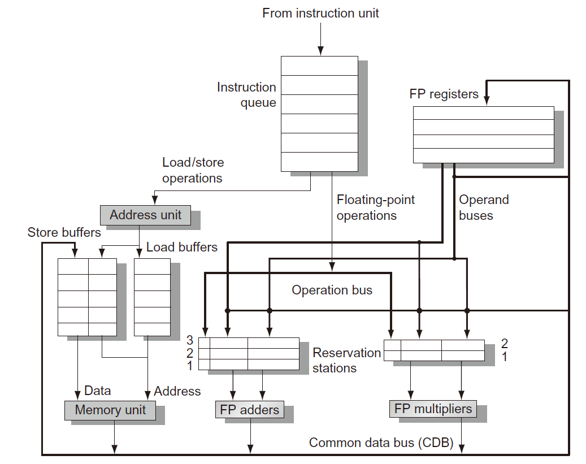

# CA8 指令级并行性 (2)

## Tomasulo 算法

- 提出
  - 动态确定某条指令何时可以执行
  - 重命名寄存器以避免不必要的危害
- 基本思路
  - 保留站尽快取入和缓存有效的操作数
  - 待执行指令说明为其提供操作数的功能单元
  - 在重叠执行期间，对同一个寄存器连续写操作，只有最后一个写操作用来实际更新寄存器
- 特点
  - 跟踪指令的操作数何时可用——最小化RAW危害
  - 寄存器重命名——最小化WAW和WAR危害

- 亮点
  - 保留站 reservation station：缓存待发出指令的操作数或关联的功能单元——完成寄存器重命名的工作
    - 缓存等待发出指令的操作数，并与功能单元关联
    - 指令不再需要从寄存器中获取操作数
  - 公共数据总线 common data bus：“广播”功能单元的执行结果
- 总线特点
  - 普通数据总线：数据+目——“去哪儿”总线
  - 公共数据总线：数据+源——“从哪来”总线

## Tomasulo算法处理器的基本结构

## 四个步骤

1. 发出issue/派遣dispatch
   - 从指令队列头部获得下已条指令（FIFO方式保证正确的数据流）
   - 如果保留站RS可用，则向其发出带有操作数数值的指令
   - 如果保留站RS不可用，则停顿该指令发出（结构危害）
   - 提示：使用保留站RS完成寄存器重命名，消除WAR和WAW危害
2. 执行
   - 当操作数可用时，将其存储到所有等待该操作数的保留站RS中
   - 当所有操作数都准备好时，发出该指令（对应功能单元执行操作）
   - 通过有效的地址计算，保持load和store指令的程序顺序
   - 分支指令完成执行前，其程序次序之后的指令不允许执行
   - 提示：直到所有操作数有效才执行指令，防止了RAW
3. 写结果
   - 讲计算结果写到公共数据总线上，供使用它的寄存器和保留站读取

## 几个问题

- 在一个周期内某个功能单元中可能有多条指令ready
  - 对于浮点数保留站，随机选择一条指令执行
  - 对于Load和Store指令执行还需要考虑附加的问题
- load和store指令需要两部执行
  - 当基址寄存器有效时，计算有效地址，放入load和store缓存器
  - 当存储单元有效时，马上执行load缓存器中load指令；store缓存器中的store指令需要等待将呗存储的数据有效后才被执行
  - 提示：load和store指令通过有效地址计算来维持程序次序，防止发生危害
- 维持中断行为
  - 分支转移指令执行完毕之前，不允许在程序顺序中其后的任何指令开始执行
  - 提示：保证在执行过程正引起中断的指令肯定会被执行

- 公共数据总线实现了向前和旁路机制
  - 生产者指令和消费者指令之间的有效延迟至少比功能单元产生结果延迟一个周期——原因是二者的匹配要在写结果后进行

## Tomasulo 算法具体实现

### 标签

将产生的源操作数的缓存器或单元

### 保留站

- Op：等待执行的操作
- Qj，Qk：产生对应源操作数的保留站号
  - 数值为0时表示源操作数已经有效
- Vj，Vk：源操作数的数值
  - 对于load指令，Vk保存地址偏移量
- A：用来保存load指令和store指令存储地址的计算信息
- Busy：表示该保留站和相应功能单元是否被占用

### 寄存器状态

- Qj：将向该寄存器存储计算结果的保留站号

### 延迟时间

load：1

add sub：2

mul：6

div：12

## 优缺点

### 优点

- 分布式危害检测逻辑
  - 由分布式RS和CDB实现
- 消除了WAR危害和WAW危害引起的停顿

### 缺点

- 硬件复杂
- 高速关联存储由于CDB导致性能限制
- 非精确中断

## 基于硬件的检测

### 原因

- 对于一个时钟周期执行多条指令的处理器，为了维持最大性能，每个时钟周期都需要执行分支指令
- 准确的分支预测结果不足以产生足够的指令级并行性
- 克服控制相关的限制，开发更多的并行性

### 推测

- 推测分支指令的执行结果，并按照推测结果来执行程序
- 不允许指令执行任何不可撤销的更改，直到这条指令不在基于推测执行

### 两者之间的差异

- 推测执行：根据预测结果，读入、发出和执行指令
- 动态调度：根据预测结果，读入和发出指令

### 三个关键思路

- 动态分支预测选择执行哪条指令

- 允许在解决控制相关之前，根据推测结果来执行指令
  - 必须具备撤销错误推测结果造成影响的能力
- 动态调度方法解决各种不同基本块之间组合的调度问题

### 推测执行必须是数据流执行

操作数一旦有效，马上执行

### 指令提交

当指令执行不再基于推测，则允许指令去修改寄存器文件或存储器

### 实现推测的关键思路

- 乱序执行，按序提交
- 在指令提交之前，防止发生任何不可撤销的操作（修改状态或发生中断）

## ROB：重排序缓存器

缓存指令处于完成和提交两种状态之间时的执行结果

与保留站相似方式提供的附加寄存器，以扩展寄存器组

### 关键不同

- 在Tomasulo算法中，一旦指令写结果，则后续发出的指令将从寄存器文件中读取操作数
- 加入推测机制后，指令提交后才更新寄存器文件，而在指令完成执行与指令提交之前时段内由ROB提供操作数

### 四个字段

- 指令类型：是否时branch/load/register
- 目标：指令结果将写入的寄存器号或存储器地址
- 数值：保存指令执行结果数值直到指令提交
- 就绪：表示指令执行完成状态

## 指令执行的四个步骤（带ROB）

- 发出
  - 指令队列头部获取一条指令
  - 如果RS和ROB有空闲单元
    - 有效操作数和分配的ROB号放入RS
    - 否则停止指令发出，结构危害
- 执行
  - 如果操作数无效，监视CDB等待——检查RAW危害
  - 当RS中两个操作数都有效，则执行操作——可能需要多个周期
    - load指令需要两部，store指令只需要基寄存器计算有效地址
- 写结果
  - 当结果有效，将结果和ROB号写入CDB，且从CDB传到ROB，同时传到需要该结果的所有RS
  - 对store指令，则将
- 提交
  - 当一条指令到达ROB头部且数据字段有效时，则使用数值更新寄存器，从ROB中移除该指令
  - 当store指令到达ROB头部且数据字段有效时，则使用数值更新存储器内容，从ROB中移除该指令
  - 当分支指令到达ROB头部
    - 如果预测结果错误，则放弃ROB中所有内容，从该分支指令的正确后继指令开始重新执行
    - 如果预测正确，则完成分支指令

## 推测与动态调度

动态调度机制：按序完成原则

推测机制：乱序完成原则

## 多发出和静态调度

为了使CPI<1

多发出三种类型

- 静态调度的超标量——按序执行
- 超长指令字 VLIW 处理器
- 动态调度的超标量——乱序执行
- EPIC 显式并行指令计算 静态调度

### 超长指令字处理器

- 将多个操作封装在一条指令中
  - 并行性有编译程序静态调度解决
- 增加代码量
- 同步操作约束
- 二进制代码兼容性

