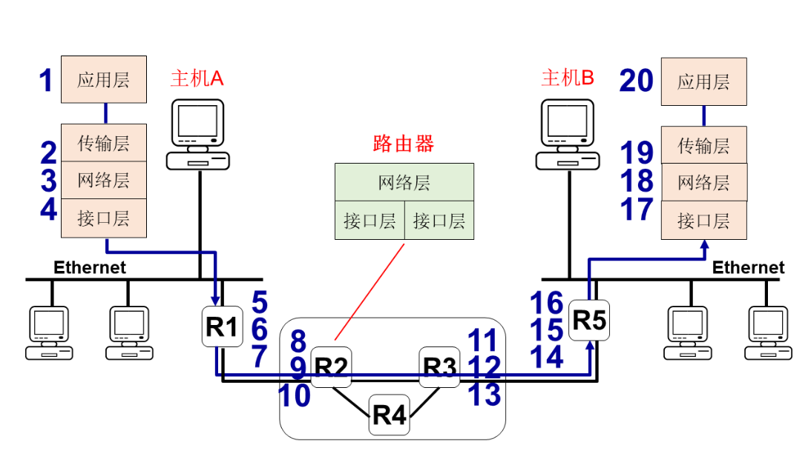

# 计算机网络 第一章 概述

## 1.1 计算机网络构成及基本概念

- 基本概念

  - 信息

  - 数据

  - 信号

  - 信道（有线与无线）

    - 信号频率与信道带宽

    - 信噪比（信号平均功率和噪声平均功率之比）

    - 信道容量（传输速率）：香农定理

      $C=W*log(1+\frac{S}{N})(bit/s)$，W为带宽（Hz）；S为信道内所传信号的平均功率；N为信道内部的高斯噪声功率

  - 串行/并行传输

  - 误码率、差错检测与纠正（CRC，汉明码）

  - 网络协议与协议标准

  - 协议数据单元

- 计算机连接的一般方法
  - 共享式连接
  - 交换式连接
- 类比电话交换机
  - 电路交换 电话交换机
  - 分组交换 交换机

- 扩展网络规模：网桥扩展、多交换机扩展

- 类比电话网络：电路交换、十分与频分多路复用；分组交换、统计多路复用

## 1.2 Internet发展历程

### ARPANET 初始结构（使用分组交换技术）

- TCP/IP 协议的设计与运用，实现异构网络互联

  TCP/IP 协议基于开放的网络体系结构，**开放性、兼容性**

- 互联网管理——自治系统 Autonomous System

  每个自治域分配一个自治域号

- 自治系统号码 http://bgp.he.net

- 网络服务提供商（ISP）及层次化结构

  - Tier-1  ISP

    全球最高级别ISP，互不结算

    中国电信、中国联通、AT&T、Deutsche Telekom...

  - Tier-2 ISP

    教育网、中国移动（往往需要像更高级别 ISP 交流量费）

  - IXP 或 IX：互联网交换点

### CERNET 结构 AS：4538

### 万维网问世：重要的里程碑

- 20 世纪 90 年代
- IPv6 与 Internet 2：解决 IPv4 地址问题
  - IPv4：32 位地址
  - IPv6：128 位地址，更合理的地址层次化结构
- 无线接入 （WiFi6/4G/5G），移动互联网及物联网的发展
  - 接入设备数量迅速增加
  - 移动应用非常丰富
- Internet 的三个重要概念
  - 开放理念
  - 自组织理念
  - 分享理念

### 互联网的标准化工作

#### 互联网协会 ISOC

- 互联网体系结构研究委员会 IAB
- 互联网研究部 IRTF
- 互联网工程部 IETF

所有互联网标准都已 RFC 的形式在互联网上发表

标准需要经过二个阶段：建议标准、互联网标准

## 1.3 Internet的核心与边缘

### 互联网结构

- 网络边缘
  - 主机：运行 TCP/IP 协议和应用的端系统，如 PC、云服务器、智能手机等
  - 接入网络：端系统通过优先网络或无线网络接入到核心网
- 网络核心
  - 由大量互联的路由器构成
  - 运行 IP 协议和路由协议

### 网络核心

- 报文分组转发

  将来自一个物理网络的报文分组转发到下一个物理网络

- 存储-转发式交换

  路由器对到达的报文分组进行缓存，只有整个报文分组完全到达且下一个物理网络链路空闲，才能被转发出去

### 简单路由器模型

分组转发率（Packet Per Second）：路由器或交换机等网络设备以分组为单位的转发速率（分组/秒）

### 网络核心：比较电路交换

- 先呼叫建立连接，实现端到端的资源预留
  - 预留的资源包括：链路带宽资源、交换机的交换能力
  - 具有和专用链路类似的性能
  - 资源专用，即使空闲也不与其他连接共享
- 频分多路复用（FDM），时分多路复用（TDM）

- 计算示例：主机A向主机B发送大小为640000bit的文件，计算所需的时间

  - 链路传输速率为1.536Mbps
  - 采用时分多路复用，24个共享连接
  - 建立连接的时间为500ms

  Rate 1.536Mpbs/24=64000bps

  tot time 0.5s+640000/64000=10.5s

### 网络核心：报文分组交换

主机A和B的报文分组没有固定的到达模式，带宽按需共享，称为统计多路复用（statistical multiplexing）。

- 路由器的缓存可以临时缓存报文分组，输出链路不需要支持N-R速率
- 单数缓存大小有限，记为B，如果缓存满了，会丢弃报文分组

统计多路复用增益=2C/R

- 网络流量具有很强的突发性
- 每个独立的流的峰值可能出现在不同时间

结论：**流越多，网络平均流量越平滑**

### 网络核心：传输时延

- 报文长度P：单位bit
- 链路长度L：单位m
- 传输速率R：单位bit/s
- 传播时延PROP：电磁波在介质上的传输时间，单位s，PROP=L/C
- 传输时间TRANSP：发送长度为P的报文所用时间，TRANSP=P/R。
- 端到端时延Latency：发送端发送第一位到接收端接受最后一位的时间，**单一链路**上计算方法为Latency=PROP+TRANSP

问题：为什么不直接发送报文，而使用报文分组？

- 可以将报文分成报文段传输可以降低端端时延
- 可以避免某条链路或路由器缓存被一个报文长时间占用

问题：报文分组到达时，如果出口链路忙，报文分组需要在路由器缓存中排队等待，会引入排队时延。

- 在给定链路长度和传输速率的情况下，只有排队时延是变化量
- 排队时延对网络性能会产生较大的影响（拥塞控制）。

- 往返时延RTT（Round-Trip Time）

  从发送方发送数据开始，到发送方收到来自接收方的确认经历的总时间。

- 时延带宽积

  - **时延带宽积=传播时延**带宽，按比特计数的链路长度

  - 若发送端连续发送数据，则在发送的第一个bit即将到达终点时，发送端就已经发送了时延带宽积个bit，这些bit都在链路上向前移动。

    只有链路管道都充满比特时，链路才得到了充分利用。

- 时延抖动

  - 变化的时延称为抖动（Jitter）
  - 时延抖动起源于网络的队列或缓冲，抖动难以精确预测
  - 在语音、视频多媒体业务中，抖动往往会严重影响用户体验

### 接入网络

如何将端系统连接到边缘路由器

- 有限接入
  - 用户数字线路（xDSL）
  - 混合光纤同轴电缆（HFC）
  - 光纤宽带（FTTH）
  - 以太网（Ethernet）
- 无线接入
  - 无线局域网（WiFi）
  - 移动通信网（4G/5G）

**注意：接入网速率、共享或专用**

### 接入网络：DSL

- 使用电话线连接到中心局CO
- DSL接入复用器分流数据和语音
- 非对称速率：最大19.2Mpbs上行，55Mpbs下行

### 接入网络：HFC

- 频分多路复用，数据和电视信号在不同频率上传输，数据通道是共享的
- 非对称：最大10Mpbs上行，30Mpbs下行

### 接入网络：其它有限接入

- 光纤宽带（FTTH）
  - GPON：下行最大2.488Gbps，上行最大1.244Gbps
  - EPON：下行最大1.25Gbps，上行最大1.25Gbps
- 以太网（Ethernet）
  - 最广泛的接入方式（机构）
  - 最大速率10Gbps（万兆以太）

### 接入网络：无线接入

- 无线局域网（WiFi）
  - 802.11/a/b/g<54Mpbs
  - 802.11n<600Mpvs
  - 802.11ac<1Gbps
  - 802.11ax(WiFi6)<9.6Gbps
- 移动通信网
  - 3G  CDMA 2000, TD-SCDMA, WCDMA
  - 4G TD-LTE 100/50Mpbs
  - 5G IMT-2020 20G/100Mpbs

### 接入网络：家庭网络、机构网络

## 1.4 TCP/IP 网络体系结构

### ISO/OSI参考模型与TCP/IP体系结构

应用层（应用层、表示层、会话层）、传输层、网络层、接口层（数据链路层、物理层）

IETF定义应用层、传输层、网络层

IEEE、3GPP等定义接口层

### TCP/IP体系结构

对等层通信，执行相关协议

### TCP/IP协议集

### 网络协议需要规定

- 计网中各实体之间数据交换必须遵守实现约定好的规则，这些规则称为协议
- 协议组成
  - 语法：数据与控制信息的结构或格式（协议数据单元PDU）
  - 语义：需要发出何种控制信息，完成何种动作以及做出何种相应
  - 时许：事件实现顺序的详细说明
- 对等性：通信的实体相同层次必须执行相同的协议

### TCP/IP协议栈实现

应用层-操作系统用户空间

传输层和网络层-操作系统内核 TCP/IP协议栈

数据链路层、物理层-接口层 驱动程序+网卡

## 1.5 Web服务器访问示例

- 应用编程接口 应用请求与主机B建立连接
- 传输层
  - 创建连接建立TCP段
  - 调用IP层提供的服务，发送TCP段到主机B
- 网络层
  - 创建IP数据包
  - 调用接口层提供的服务，发送IP数据报到下一跳路由器
- 接口层
  - 接受以太数据帧，判断地址、差错校验
  - 如果正确，将IP数据包传给IP层
- 网络层
  - 使用IP的目的地址确定下一跳路由器
  - 请求接口层发送数据包

接口层

- 创建以太数据帧
- 请求物理层按位发送数据帧

……

