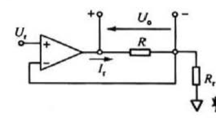
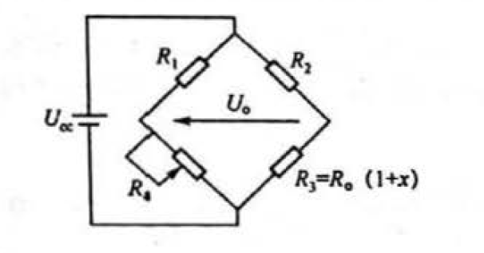

# 感知技术期末考前复习 第 3 章 电阻、电容和电感的传感原理与测量方法

梦回高中物理（bushi）

## 3.2 电阻传感器与电阻参数的测量（重点:warning:）

### 3.2.1 电阻传感器原理与电阻测量问题

电阻传感器的基本原理时将被测物理量或化学量变化转换成电阻值的变化，再通过测量阻值变化得到被测信号。

低阻（需要考虑引线电阻和接触电阻）、中阻、高阻、超高阻。

### 3.2.2 测量电阻时需要考虑的问题和方法

#### 1. 考虑主要问题——自热、引线电阻、非线性

以电阻值变化为特征的敏感器件，检测电路需满足两项基本要求：

1. 电阻变化本事不能提供信号输出必须为敏感电阻提供驱动电压或电流
2. 电流流过电阻会发热，必须考虑电阻自热因素

导体电阻与温度间的关系可表示为：

$R=R_0[1+\alpha_1(T-T_0)+\alpha_2(T-T_0)^2+...+\alpha_n(T-T_0)^n]$

其中，$R_0$ 是参考温度 $T_0$ 处电阻值。

线性范围内，可简化为：$R=R_0[1+\alpha(T-T_0)]$，α 为两个参考温度处测得的电阻值估算出的电阻温度系数，也称相对灵敏度。$\alpha=\frac{R_{t_2}-R_{t_1}}{(t_2-t_1)R_{t_1}}$

#### 2. 测量电阻的一般方法

1. 偏转法(重点:warning:)

- 流经参考电阻 $R_r$ 的电流为 $I_r=\frac{U_r}{R_r}$。

- 传感器上电压为 $U_o=I_rR=\frac{U_r}{R_r}R_0(1+x)$

- 显然，电路输出 $U_0$ 与传感电阻变化了 x 呈线性关系，但存在零位电压 $\frac{U_rR_0}{R_r}$。

- 如果 $x<<1$，对应 x 输出电压将叠加在一个很大的零位电压上。因此该电路适合阻值变化范围较大即 x 较大的情况（如热敏电阻）。

- 通过后续调理电路从输出电压中减去零位电压值，去 $R_r=R_0$，则从 $U_0$ 中减去 $I_0R_0$ 得到的输出为：

  $U_s=U_0-I_rR_r=U_r(1+x)-U_r=U_rx$

2. 分压法

   略略略

3. 电桥法

桥位电阻比 $k=R_1:R_4=R_2:R_3=R_2:[R_0(1+x)]$

## 3.3 电容传感器原理与电容参数的测量

### 3.3.1 电容传感原理

通交流，阻直流

电容公式：$C=\frac{\epsilon_0\epsilon A}{d}$

ε0 为介电常数，ε 为电介质相对介电常数，A 为平板重叠部分的面积，d 为间隔距离。

电容传感器的优点：分辨率高、动态响应好、结构简单。缺点：量程小、输出阻抗高、抗干扰能力差

如果将板子位移 x，距离变为 d-x，则电容 $C_x=\frac{\epsilon_0\epsilon A}{d-x}$

电容的相对变化率 $\frac{\Delta C}{C}=\frac{C_x-C}{C}=\frac{x}{d}(1-\frac{x}{d})^{-1}$

当 $\frac{x}{d}<<1$ 时，$\Delta C=C\frac{x}{d}[1+\frac{x}{d}+(\frac{x}{d})^2+(\frac{x}{d})^3+...]$

灵敏度为：$K=\frac{\Delta C}{x}=\frac{C}{d}[1+\frac{x}{d}+(\frac{x}{d})^2+(\frac{x}{d})^3+...]=\frac{\epsilon_0\epsilon A}{d^2}[1+\frac{x}{d}+(\frac{x}{d})^2+(\frac{x}{d})^3+...]$

因此灵敏度与极距的平方成反比。

此外，还可以测量 d+x 的电容和 d-x 的电容，两式相减得到差动方程，消去非线性的偶次项，降低了非线性性。

## 3.4 电感传感器原理与电感参数的测量

### 3.4.1 电感的传感原理

#### 自感式传感器工作原理与类型

- 变气隙型自感式传感器：灵敏度高，但是非线性严重
- 气隙面积变化型自感式传感器
- 螺管型自感式传感器

#### 互感式传感器工作原理与类型

电磁感应中的互感现象。本质上是一个变压器

### 3.4.2 电感参数的测量

#### 双线圈（差动）的测量

差动整流电路

相敏检波电路

