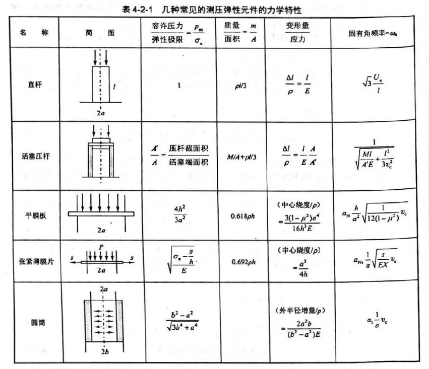
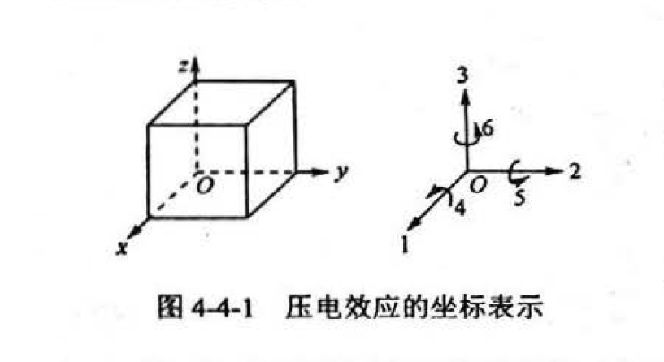

# 感知技术期末考前复习 第 4 章 传感器中常用的物理效应与器件

## 4.1 概述

### 4.1.2 功能材料类型与特点

制作传感器的材料要求：变换功能大、感应范围广、灵敏度和精度高、稳定性和再现性好、体积小、结构简单、使用寿命长

制作材料：贵金属（用得最多）；半导体；功能陶瓷；功能高分子

无机功能材料

- 金属功能材料
  - 磁功能材料
  - 电功能材料
  - 热功能材料
  - 力功能材料
  - 化学功能材料
- 非金属功能材料（半导体、玻璃、陶瓷、其它）
  - 磁功能材料
  - 电功能材料
  - 热功能材料
  - 力功能材料
  - 光功能材料

有机功能材料（高分子材料）

- 电功能材料
- 光功能材料
- 力功能材料
- 化学功能材料

复合功能材料

- 高分子系复合功能材料
- 金属系复合功能材料
- 陶瓷系复合功能材料

## 4.2 弹性效应和弹性元件

### 4.2.1 弹性敏感元件的基本特性

输出-输入特性一般可表示为：$y=\sum_{i=0}^\infty a_ix^i$

#### 弹性元件的特性

1. 刚度：弹性元件受外力作用下变形大小的量度表示。

   刚度 $k=\underset{\Delta\omega\rightarrow\infty}{\lim}(\frac{\Delta F}{\Delta\omega})=\frac{dF}{d\omega}$

2. 灵敏度：灵敏度是刚度的倒数。

   灵敏度 $K=\frac{d\omega}{dF}$

   当弹性元件并联时，$K=(\underset{i=1}{\overset{n}{\sum}}K_i^{-1})^{-1}$

   当弹性元件串联时，$K=\underset{i=1}{\overset{n}{\sum}}K_i^{-1}$

### 4.2.2 弹性元件的材料性能及稳定性处理

弹性储能（应变能）

常用的弹性合金：高弹性合金；恒弹性合金

非金属弹性材料：陶瓷、半导体硅

特殊合金材料

- 铝、铜及钛合金
- 铌基合金

#### 弹性元件材料的稳定性处理

时效处理；退火；反复加载和机械振动；冷处理

## 4.3 电阻应变效应和压阻效应及器件

### 4.3.1 电阻应变原理和电阻应变片（重点:warning:）

电阻应变是力的作用的结果。

应力：力/受力面积 $P=\frac{+F}{A}$（正号表示拉应力）

应力作用产生应变，应变：长度变化/未加应力时的原长 $\epsilon=\frac{\pm\Delta l}{l}$（正号表示拉伸，负号表示压缩）

纵向应变，应变与应力成线性关系，直线的斜率为物体的弹性模量 $E=\frac{P}{\epsilon}$

应变片是一种金属或半导体材料制成的元件，当元件受外力作用产生应变时，其电阻值发生变化。设元件长度 l，横向面积为 A，电阻率为 ρ，则其电阻为 $R=\frac{\rho l}{A}$

其中三个变量都可能发生变化，因此：$\Delta R$$=\frac{\partial R}{\partial l}$$\Delta l$$+\frac{\partial R}{\partial A}$$\Delta A+\frac{\partial R}{\partial\rho}$$\Delta\rho$

代入阻值公式得 $\Delta R=\frac{\rho}{A}\Delta l-\frac{\rho l}{A^2}\Delta A+\frac{l}{A}\Delta\rho$

两边同时除以 R，得 $\frac{\Delta R}{R}=\frac{\Delta l}{l}-\frac{\Delta A}{A}+\frac{\Delta\rho}{\rho}$

$\frac{\Delta l}{l}$ 为纵向应变 $\epsilon_L$，横截面积 $A=Wt$，W 为宽度，t 为厚度。因此 $\frac{\Delta A}{A}=\frac{\Delta W}{W}+\frac{\Delta t}{t}=2\epsilon_T$

式中 $\epsilon_T$ 为元件的横向应变。根据材料力学原理有 $\epsilon_T=-\mu\epsilon_L$，其中 μ 称为泊松比，其值由材料决定。

将式子代入得 $\frac{\Delta R}{R}=\epsilon_L-2\epsilon_T+\frac{\Delta\rho}{\rho}$

定义应变片的灵敏系数 K 为电阻的应对变化与应变变化，即 $K=(\Delta R/R_0)/\epsilon_L$

$R_0$ 是无应变时变片的电阻。

### 4.3.2 应变片和应变式传感器的特点及应用

#### 应变片的应用

应变片主要用于结构的应力和应变分析、用作不同物理量传感器的转换元件。

1. 应变片贴于待测构件测量部位，直接测量应力或应变。
2. 应变片贴于弹性硬件上，弹性元件为敏感元件，应变片为转换元件。

常用电桥法，克服非线性性，提高灵敏度

#### 应变式传感器的主要特点

- 测量范围广
- 线性度好
- 频率响应好
- 性能稳定，工作可靠，性价比高
- 能在恶劣环境、大加速度和振动条件下工作
- 必须考虑应变片横向效应引起的横向灵敏度与温度影响的补偿问题

### 4.3.3 压阻效应

#### 影响压阻系数的因素

半导体材料中扩散杂质的表面浓度和晶向。

## 4.4 压电效应与器件

### 4.4.1 压电效应与材料

#### 压电效应（重点:warning:）

外力沿压电材料特定晶向作用使晶体产生形变，在相对的两个晶面上产生电荷，去掉外力后压电材料又重回不带电的状态，这种由外力作用产生电极化的现象称为正压电效应。

压电效应是可逆的，即在压电材料特定晶向施加电场时，不仅有极化现象发生，还将产生机械形变；去掉电场，应力和形变也随之消失，这种现象称为逆压电效应。

外力 F 沿特定方向作用于压电晶体时，在相对的晶面上产生电荷 Q，其关系为 $Q=dF$，d 为压电常数，描述压电效应的强弱程度。当考虑外力作用方向（晶向）和特定的产生电荷的晶面（垂直晶向的表面）之间的关系时表示为：$q_i=\underset{j=1}{\overset{6}{\sum}}d_{ij}\sigma_j\ (i=1,2,3)$，i 代表 x，y，z 三个轴，j 的 1 2 3 代表沿 x y z 轴方向作用的应力，4 5 6 分别表示作用在垂直于 x y z 轴方向上的剪切应力，如下图表示

压电晶体的对称性越低（各向异性越明显），压电常数越大；反之则越小。

可以将三个极化方向和 6 个独立的应力分量表示成三行六列矩阵，它能反应压电晶体的弹性应变与其压电性能的耦合关系。压电常数单位为 C/N。

矩阵表达式为：
$$
\begin{bmatrix}
q_1\\q_2\\q_3
\end{bmatrix}
=
\begin{bmatrix}
d_{11}&d_{12}&d_{13}&d_{14}&d_{15}&d_{16}\\
d_{21}&d_{22}&d_{23}&d_{24}&d_{25}&d_{26}&\\
d_{31}&d_{32}&d_{33}&d_{34}&d_{35}&d_{36}&
\end{bmatrix}
\begin{bmatrix}
\sigma_{1}\\\sigma_{2}\\\sigma_{3}\\\sigma_{4}\\\sigma_{5}\\\sigma_{6}\\
\end{bmatrix}
$$
q 为垂直于三个坐标轴方向的晶面上的电荷密度，σ 1-3 为作用三个坐标轴方向上的力， 4-6 为剪切应力。

与逆压电效应类似的还有电致伸缩效应。作用在电介质上，与电场方向无关，应变大小与电场强度的平方成正比。

#### 压电材料

石英晶体（最早、最重要、用量最大）

新型压电材料（人造晶体被淘汰、人造压电石英、压电陶瓷、最常用的是锆钛酸铅）

### 4.4.2 压电元件的等效电路和测量电路（重点:warning:）

把压电材料垂直于极化方向的表面镀上金属电极、接上引线即可构成压电元件。压电元件是压电式传感器的敏感元件，它受外力作用时会在垂直于电轴或垂直于极化方向的表面产生电荷，在一个表面上聚集正电荷，在另一个表面上聚集负电荷，因此，压电传感器可视为一个静电荷发生器。

当压电元件两表面聚集电荷时，就是一个电容器，电容量为 $C_a=\epsilon s/t=\epsilon_r\epsilon_0s/t$

s 为极板面积，t 为压电元件厚度，ε 为压电材料的介电常数。

压电元件可等效为一个电荷源与一个电容并联的等效电路 $u_a=q/C_a$

压电元件也可等效为一个电压源和一个电容串联的等效电路。

由于压电元件的输出信号非常微弱，一般需要将电信号进行放大才能实现测量。但压电元件内部阻抗高，难以直接放大。因此需要用电压前置放大器（阻抗变换器）进行前置放大。

压电元件输出可以是电压（电压发生器），也可以是电荷（电荷发生器）

#### 压电加速度传感器

压电加速度计

## 4.5 光电效应与传感器件

### 4.5.1 光电效应（重点:warning:）

物质在光照的作用下释放电子的现象称为光电效应。光电子在外电场作用下行成的电流叫光电流。光电流大小和入射光频率有关。

#### 外光电效应（复习高中物理）

光电子溢出金属表面：$\frac{1}{2}m_cv_0^2=h\nu-\phi>0$

极限频率：$v_0=\phi h^{-1}$，光频率：$\nu=c\lambda^{-1}$，极限波长为：$\lambda_0=ch\phi^{-1}$

极限频率 $\nu_0$ 越低，极限波长越长，越容易发生光电效应。

应用：光电管、光电倍增管……

#### 内光电效应

释放的电子留在物体内部，使物体的电导率发生变化或产生光生电动势。分为光电导效应和光生伏特效应两类

1. 光电导效应。

   入射光强改编物质的电导率。光电子获得能量，跃迁称为自由电子（载流子）。同时价带行成自由空穴，构成电子 - 空穴对。随着自由电子和价带自由空穴的浓度增加，使得半导体的电阻率下降。电子和空穴统称载流子，载流子在端电压的作用下可行成光电流。

   应用：光敏电阻、光敏二极管

   无光照时的电阻：暗阻，电流：暗电流

   有光照时的电阻：亮阻，电流：亮电流

   光电流 = 亮电流 - 暗电流

   光敏电阻种类很多，一般由金属硫化物、硒化物、碲化物制成。结构简单、电路连接方便、灵敏度高、光谱范围广、体积小、性能稳定、价格低，被广泛用于检测系统

2. 光伏特效应

   光照产生电动势。要有电场。

   应用：光敏二极管、光电池、半导体位置敏感元件

### 4.5.2 光电效应主要器件及基本特性

#### 内光电效应器件

- 光电池
- 光敏二极管
- 光敏三极管
- 光敏电阻

### 4.5.5 红外传感器原理与探测器特点

#### 红外探测器的分类与特点

基于热效应的热探测器

- 热释电探测器
- 热电偶探测器
- 热电阻
- 气动探测器

基于光电效应的光子探测器

- 光电导探测器
- 光生伏特探测器
- 光电子探测器

#### 红外探测器的性能参数

1. 响应率
2. 光谱响应
3. 噪声等功率 NEP
4. 探测率 D
5. 响应时间

## 4.6 光纤传感器与原理

### 4.6.1 光纤传感原理

光纤传感器优点：灵敏度高、抗电磁干扰能力强、耐腐蚀、电绝缘性好、光路可弯曲，易于连接计算机、结构简单、体积小、耗电少

光波方程描述：$\bold E=E_0\cos(\omega t+\phi)$

#### 光纤结构

纤芯、包层、外套

#### 光纤种类

1. 阶跃型光纤 SIF
2. 渐变型光纤 GIF
3. W 型光纤（双包层光纤）

#### 光纤传感器的组成

- 光源
- 光纤耦合器
- 光探测器

## 4.7 磁电效应和磁敏器件（高中物理）

### 4.7.1 磁电效应与器件结构（重点:warning:）

电磁感应定律：$e=-W\frac{d\Phi}{dt}$

感应电动势大小 e 取决于线圈匝数 W，和磁通变化率。

磁电式传感器可分为：动圈式、动磁铁式、磁阻式

线圈切割磁感线的感应电动势为：$e=WBlv_y$

### 4.7.2 霍尔效应与半导体器件（重点:warning:）

#### 霍尔效应

（半）导体在均匀磁场中，通入电流时，在宽度上产生一个横向电场，这一电场称为霍尔电场，产生的电动势为霍尔电势。

本质：磁场中运动电荷受洛伦兹力作用的结果

当电子速度与磁场垂直时，感应电动势大小：$U_H=R_HIB/d$，$R_H$ 为霍尔系数

当不垂直时，$U_H=R_HIB\cos\theta/d$。

#### 霍尔元件

霍尔电极，磁场方向垂直于元件面

#### 霍尔元件的主要参数和特征

- 输入电阻 $R_{IN}$ 和输出电阻 $R_{OUT}$。
- 额定控制电流 $I_c$
- 灵敏度
- 磁场的线性
- 不平衡电压
- 温度特性

### 4.7.5 磁敏器件的应用

天文、地理、医学……

两类

- 直接利用其检测磁场的功能

  计算机存储

- 间接应用

  运动信息（位置、位移、速度、压力等）

## 4.8 磁致伸缩效应和压磁效应

### 4.8.1 磁致伸缩效应

磁畴

有外磁场作用时，磁畴的磁偶极矩矢量方向转向于外磁场平行方向，被磁化。

当外磁场很强时，呈现磁饱和现象

**磁偶极矩变化使得磁畴之间的界限变化，晶界位移，从而使得材料产生机械形变**，被称之为磁致伸缩效应。

正磁伸缩：受拉时，受力方向上磁导率增高

负磁伸缩：受拉时，受力方向上磁导率降低

### 4.8.2 压磁效应

压磁效应是磁导伸缩效应的逆效应。

铁磁材料在外力作用下产生应变，磁畴之间界限变化，晶界发生位移，导致磁偶极矩变化，使材料的磁化强度发生变化。这种应力改变铁磁材料磁化强度的现象叫做压磁效应。

压磁效应表现为压应力时，力作用方向的磁导率 μ 减小，垂直作用力方向的磁导率 μ 增大；拉应力的时候情况相反。

利用磁导率的变化与应力的关系可做成压磁传感器，用来测量压力、拉力、弯矩、力矩。

## 4.9 热阻效应、热电效应和热释电效应

### 4.9.1 热阻效应与热敏器件

原理：物质的电阻率随温度变化。

- 金属热电阻
  - 一般温度越高，电阻率越大 $R_t=R_0(1+\alpha(t-t_0))$
  - 电阻的灵敏度 $K=R_0^{-1}\frac{dR_t}{dt}=\alpha$
  - 金属电阻的 α 一般在 0.003 ~ 0.006 之间，在一定温度范围内可看作常数

- （半导体）热敏电阻
  - 温度越高，电阻率越大

### 4.9.2 热电效应及器件

把两种不同材料的导体串联成闭合回路，当两节点处温度不同时，回路中将产生感应电动势并产生回路电流。这种由温差产生热电势的现象称为热电效应（塞贝克效应）。

热电动势=接触电势+温差电势

## 4.10 与声波有关的效应与器件（重点:warning:）

### 4.10.1 超声波检测的原理和超声波换能器

超声波频率高（一般能达到 $10^9Hz$）、波长短、绕射现象小。方向性好，能称为射线定向传播。在固体液体中衰减很小。

通过超声发生器将超声波发射出去，再将接收回来的超声波变换成电信号，完成这种工作的装置叫超声波传感器。发射和接收部分称为超声波换能器或超声波探头。超声波传感器可测量液位、流量、速度、浓度、厚度等参量用于无损探伤。

#### 超声波传感器的工作原理

超声波传感器检测各种非声量是通过对某些媒质的声学特性的测量来进行的。超声测量中应用最广的声学特性就是媒质的声速。在声速已知的媒质中可利用声波传播距离与时间的关系或波长与频率的关系进行超声测距。

采用测声阻抗率的方法也即测传感器对媒质的辐射阻抗率，可测量媒介的密度、弹性模量、液体的粘度、密度等非声量。声衰减法也可测非声量，但精度低。

#### 压电换能器结构

超声波换能器按其结构可分为直式换能器、斜式换能器、表面波换能器、兰姆波换能器、聚焦换能器等形式。

按照其作用原理，有：压电式、磁致伸缩式、电磁式等。