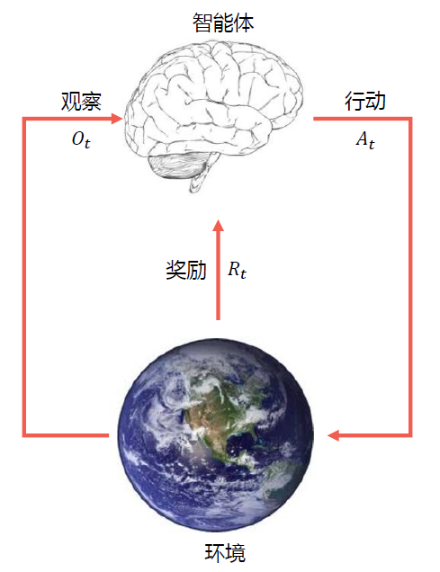

授课老师：张伟楠 STJU

# 强化学习简介

## Review：两种机器学习类型

### 预测型

- 根据数据预测所需输出（**有监督**）

  根据 $P(x)$ 预测 $P(y|x)$

- 生成数据实例（**无监督**）：$P(x,y)$

### 决策型

在动态环境中采取行动（**强化学习**），此处行动会引起环境中的改变

- 转变到新的状态
- 获得即时奖励
- 随着时间的推移最大化累计奖励

## 强化学习的定义

通过从交互中学习来实现目标的计算方法 (Learning from the interaction with environment)

智能体（agent）通过观察（observation），决策行动（action）以获得奖励（reward）。

*智能体和非智能体的区别：能通过行动改变环境，不仅仅是预测*

三个方面：

1. 感知：在某种程度上感知环境的状态
2. 行动：可以采取行动来影响状态或达到目标
3. 目标：随着时间推移最大化累积奖励

## 强化学习交互过程

在每一步 $t$，

- 智能体：获得观察 $O_t$，获得上一轮到这一轮的奖励 $R_t$，执行行动 $A_t$
- 环境：获得行动 $A_t$，给出观察 $O_{t+1}$，给出奖励 $R_{t+1}$
- $t$ 在环境这一步增加为 $t+1$

## 强化学习系统要素

### 历史

观察、行动和奖励的序列：$H_t=O_1,R_1,A_1,O_2,R_2,A_2,...,O_{t-1},R_{t-1},A_{t-1},O_t,R_t,A_t$

- 即一直到时间 $t$ 为止的所有可观测变量
- 根据这个历史可以决定接下来会发生什么
  - 智能体选择行动
  - 环境选择观察和奖励

### 状态（state）

- 是一种用于确定接下来会发生的事情（action、observation、award）的信息

  状态时关于历史的函数 $S_t=f(H_t)$

### 策略（policy）

智能体在特定时间的行为方式

- 是从状态到行动的映射
- 确定性策略（Deterministic Policy）：$a=\pi(s)$
- 随机策略（Stochastic Policy）：$\pi(a|s)=P(A_t=a|S_t=s)$，是一个条件分布

### 奖励（Reward）

- 一个定义强化学习目标的标量
- 能立即感知到什么是“好”的

### 价值函数（Value Function）

用于评估给定策略下状态的好坏

- 状态价值是一个标量，用于定义**对长期来说**什么是“好”的

- 价值函数是对于未来累计奖励的预测

  - 用于评估在给定策略下，状态的好坏

    $v_{\pi}(s)=\mathbb{E}_\pi[R_{t+1}+\gamma R_{t+2}+\gamma^2R_{t+3}+...+|S_t=s]$，其中 $\gamma\in(0,1)$

### 环境的模型（Model）

用于模拟环境的行为

- 预测下一个状态

  $\mathcal{P}_{ss'}^a=\mathbb{P}[S_{t+1}=s'|S_t=s,A_t=a]$

- 预测下一个（**立即**）奖励

  $\mathcal{R}_s^a=\mathbb{E}[R_{t+1}|S_t=s,A_t=a]$

## 以迷宫为例

状态：智能体的为止

行动：N E S W

状态转移：根据行动方向朝下一格移动（如果行动方向是墙则不动）

奖励：每一步为 -1

给定一个确定性策略，根据策略可以反推各个状态下的价值函数

## 强化学习智能体分类

### 根据是否已知（环境）模型两类

#### 基于模型的强化学习（model-based）

- 策略（和/或）价值函数
- 环境模型已知
- 比如：迷宫游戏、围棋等

#### 模型无关的强化学习（model-free）

更接近真实情况，真正和环境进行交互（更难、更加 data-hungry）

- 策略（和/或）价值函数
- 没有环境模型
- 比如：Atari 游戏的通用策略：
  - 游戏规则未知
  - 从交互游戏中学习
  - 在操纵杆上选择行动并查看分数和像素画面

### 基于价值还是基于策略？

- 基于价值：没有策略（隐含）、有价值函数

- 基于策略：有策略、没有价值函数

- Actor-Critic：有策略、也有价值函数

# 探索与利用

## 探索与利用

### 序列决策任务中的一个基本问题

基于目前策略获取已知最优收益还是尝试不同的决策

- exploitation （利用）执行能够获得已知最优收益的决策
- exploration（探索）尝试更多可能的决策，不一定会是最优收益

当前策略不一定是最优策略，通过探索与利用，更新当前策略，以接近最优策略。

根据 $\epsilon_t=\{\pi_t^i|i=1,2,...,n\}$ 探索 $\epsilon_{t+1}=\{\pi_t^i|i=1,...,n\}\cup\{\pi_e^j|j=1,...,m\}$

$\exist V^*(\cdot|\pi_t^i\sim\epsilon_t)\leq V^*(\cdot|\pi_{t+1}^i\sim\epsilon_{t+1})$，其中，$\pi_{t+1}^i\sim\{\pi_e^i|i=1,...,m\}$

探索：**可能**发现更好策略

### 策略探索的一些原则

朴素方法（Naive Exploration）：添加策略噪声 $\epsilon-greddy$

积极初始化（Optimistic Initialization）

基于不确定性的度量（Uncertainty Measurement）

- 尝试具有不确定收益的策略，可能带来更高的收益

概率匹配（Probability Matching）

- 基于概率选择最佳策略

状态搜索（State Searching）

- 探索后续状态可能带来更高收益的策略

## 多臂老虎机（multi-arm bandit）

### 形式化描述

动作集合：$a^i\in\mathcal A,i=1,...,K$

收益（反馈）函数分布：$\mathcal R(r|a^i)=\mathbb P(r|a^i)$

$<\mathcal A,\mathcal R>$

最大化累积时间的收益：$\max\sum_{t=1}^Tr_t,r_t\sim\mathcal R(\cdot|a)$

### 收益估计

- 期望收益和采样次数的关系

  $Q_n(a^i)=\frac{r_1+r_2+...+r_{n-1}}{n-1}$

- 缺点：每次更新的空间复杂度是 $O(n)$

改进：增量实现

$Q_{n+1}(a^i)=\frac{1}{n}\sum_{i=1}^nr_i=\frac{1}{n}(r_n+\frac{n-1}{n-1}\sum_{i=1}^{n-1}r_i)=\frac{1}{n}r_n+\frac{n-1}{n}Q_n=Q_n+\frac{1}{n}(r_n-Q_n)$

误差项：$\Delta_n^i=r_n-Q_n$

空间复杂度为 $O(1)$

### 算法：多臂老虎机

1. 初始化：$Q(a^i)=c^i,N(a^i)=0,i=1,...,n$
2. 主循环 $t=1:T$
   - 利用策略 $\pi$ 选取某个动作 $a$
   - 获取收益：$r_i=Bandit(a)$
   - 更新计数器：$N(a)=N(a)+1$
   - 更新估值：$Q(a)=Q(a)+\frac{1}{N(a)}[r_t-Q(a)]$

应当选取什么样的策略 $\pi$？

### Regret 函数

- 决策的期望收益：$Q(a^i)=\mathbb E_{r\sim\mathbb P(r|a^i)}[r|a^i]$
- 最优收益：$Q^*=\max_{a^i\in\mathcal A}Q(a^i)$

#### Regret

- 决策与最优决策的收益差：$R(a^i)=Q^*-Q(a^i)(>0)$
- Total Regret 函数：$\sigma_R=\mathbb E_{a\sim\pi}[\Sigma_{t=1}^TR(a_t^i)]$

#### 等价性

- $\min\sigma_R=\max\mathbb E_{a\sim\pi}[\Sigma_{t=1}^TQ(a_t^i)]$

*必须要一直探索吗？*

> 如果一直探索新策略：$\sigma_R\propto T\cdot R$，total regret 将线性递增，无法收敛
>
> 如果一直不探索新策略：$\sigma_R\propto T\cdot R$，total regret 将线性递增

*是否存在一个方法具有次线性 (sublinear) 收敛保证的 regret?*

#### 下界（Lai & Robbins）

使用 $\Delta_a=Q^*-Q(a)$ 和反馈函数分布相似性：$D_{KL}(\mathcal R(r|a)||\mathcal R^*(r|a))$ 描述。

$\lim_{T\rightarrow\infty}\sigma_R\ge\log T\sum_{a|\Delta_a>0}\frac{\Delta_a}{D_{KL}(\mathcal R(r|a)||\mathcal R^*(r|a))}$

#### 贪心策略和 ε-greedy 策略

贪心策略是线性增长的 Total regret

ε-greedy 策略

- 以 1-ε 概率去采样 argmax Q(a)，以 ε 概率做 uniform 的探索
- 常量 ε 保证 total regret 满足 $\sigma_R\ge\frac{\epsilon}{|\mathcal A|}\sum_{a\in\mathcal A}\Delta_a$
- total regret 仍然是线性递增的，知识增长率比贪心策略小

#### 衰减贪心策略

- ε-greedy 策略的变种，ε 随着时间衰减
- 理论上对数渐进收敛
- 但是很难找到合适的衰减规划

#### 积极初始化

- 给 $Q(a^i)$ 一个较高的初始化值
- 增量式蒙特卡洛估计更新 $Q(a^i)$
- 有偏估计，但是随着采样增加，偏差带来的影响会越来越小
- 仍然可能陷入局部最优

#### 显式考虑动作的价值分布

1. 显示鼓励不确定性
2. 直接根据分布采样来选择 

#### 基于不确定性测度

不确定性越大的 $Q(a^i)$，越具有探索价值，越有可能是最好的策略

一个经验性的指导：

- N(a) 大，U(a) 小
- N(a) 小，U(a) 大
- 策略 $\pi$：$a=\arg$$\max_{a\in\mathcal A}\hat{Q}(a)$$+\hat U(a)$

也成为 UCB：上置信界法 upper confidence bounds

（数学证明略，听不懂）

#### Thompson Sampling 方法

根据每个动作成为最优的概率来选择动作

（公式一大坨，看不懂）

实现：根据当前每个动作的价值概率分布来采样到其价值，选择价值最大的动作

## 总结

- 探索与利用是强化学习中 trail-and-error 中的必备技术
- 多臂老虎机可以被看成是无状态强化学习
- 躲避老虎机是研究探索和利用技术理论的最佳环境
- ε-greedy、UCB 和 Thompson Sampling 方法在多臂老虎机任务中十分常用，在强化学习探索中也十分常用，最常见的是 ε-greedy

