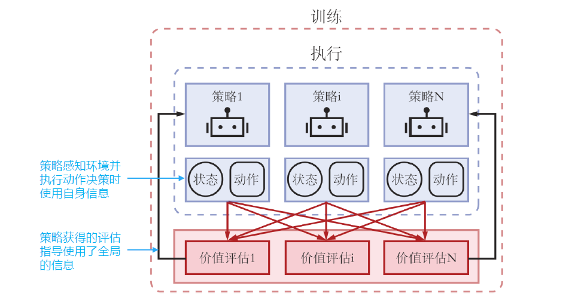

# MARL 简介

强化学习：智能体与环境交互，智能体感知环境结果，做出动作，得到环境反馈的奖励。

环境要是**稳态**的：某些分布是确定不变的，否则不能保证强化学习的收敛性

## MARL 的例子

去中心化的游戏人工智能

- 为复杂的集体游戏智能设计多智能体通信和协同学习的算法
- 英雄联盟、星际争霸等

城市交通

- 车辆路由策略

- 交通灯控制
- 车队管理以及出租车调度

分拣机器人

## MARL 的难点

原理上困难

- 多智能体不仅要与环境交互，还要相互进行交互
- 将其它智能体当作环境的一部分进行学习，会导致训练出的智能体不稳定！因为理论上这样定义环境不稳定（数据分布非稳态），训练过程不收敛

# MARL 问题定义

环境的稳态：条件概率的分布是固定的

序贯决策的三种问题

1. 马尔可夫决策过程
   - 一个智能体
   - 多个状态
2. 重复博弈
   - 多个智能体
   - 一个状态
3. 随机博弈（马尔可夫博弈）
   - 多个智能体
   - 多个状态

MARL 的任务属于随机博弈

### 随机博弈

表格型强化学习设置下，每个状态对应一个博弈表格

每个时间步，所有智能体在当前博弈表格中同时选择自己的动作

根据智能体共同决定的博弈表格单元分配给智能体奖励

博弈根据状态和联合动作转移到下一个状态，对应另一个博弈表格

一般情况下，奖励值随时间步衰减

### 随即博弈的问题定义

一个随机博弈可以定义成元组 $(N,\mathcal S,\mathcal A,\mathcal R,p,\gamma)$

- $N$ 是智能体的数目
- $\mathcal S$ 是所有智能体的状态集合
- $\mathcal A=A_1\times A_2\times\cdots\times A_N$ 是所有智能体的动作集合
- $\mathcal R=r_1\times r_2\times\cdots\times r_N$ 是所有智能体的奖励函数集合
- $p:\mathcal S\times\mathcal A\rightarrow\Omega(\mathcal S)$ 是环境转移的概率，其中 $\Omega(\mathcal S)$ 在 $\mathcal S$ 的分布集合
- $\gamma\in(0,1)$ 是奖励随时间步的衰减因子

对于一个随即博弈中的每一个智能体 $i$，其策略表示为：$\pi_i:\mathcal S\rightarrow\Omega(A_i)$

所有智能体的联合策略可表示为 $\textbf π=[\pi_1,\cdots,\pi_N]$

所有智能体的联合动作可表示为 $\textbf a=[a_1,\cdots,a_N]$

基于联合策略 $\textbf π$，智能体 $i$ 在状态 $s$ 下的价值为：$V_i^\pi(s)=\sum_{t=0}^\infty\gamma^t\mathbb E_{\textbf π,p}[r_i^t|s_0=s]$

基于联合策略 $\textbf π$，智能体 $i$ 在状态行动对 $(s,\textbf a)$ 下的价值为：$Q^\pi_i(s,\textbf a)=r_i(s,\textbf a)+\gamma\mathbb E_{s'\sim p}[V_i^\pi(s')]$

### MARL 方法分类

完全中心化：将所有智能体看成一个超级智能体在做决策。优点：环境是稳态 缺点：但复杂度高

完全去中心化：每个智能体都独立进行学习，不考虑其它智能体的改变。优点：简单好实现 缺点：环境非稳态，可能不收敛

中心化训练，去中心化执行：训练时使用一些单个智能体看不到的全局信息，执行时不使用这些信息。介于完全中心化和完全去中心化方法之间

# 完全中心化方法

### 整体智能体

对于合作任务，可以将 N 个智能体堪称一个大的智能体，每次在具体的状态下，直接选择联合联合动作，以每个智能体获得的奖励之和作为大智能体的奖励。

缺点：

1. 动作空间太大，状态转移和奖励函数复杂度太高
2. 无法处理**非合作**任务

### 纳什 Q 学习

给定联合策略，针对智能体 i 优化其状态价值函数依赖于联合策略

在随机博弈中的纳什均衡可以由一个联合策略 $\textbf π^*$ 来表示，使得没有任何一个智能体有动机去进一步修改其策略

$V_i^{\textbf π*}(s)\geq V_i(s,\pi_i,\textbf π_{-i}^*)$ for $\forall\pi_i$

给定纳什策略 $\textbf π^*$，其纳什价值函数为 $V_{Nash}(s)=[V_1^{\textbf π*}(s),V_2^{\textbf π*}(s),\cdots,V_N^{\textbf π*}(s)]$

考虑到智能体 i 在状态行动对$(s,\textbf a)$ 下的价值为 $Q^\pi_i(s,\textbf a)=r_i(s,\textbf a)+\gamma\mathbb E_{s'\sim p}[V_i^\pi(s')]$

纳什 Q 学习进行一下两步操作，直到收敛

1. 基于当前每个状态的 Q 值表，求解纳什均衡，以及每个状态的纳什价值函数
2. 基于纳什价值函数，更新 Q 值表

作为一种完全中心化的方法，纳什 Q 学习的缺点

1. 计算复杂度太高
2. 无法处理非合作的博弈场景

# 完全去中心化方法

简单好实现，但是很可能不收敛

一个随机博弈可以定义成元组 $(N,\mathcal S,\mathcal A,\mathcal R,p,\gamma)$

- $N$ 是智能体的数目
- $\mathcal S=S_1\times S_2\times\cdots\times S_N$ 是所有智能体的状态集合 **完全去中心化的方法可以让每个智能体的局部感知状态不同。**
- $\mathcal A=A_1\times A_2\times\cdots\times A_N$ 是所有智能体的动作集合
- $\mathcal R=r_1\times r_2\times\cdots\times r_N$ 是所有智能体的奖励函数集合
- $p:\mathcal S\times\mathcal A\rightarrow\Omega(\mathcal S)$ 是环境转移的概率，其中 $\Omega(\mathcal S)$ 在 $\mathcal S$ 的分布集合
- $\gamma\in(0,1)$ 是奖励随时间步的衰减因子

独立 Q 学习：对智能体 i，假设其它智能体策略不变，直接 Q 学习

- 此处环境的奖励还是基于联合动作，后期会变化导致可能不收敛

独立 PPO：对智能体 i，建设其它智能体策略是不变的，直接 PPO

# 中心化训练，去中心化执行

aka CTDE, centralized training with decentralized execution

在训练的时候使用一些单个智能体看不到的全局信息而达到更好的训练效果，而在执行时不使用这些信息，每个智能体完全根据自己的策略直接行动，以达到去中心化执行的效果。

## CTDE 问题建模

建模为部分可观测马尔可夫博弈元组

- $N$ 是智能体的数目
- $\mathcal S$ 是所有智能体的状态集合
- $\mathcal A$ 是所有智能体的动作集合
- $p:\mathcal S\times\mathcal A\rightarrow\Omega(\mathcal S)$ 是环境转移的概率，其中 $\Omega(\mathcal S)$ 在 $\mathcal S$ 的分布集合
- $\gamma\in(0,1)$ 是奖励随时间步的衰减因子
- 对于每个智能体 $i$
  - $O_i$ 是其关测集合
  - $A_i$ 是其动作集合
  - $\pi_i:O_i\rightarrow\Omega(A_i)$
  - $r_i:S\times\mathcal A\rightarrow\mathbb R$ 是奖励函数，$r_i^t$ 表示在 $t$ 时间步获得的具体奖励信号
  - 目标是最大化期望累积奖励 $R_i=\mathbb E[\sum_{t=0}^T\gamma^tr_i^t]$

## CTDE 算法：MADDPG

MADDPG

- 每个智能体 i 是一个 Actor-Critic
- Actor 策略 $\mu_i(a_i|o_i)$ 是自己独有的，只能局部关测
- Critic 价值函数 $Q_i^\mu(\textbf x,a_1,\cdots,a_N)$ 则是所有智能体贡献的，具有全局信息
- $\mathbf x=(o_1,o_2,\cdots,o_N)$ 为所有智能体的观测

对于确定性策略来说，考虑 N 个连续策略 $\mu_\theta$，其 DDPG 梯度公式为：

$\nabla_{\theta_i}J(\mu_i)=\mathbb E_{x\sim\mathcal D}[\nabla_{\theta_i}\mu_i(o_i)\nabla_{a_i}Q_i^\mu(\textbf x,a_1,\cdots,a_N)|_{a_i=\mu_i(o_i)}]$

- 其中 $\mathcal D$ 为经验回放池，里面存储的数据单元为 $(\textbf x,\textbf x',a_1,\cdots,a_N,r_1,\cdots,r_N)$

对于中心化的 critic 价值函数 $Q^\mu_{\omega_i}(\textbf x,a_1,\cdots,a_N)$ 则通过时序差分来学习。

