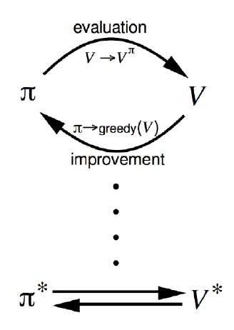

# 马尔可夫决策过程

## 马尔可夫决策过程

- Markov Decision Process, MDP

  提供了一套为在**结果部分随机，部分在决策者的控制下的决策过程建模**的数学框架

- MDP 形式化地描述了一种强化学习环境

  - 环境完全可测（不用知道是之前是由怎么样来到当前状态的）
  - 当前状态可以完全表征过程（**马尔可夫性质**）

## 马尔可夫性质

*The future is independent of the past given the present*

### 定义

状态 $S_t$ 是马尔可夫的，当且仅当 $\mathbb P[S_{t+1}|S_t]=\mathbb P[S_{t+1}|S_1,...,S_t]$。

（$S_t=f(H_t)$）

### 性质

- 状态从历史中捕获到了所有相关信息
- 当状态已知的时候，可以抛开历史不管
- i.e. **当前状态是未来的充分统计量**

## MDP 五元组

MDP可以由一个五元组表示：$(S,A,\{P_{sa}\},\gamma,R)$

- $S$ 是状态的集合。比如：迷宫中的为止，Atari 游戏中的当前屏幕显示

- $A$ 是动作的集合。比如：像上下左右四个方向移动，手柄操纵杆的方向和按钮

- $P_{sa}$ 是状态转移概率。

  - 对每个状态 $s\in S$ 和动作 $a\in A$，$P_{sa}$ 是下一个状态在 $S$ 中的概率分布

    i.e. $P_{sa}$ 是映射到概率分布 $\Omega(S)$ 中（可看作一个函数）

- $\gamma\in[0,1]$ 是对未来奖励的折扣因子

- $R:S\times A\leftrightarrow \mathbb R$ 是奖励函数。有时奖励只与状态相关

## MDP 的动态

MDP 的动态如下表示：

- 从状态 $s_0$ 开始
- 智能体选择某个动作 $a_0\in A$
- 智能体得到奖励 $R(s_0,a_0)$
- MDP 随机转移到下一个状态 $s_1\sim P_{s_0a_0}$

这个过程不断进行：$s_0\xrightarrow{a_0,R(s_0,a_0)}s_1\xrightarrow{a_1,R(s_1,a_1)}a_2\xrightarrow{a_2,R(s_2,a_2)}s_3\cdots$

直到终止状态 $S_T$ 出现为止，或者无止尽地进行下去

智能体的总回报为：$R(s_0,a_0)+\gamma R(s_1,a_1)+\gamma^2(s_2,a_2)+\cdots$

# 基于动态规划的强化学习

## MDP 目标和策略

### 目标

选择能够最大化累积奖励期望的动作：$\mathbb E[R(s_0)+\gamma R(s_1)+\gamma^2R(s_2)+\cdots]$

（所有的这些奖励都可能是随机的，故此处采用期望）

- $\gamma\in[0,1]$ 表示未来奖励的折扣因子，使得和未来奖励相比起来智能体更重视即时奖励

  （以金融为例，今天的￥1 比明天的￥1 更有价值）

### 策略

给定一个特定的策略：$\pi(s):S\rightarrow A$，即在状态 $s$ 下采取动作 $a=\pi(s)$

给策略 $\pi$ 定义价值函数：$V^\pi(s)=\mathbb E[R(s_0)+\gamma R(s_1)+\gamma^2R(s_2)+\cdots|s_0=s,\pi]$，即给定其实状态和根据策略 $\pi$ 采取动作时的累积奖励期望

## 价值函数的 Bellman 等式

给策略 $\pi$ 定义价值函数公式中的 $\gamma R(s_1)+\gamma^2R(s_2)+\cdots$ 项可以写成 $\gamma V^\pi(s_1)$。

因此可以得到 Bellman 等式：$V^\pi(s)=R(s)+\gamma\sum\limits_{s'\in S}p_{s\pi(s)}(s')V^{\pi}(s')$

- $R(s)$ 即时奖励
- $p_{s\pi}(s')$ 状态转移概率
- $V^{\pi}(s')$ 下一个状态的价值

## 最优价值函数

- 对于状态 $s$ 来说的最优价值函数是所有策略可获得的最大可能折扣奖励和

  $V^*(s)=\max\limits_{\pi}V^\pi(s)$

- 最优价值函数的 Bellman 等式

  $V^*(s)=R(s)+\max\limits_{a\in A}\gamma\sum\limits_{s'\in S}p_{sa}(s')V^*(s')$

- 最优策略

  $\pi^*(s)=\arg\max\limits_{a\in A}\sum\limits_{s'\in S}p_{sa}(s')V^*(s')$

- 对状态 $s$ 和策略 $\pi$

  $V^*(s)=V^{\pi^*}(s)\ge V^\pi(s)$

## 价值迭代和策略迭代

价值函数和策略相关

$V^\pi(s)=R(s)+\gamma\sum\limits_{s'\in S}p_{s\pi(s)}(s')V^{\pi}(s')$

$\pi(s)=\arg\max\limits_{a\in A}\sum\limits_{s'\in S}p_{sa}(s')V^\pi(s')$

可以对最优价值函数和最优策略执行迭代更新

- 价值迭代
- 策略迭代

### 价值迭代

对于一个动作空间和状态空间有限（$|S|\lt\infty,|A|\lt\infty$）的 MDP

价值迭代过程

1. 对每个状态 $s$，初始化 $V(S)=0$

2. 重复一下过程直到收敛

   - 对每个状态，更新 $V(s)=R(s)+\max\limits_{a\in A}\gamma\sum\limits_{s'\in S}p_{sa}(s')V(s')$

   **注意：以上计算中没有明确的策略**

#### 同步 vs. 异步价值迭代

同步的价值迭代会储存两份价值函数的拷贝

1. 对 $S$ 中的所有状态 $s$

   $V_{new}(s)\leftarrow\max\limits_{a\in A}(R(s)+\gamma\sum\limits_{s'\in S}p_{sa}(s')V_{old}(s'))$

2. 更新 $V_{old}(s)\leftarrow V_{new}(s)$

异步价值迭代值只储存一份价值函数

- 对 $S$ 中的所有状态 $s$：$V(s)\leftarrow\max\limits_{a\in A}(R(s)+\gamma\sum\limits_{s'\in S}p_{sa}(s')V(s'))$

### 策略迭代

对于一个动作空间和状态空间有限（$|S|\lt\infty,|A|\lt\infty$）的 MDP

策略迭代过程

1. 随机初始化策略 $\pi$

2. 重复一下过程直到收敛

   - 让 $V\leftarrow V^\pi$（特别耗时）
   - 对每个状态，更新 $\arg\max\limits_{a\in A}\sum\limits_{s'\in S}p_{sa}(s')V(s')$

   **更新价值函数会很耗时**

策略评估

- 估计 $V^\pi$
- 迭代的评估策略

策略改进

- 生成 $\pi'\ge\pi$
- 贪心策略改进

### 总结

1. 价值迭代是贪心更新法
2. 策略迭代中，用 Bellman 等式更新价值函数的代价很大
3. 对于空间较小的 MDP，策略迭代通常很快收敛
4. 对于空间较大的 MDP，价值迭代更实用（效率更高）
5. 如果没有状态转移循环，最好使用价值迭代

# 基于模型的强化学习

## 学习一个 MDP 模型

目前我们关注在给定一个已知 MDP 模型后（状态转移函数 $P_{sa}(s')$ 和奖励函数 $R(s)$ 明确给定后）

- 计算最优价值函数
- 学习最优策略

但是，在实际问题中，**状态转移**和**奖励函数**一般不是明确给出的。

比如，我们只看到了一些 episodes（采样）：

- Episode1: $s_0^{(1)}\xrightarrow{a_0^{(1)},R(s_0)^{(1)}}s_1^{(1)}\xrightarrow{a_1^{(1)},R(s_1)^{(1)}}s_2^{(1)}\cdots s_T^{(1)}$

- Episode2: $s_0^{(2)}\xrightarrow{a_0^{(2)},R(s_0)^{(2)}}s_1^{(2)}\xrightarrow{a_1^{(2)},R(s_1)^{(2)}}s_2^{(2)}\cdots s_T^{(2)}$

从“经验”中学习一个 MDP 模型

- 学习状态转移概率 $P_{sa}(s')$ = 在 $s$ 下采取动作 $a$ 并转移到 $s'$ 的次数 ÷ 在 $s$ 下采取动作 $a$ 的总次数
- 学习奖励函数 $R(s)$，也就是立即奖赏期望 $R(s)=average[R(s)^{(i)}]$ 

另一种解决方式是不学习 MDP，直接从经验中学习价值函数和策略

- 也就是**模型无关（Model-free）的强化学习**

## 学习模型 & 优化策略

### 算法思路

1. 随机初始化策略 $\pi$
2. 重复以下过程直到收敛
   - 在 MDP 中执行 $\pi$ 进行一些测验
   - 使用 MDP 中的累积经验更新 $P_{sa}$ 和 $R$ 的估计
   - 利用 $P_{sa}$ 和 $R$ 的估计执行价值迭代，得到新的估计价值函数 $V$
   - 根据 $V$ 更新策略为 $\pi$ 为贪心策略

