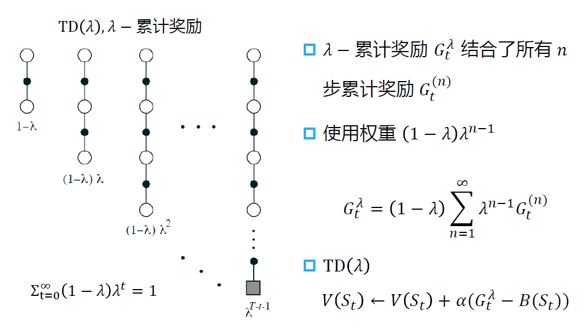
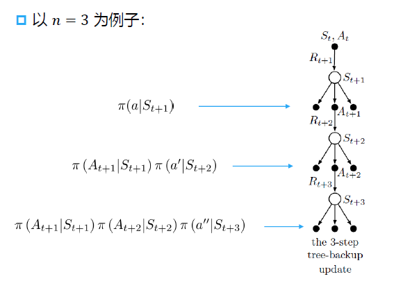
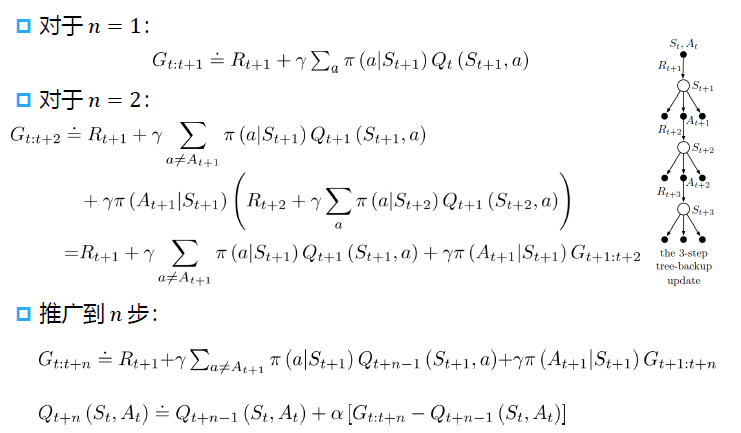

# SARSA

## SARSA

对于当前策略执行每个（状态→动作→奖励→状态→动作）元组

SARSA 更新状态-动作值函数为：$Q(s,a)\leftarrow Q(s,a)+\alpha(r+\gamma Q(s',a')-Q(s,a))$

### 使用 SARSA 的在线策略（on-policy）可控制

对于每个时间步长

- 评估策略：$Q(s,a)\leftarrow Q(s,a)+\alpha(r+\gamma Q(s',a')-Q(s,a))$
- 策略改进：$\epsilon-greedy$ 方法

### 算法具体步骤

1. 初始化 $Q(s,a)$

2. 循环（for each episode）

   - 初始化 S

   - 基于已有的 Q（$\epsilon-greedy$）从 S 中选择 A

   - 循环：

     - 选择 A，观察 R 和 S'
     - 基于 Q，从 S' 中选择 A'
     - $Q(s,a)\leftarrow Q(s,a)+\alpha(r+\gamma Q(s',a')-Q(s,a))$
     - $S\leftarrow S'$，$A\leftarrow A'$

     当 S 终止

在线策略时序差分控制（on-policy TD control）使用当前策略进行动作采样，即 SARSA 算法中的两个 Action 都是基于当前策略选择的。

# Q-Learning

## Q-Learning 算法及其收敛性

### 离线策略学习

#### 什么是离线策略学习

- 目标策略 $\pi(a|s)$ 进行值函数评估（$V^\pi(s)$ 和 $Q^\pi(s,a)$）
- 行为策略 $\mu(a|s)$ 收集数据 $\{s_1,a_1,r_1,s_2,r_2,a_2,\cdots,s_T\}\sim\mu$

#### 为什么使用离线策略学习

- 平衡探索 exploration 和利用 exploitation
- 通过观察人类或其它智能体学习策略
- 重用旧策略所产生的经验
- 遵循探索策略时学习最优策略
- 遵循一个策略时学习多个策略

### Q 学习

- 学习状态-动作值函数 $Q(s,a)\in\mathbb R$，不直接优化策略

- 是一种离线策略（off-policy）学习方法

  数据有可能是通过其它策略采样得到的

  $Q(s_t,a_t)=\sum_{t=0}^T\gamma^tR(s_t,a_t),a_t\sim\mu(s_t)$

  - 策略函数 $\mu(\cdot|s_t)\sim\mu(s_t)$
  - 动作空间 $a\sim A$
  - 迭代式 $Q(s_t,a_t)=R(s_t,a_t)+\gamma Q(s_{t+1},a_{t+1})$

- 无需重要性采样

- 根据行为策略选择动作 $a_t\sim\mu(\cdot|s_t)$

- 根据目标策略选择后续动作 $a_{t+1}'\sim\pi(\cdot|s_t)$

  - 目标 $Q^*(s_t,a_t)=r_t+\gamma Q(s_{t+1},a_{t+1}')$

- 更新 $Q(s_t,a_t)$ 的值以逼近目标状态-动作值

  $Q(s_t,a_t)\leftarrow Q(s_t,a_t)+\alpha(r_{t+1}+\gamma Q(s_{t+1},a_{t+1}')-Q(s_t,a_t))$

#### 使用 Q 学习的离线策略控制

- 允许行为策略和目标策略都进行改进

- 目标策略 $\pi$ 是关于 $Q(s,a)$ 的贪心策略

  $\pi(s_{t+1})=\arg\max_{a'}Q(s_{t+1},a')$

- 行为策略 $\mu$ 是关于 $Q(s,a)$ 的 ε-greedy 策略

- Q 学习目标函数可简化为

  $r_{t+1}+\gamma Q(s_{t+1},a_{t+1}')=r_{t+1}+\gamma Q(s_{t+1},\arg\max_{a_{t+1}'}(s_{t+1},a_{t+1}))$

  $=r_{t+1}+\gamma\max_{a_{t+1}'}Q(s_{t+1},a_{t+1}')$

- Q 学习更新方式

  $Q(s_t,a_t)\leftarrow Q(s_t,a_t)+\alpha(r_{t+1}+\gamma\max_{a_{t+1}'}Q(s_{t+1},a_{t+1}')-Q(s_t,a_t))$

#### Q 学习控制算法

状态 s，执行动作 a→观测到奖励 r→转移到下一状态 s'，执行动作 $\arg\max_{a'}Q(s',a')$

定理：Q 学习控制收敛到最优状态-动作值函数 $Q(s,a)\rightarrow Q^*(s,a)$

### Q 学习的收敛性证明

#### 收缩算子 contraction operator

- $Q(s,a)=r(s,a)+\gamma\max_{a'}Q(s',a')$
- 定义 H 算子：$HQ=r(s,a)+\gamma\mathbb E_{s'\sim p(\cdot|s,a)}[\max_{a'}Q(s',a')]$
- 最优值函数 $Q*$ 是 $H$ 的不动点，意味着 $Q^*=HQ^*$

### 直接从 Q 函数证明

$(Hq)(x,a)=\sum_{y\in\mathcal X}P_a(x,y)[r(x,a,y)+\gamma\max_{b\in\mathcal A}q(y,b)]$

$||\bold{H}q_1-\bold{H}q_2||_\infty$

$=\max_{x,a}|\sum_{y\in\mathcal X}P_a(x,y)[\gamma\max_{b\in\mathcal A}q_1(y,b)+\gamma\max_{b\in\mathcal A}q_2(y,b)]|$

$\le\max_{x,a}\gamma\sum_{y\in\mathcal X}P_a(x,y)|\max_{b\in\mathcal A}q_1(y,b)-\max_{b\in\mathcal A}q_2(y,b)|$

$\le\max_{x,a}\gamma\sum_{y\in\mathcal X}P_a(x,y)\max_{z,b}|q_1(z,b)-q_2(z,b)|$

$=\max_{x,a}\gamma\sum_{y\in\mathcal X}P_a(x,y)||q_1-q_2||_\infty$

$=\gamma||q_1-q_2||_\infty$

可以使用柯西收敛准则证明

# 第 3 讲 多步自助法

## 多步时序差分预测

### 回顾动态规划和时序差分

动态规划需要知道整个 MDP 环境的状态转移和奖励函数，完全反向传播。

时序差分算法基于一步采样去做。

### 回顾蒙特卡洛方法和时序差分

蒙特卡洛：基于当前 state 采样后面所有步，累积奖励函数

时序差分：只走一步

那么有没有介于时序差分和蒙特卡洛的方法呢？

> 有，被称之为多步时序差分。

### 多步时序差分

比如 3-step TD。向前走三步，得到一个累积奖励值来更新

n=1 时，是 TD

1＜n＜∞ 时，是 n-step TD

n=∞ 时，是蒙特卡洛方法

n 步累计奖励：$G_{t}^{(n)}=R_{t+1}+\gamma R_{t+2}+\cdots+\gamma^{n-1}R_{t+n}+\gamma^nV(S_{t+n})$

n 步时序差分学习：$V(S_t)\leftarrow V(S_t)+\alpha(G_t^{(n)}-V(S_t))$

### 平均 n 步累计奖励

可以进一步对不同 n 下的 n 步累计奖励求平均值

例如求 2 步和 3 步时的平均累计奖励 $\frac{1}{2}G^{(2)}+\frac{1}{2}G^{(3)}$

### 使用平均 n 步累计奖励的 TD(λ) 算法

当 λ = 1 时，相当于蒙特卡洛方法

当 λ = 0 时，相当于单步时序差分

## 多步 SARSA

n-step 的思想用在控制上，就是多步 SARSA 算法。

## 使用重要性采样的多步离线学习法

对于状态值函数 V

$V_{t+n}(S_t)=V_{t+n-1}(S_t)+\alpha\rho_{t:t+n-1}[G_{t:t+n}-V_{t+n-1}(S_t)]$

$\rho_{t:h}=\Pi_{k=t}^{\min(h,T-1)}\frac{\pi(A_k|S_k)}{b(A_k|s_k)}$

对于动作值函数 Q：

$Q_{t+n}(S_t,A_t)=Q_{t+n-1}(S_t,A_t)+\alpha\rho_{t+1:t+n}[G_{t:t+n}-Q_{t+n-1}(S_t,A_t)]$

$\rho_{t:h}=\Pi_{k=t}^{\min(h,T-1)}\frac{\pi(A_k|S_k)}{b(A_k|s_k)}$

## 多步树回溯算法

多步连乘导致方差大，为了解决这一问题，避免重要性采样。可用多步树回溯算法替代。

### 多步树回溯算法推导

