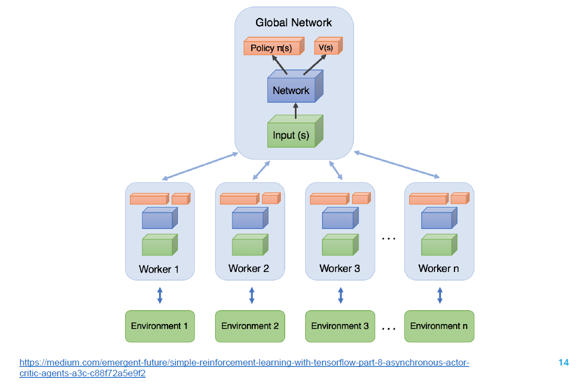
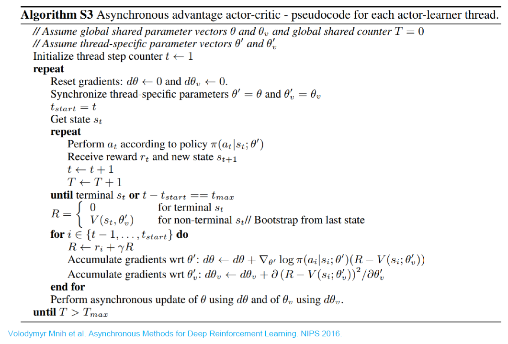

# A3C

## Actor-Critic

- 演员采取动作使评论家满意
- 评论家学会准确估计演员策略所采取动作价值的值函数

## A2C

Advantage Actor-Critic

通过减去一个基线函数来优化评论家的打分

- 更多信息指导：降低较差动作概率，提高较优动作概率
- 进一步降低方差

优势函数 $A^\pi(s,a)=Q^\pi(s,a)-V^\pi(s)$

## A3C：异步 A2C 方法

Asynchronous Advantage Actor-Critic

- 异步：算法涉及并执行一组环境
- 优势：策略梯度的更行使用优势函数
- 动作评价

Global Network 是表演者和评论家的所在

这些 Workers 学习完一段时间后，产生梯度，传到 global network 中去。更新完全局网络后参数又同步到所有 workers 上去。这样的好处是并行化，提升性能。

# 确定性策略梯度 DPG

## 随机策略与确定性策略

- 随机策略
  - 对于离散动作：$\pi(a|s;\theta)=\frac{\exp\{Q_\theta(s,a)\}}{\Sigma_{a'}\exp\{Q_\theta(s,a')\}}$
  - 对于连续动作：$\pi(a|s;\theta)\propto\exp\{(a-\mu_\theta(s))^2\}$
- 确定性策略
  - 对于离散动作：$\pi(s;\theta)=\arg\max_aQ_\theta(s,a)$ 不可微
  - 对于连续动作：$a=\pi(s;\theta)$ 可微

## 确定性策略梯度

用于估计状态-动作值的评论家模块

$Q^w(s,a)\simeq Q^\pi(s,a)$

$L(w)=\mathbb E_{s\sim\rho^\pi,a\sim\pi_\theta}[(Q^w(s,a)-Q^\pi(s,a))^2]$

确定性策略梯度定理

$J(\pi_\theta)=\mathbb E_{s\sim\rho^\pi}[Q^\pi(s,a)]$

$\nabla_\theta J(\pi_\theta)=\mathbb E_{s\sim\rho^\pi}[\nabla_\theta\pi_\theta(s)\nabla_a Q^\pi(s,a)|_{a=\pi_\theta(s)}]$

# 深度确定性梯度策略 DDPG

在 DPG 的基础上增加

- 经验重放（离线策略）
- 目标网络
- 在动作输入前对 Q 网络做 batch normalization
- 添加连续噪声

目标网络至关重要

# 信任区域策略优化 TRPO

## 策略梯度的缺点

步长难以确定：

- 采集到数据的分布会随策略的更新而变化
- 较差的步长产生的影响大，进而导致策略变差

## TRPO

优化目标：策略梯度

第一种：$J(\theta)=\mathbb E_{\tau\sim p_\theta(\tau)}[\Sigma_t\gamma^tr(s_t,a_t)]$

第二种：$J(\theta)=\mathbb E_{s_0\sim p_\theta(s_0)}[V^{\pi_\theta}(s_0)]$

### 优化目标的优化量

$J(\theta')-J(\theta)=J(\theta')-\mathbb E_{s_0\sim p_\theta(s_0)}[V^{\pi_\theta}(s_0)]$

$=J(\theta')-\mathbb E_{\tau\sim p_{\theta'(\tau)}}[V^{\pi_\theta}(s_0)]$

$=J(\theta')-\mathbb E_{\tau\sim p_{\theta'(\tau)}}[\sum_{t=0}^\infty\gamma^tV^{\pi_\theta}(s_t)-\sum_{t=1}^\infty\gamma^tV^{\pi_\theta}(s_t)]$

$=J(\theta')+\mathbb E_{\tau\sim p_{\theta'(\tau)}}[\sum_{t=0}^\infty\gamma^t(\gamma V^{\pi_\theta}(s_{t+1})-V^{\pi_\theta}(s_t))]$

$=\mathbb E_{\tau\sim p_{\theta'(\tau)}}[\sum_{t=0}^\infty\gamma^tr(s_t,a_t)]+\mathbb E_{\tau\sim p_{\theta'(\tau)}}[\sum_{t=0}^\infty\gamma^t(\gamma V^{\pi_\theta}(s_{t+1})-V^{\pi_\theta}(s_t))]$

$=\mathbb E_{\tau\sim p_{\theta'(\tau)}}[\sum_{t=0}^\infty\gamma^t(r(s_t,a_t)+\gamma V^{\pi_\theta}(s_{t+1})-V^{\pi_\theta}(s_t))]$

$=\mathbb E_{\tau\sim p_{\theta'(\tau)}}[\sum_{t=0}^\infty\gamma^tA^{\pi_\theta}(s_t,a_t)]$

优势函数 $A^{\pi_\theta}(s_t,a_t)=Q^{\pi_\theta}(s_t,a_t)-V^{\pi_\theta}(s_t)$

### 使用重要性采样

$J(\theta')-J(\theta)$

$=\mathbb E_{\tau\sim p_{\theta'(\tau)}}[\sum_{t=0}^\infty\gamma^tA^{\pi_\theta}(s_t,a_t)]$

$=\sum_t\mathbb E_{s_t\sim p_{\theta'(s_t)}}[\mathbb E_{a_t\sim\pi_{\theta'}(a_t|s_t)}[\gamma^tA^{\pi_\theta}(s_t,a_t)]]$

$=\sum_t\mathbb E_{s_t\sim p_{\theta'(s_t)}}[\mathbb E_{a_t\sim\pi_{\theta'}(a_t|s_t)}[\frac{\pi_{\theta'}(a_t|s_t)}{\pi_\theta(a_t|s_t)}\gamma^tA^{\pi_\theta}(s_t,a_t)]]$

### 忽略状态分布的差异

当策略更新前后变化较小时，令 $p_\theta(s_t)\approx p_{\theta'}(s_t)$

## 策略改进的单调性保证

每轮迭代都能保证函数值优化

# 近端策略优化 PPO

TRPO 使用 KL 散度约束策略更新的幅度

TRPO 的不足

- 近似带来误差
- 求解约束优化问题的困难

## 在 TRPO 基础上进行改进

1. 截断式优化目标

   基于 CLIP 的方式，截断式优化 TRPO 中的重要性采样

2. 优势函数选用多步时许差分

   - 每次迭代中，并行 N 个 actor 收集 T 步经验数据
   - 计算每步的优势函数，构成 mini-batch
   - 更新参数

3. 自适应的 KL 惩罚项参数

